# **HUMANOID ASSISTIVE ROBOTIC PLATFORM**

**COLLEGE OF ELECTRICAL AND MECHANICAL ENGINEERING NATIONAL UNIVERSITY OF SCIENCES AND TECHNOLOGY RAWALPINDI 2025**

# **DE-43 MTS PROJECT REPORT HUMANOID ASSISTIVE ROBOTIC PLATFORM**

Submitted to the Department of Mechatronics Engineering

in partial fulfillment of the requirements

for the degree of

**Bachelor of Engineering**

**In**

**Mechatronics**

**2025**

**Sponsoring DS: Submitted By:** 

**AP Kanwal Naveed Syed Muhammad Daniyal Gillani Lecturer Usman Asad Muhammad Abdullah Khalid Dr Anas bin Aqeel Wajieh Badar Umair Shahzad**

# **ACKNOWLEDGMENTS**

To conduct this Thesis on humanoid robot, we would like to express our gratitude to Allah Almighty, who bestowed His blessings to carry out this extensive research, designing and completion of our project. Further, we would like to extend our humble gratitude to our supervisor, A/P Kanwal Naveed, whose unwavering support, invaluable guidance, and insightful feedback have been instrumental in shaping this thesis. Her expertise and encouragement have inspired us to strive for excellence in our research endeavours.

We also extend our heartfelt appreciation to our co-supervisors, Lec. Usman Asad and Dr. Anas Bin Aqeel, for their dedicated mentorship and constructive criticism. Their expertise and encouragement have enriched our understanding and enhanced the quality of our work.

Lastly, we are grateful to NUST H-12 for giving us a sponsorship funded flagship project, and we would like to acknowledge the support and encouragement of our parents and friends. Their unwavering belief in our abilities, endless encouragement, and unconditional support have been a constant source of strength throughout the arduous process of undertaking this final year project. Their words of wisdom and encouragement have been a guiding light, motivating us to overcome challenges and strive for excellence.

# **ABSTRACT**

As autonomous systems and robotics become more integrated into daily life, their impact is increasingly transformative, especially in sectors like healthcare. The Humanoid Assistive Robotic Platform (HARP) is designed to support individuals in everyday tasks with a strong focus on assistance and communication. Unlike existing solutions with short-term benefits, HARP offers sustainable, long-term impact through advanced interactive capabilities. The robot features autonomous navigation via Passive SLAM, behavior recognition using video classifiers, natural communication powered by language learning models, and lifelike movement through a gimbal-based neck system. These technologies enable the robot to assist with mobility, conversation, and basic caregiving tasks, making it a versatile and dependable companion. HARP redefines human-robot interaction by combining human-like engagement and reliable support, bringing us closer to a future where robotic assistance is not only functional but truly personal.

# TABLE OF CONTENTS

| ACKNOWLEDGMENTS                                              | ii          |
|--------------------------------------------------------------|-------------|
| ABSTRACT                                                     | iii         |
| TABLE OF CONTENTS                                            | iv          |
| LIST OF FIGURES                                              | <b>vi</b> i |
| LIST OF TABLES                                               | ix          |
| LIST OF SYMBOLS                                              | X           |
| Chapter 1 – INTRODUCTION                                     | 1           |
| 1.1 Overview                                                 | 1           |
| 1.2 Motivation                                               | 1           |
| 1.3 Problem Statement                                        | 1           |
| 1.4. Objectives of this project                              | 2           |
| 1.5 Organization of the Thesis                               | 2           |
| Chapter 2 – LITERATURE REVIEW                                | 4           |
| 2.1. Holonomic Robot Base                                    | 4           |
| 2.2. Passive Visual Simultaneous Localization and Mapping    | 6           |
| 2.3. Semantic Perception in Humanoid Robots                  | 7           |
| 2.4. Emotive Displays on Social Robots                       | 9           |
| 2.5. Sophisticated Emotion & Behavior Recognition Techniques | 10          |
| 2.6. Role of Assistive Humanoids in Healthcare               | 11          |
| Chapter 3 – METHODOLOGY                                      | 13          |
| 3.1. Design of Mecanum-Wheel Base                            | 13          |
| 3.1.1. Requirements                                          | 13          |
| 3.1.2. Inspiration                                           | 14          |
| 3.1.3. CAD Model - Design Process                            | 14          |
| 3.1.4. Parts                                                 | 15          |

| 3.1.5. Final Design                                           | 17 |
|---------------------------------------------------------------|----|
| 3.1.6. Mathematical Calculations                              | 18 |
| 3.1.7. Finite Element Analysis (FEA)                          | 22 |
| 3.1.8. URDF Generation using SolidWorks Plugin                | 24 |
| 3.1.9. Mechanical Manufacturing                               | 25 |
| 3.2. Design Specification for a 2 DOF Neck Movement Mechanism | 30 |
| 3.2.1. Hardware Design for Neck Movement                      | 30 |
| 3.2.2. Face Tracking and Control Logic                        | 30 |
| 3.2.3. Look Around Function and Control Logic                 | 31 |
| 3.3. Face animations                                          | 31 |
| 3.3.1. Facial Expressions Logic                               | 31 |
| 3.4. Behavior Recognition                                     | 32 |
| 3.4.1. Development of Video Classifier (Self-Trained)         | 32 |
| 3.4.2. Implementation of A Pre-Trained Model                  | 37 |
| 3.5. Conversational Capabilities in HARP                      | 41 |
| 3.5.1. Background                                             | 41 |
| 3.5.2. The Role of Conversation in Humanoid Assistive Robots  | 41 |
| 3.5.3. Why Conversational Capabilities Matter for HARP        | 41 |
| 3.5.4. Working of a Large Language Model (LLM)                | 42 |
| 3.5.5. LLM Pipeline                                           | 42 |
| 3.5.6. Advantages of This Approach                            | 44 |
| 3.5.7. Limitations                                            | 44 |
| 3.6. Passive Visual SLAM of Four-Wheel Mecanum Robot          | 45 |
| 3.6.1. Background                                             | 45 |
| 3.6.2. Four Mecanum Wheel Omni Directional Kinematics         | 45 |
| 3.6.3. Motor Encoder                                          | 46 |
| 3.6.4. PID Controller                                         | 47 |

| 3.6.5. Visual Passive SLAM               | 47 |
|------------------------------------------|----|
| 3.6.6. Physical Implementation           | 52 |
| 3.7. Integration of subsystems with ROS2 | 54 |
| 3.7.1. Vision Module                     | 55 |
| 3.7.2. Neck Module                       | 56 |
| 3.7.3. Face Animations                   | 58 |
| 3.7.4. MQTT Module                       | 59 |
| 3.7.5. Teleops Module                    | 59 |
| 3.7.6. Speech Module                     | 60 |
| Chapter 4 – RESULTS                      | 61 |
| 4.1. Ansys Workbench Analysis Results    | 61 |
| 4.1.1. Static Structural                 | 61 |
| 4.1.2. Modal Analysis                    | 65 |
| 4.1.3. Eigenvalue Buckling Analysis      | 67 |
| 4.1.4. Conclusion of FEA                 | 68 |
| 4.2. Other Results                       | 68 |
| 4.3 Final Look                           | 68 |
| Chapter 5 – CONCLUSION & FUTURE WORK     | 69 |
| 5.1. Conclusion                          | 69 |
| 5.2. Future Work                         | 69 |
| REFERENCES                               | 71 |
| ADDENIDIV                                | 72 |

# **LIST OF FIGURES**

| Figure 1. Pepper Bot                                               | 14 |
|--------------------------------------------------------------------|----|
| Figure 2. Base CAD                                                 | 15 |
| Figure 3. Motor Bracket                                            | 16 |
| Figure 4. Fibre Glass Skirt                                        | 16 |
| Figure 5. Left and Right Mecanum Wheels                            | 17 |
| Figure 6. Motor Coupler                                            | 17 |
| Figure 7, Rendered Image                                           | 17 |
| Figure 8, Final CAD model                                          | 18 |
| Figure 9. Stability Simulation in CoppeliaSim                      | 25 |
| Figure 10. Base Foundation Manufacturing (i)                       | 26 |
| Figure 11. Base Fabrication Manufacturing (ii)                     | 26 |
| Figure 12. Base Foundation Manufacturing (iii)                     | 27 |
| Figure 13. Base After Welding                                      | 27 |
| Figure 14. Drilling of Base Top to Fasten with Torso               | 27 |
| Figure 15. Motor Coupler Fabrication                               | 28 |
| Figure 16. Fabricated Motor Coupler                                | 29 |
| Figure 17. Gimbal Mounting Plate Manufacturing                     | 29 |
| Figure 18. 2 DOF Gimbal assembly.                                  | 30 |
| Figure 19. Robot "Sad" Expression                                  | 31 |
| Figure 20. Robot "Happy" Expression                                | 32 |
| Figure 21. Training code workflow                                  | 34 |
| Figure 22. Model evaluation after training for more than 20 epochs | 36 |
| Figure 23. Confusion Matrix                                        | 36 |
| Figure 24. MoViNet architecture                                    | 39 |
| Figure 25. Inference Flow Diagram                                  | 40 |
| Figure 26, LLM pipeline Flowchart                                  | 45 |
| Figure 27. Encoder Motor Pulses                                    | 47 |

| Figure 28. Intel Realsense Camera                         | . 48 |
|-----------------------------------------------------------|------|
| Figure 29. RTAB 3D Map                                    | . 49 |
| Figure 30. 2D Grid Map                                    | . 49 |
| Figure 31. A start navigation omni directional simulation | . 52 |
| Figure 32. Proposed System                                | . 52 |
| Figure 33, ROS 2 Environment Architecture Flowchart.      | . 55 |
| Figure 34. Vision Module Flowchart                        | . 56 |
| Figure 35. Neck Module Integration with ROS2              | . 57 |
| Figure 36. Face Animation Module                          | . 59 |
| Figure 37. ROS 2 MQTT and Teleops functionality.          | . 60 |
| Figure 38. Speech Module                                  | . 60 |
| Figure 39, Directional Deformation                        | . 62 |
| Figure 40, Total Deformation                              | . 62 |
| Figure 41, Equivalent Elastic Strain                      | . 63 |
| Figure 42, Maximum Principal Elastic Strain               | . 63 |
| Figure 43, Equivalent Stress                              | . 64 |
| Figure 44, Maximum Principal Stress                       | . 64 |
| Figure 45, Mode 1 (20.317Hz)                              | . 66 |
| Figure 46, Mode 2 (23.627Hz)                              | . 66 |
| Figure 47. Final Fabricated Design of HARP                | . 68 |

# **LIST OF TABLES**

| Table 1. Pros & Cons of Different Wheels          | 5  |
|---------------------------------------------------|----|
| Table 2. Available Data for Calculations          | 18 |
| Table 3. Calculation Results                      | 20 |
| Table 4. Parameters for Load & Stability Analysis | 20 |
| Table 5. Motor Calculations Parameters            | 21 |
| Table 6. Structural Analysis Parameters           | 23 |
| Table 7. Feature Exactor Parameters               | 35 |
| Table 8. LSTM Model Summary                       | 35 |
| Table 9. Static Analysis Results                  | 61 |
| Table 10. Modal Analysis Natural Frequencies      | 65 |
| Table 11. Eigenvalue Buckling Load Factors        | 67 |

# **LIST OF SYMBOLS**

#### **Latin Letters**

*A* acceleration

*M* mass

*m mass*

*a acceleration*

*V Voltage*

*N Newton*

r radius

F Force

P Power

#### **Greek Letters**

µ Friction coefficient

ω Angular velocity

τ Torque

π pi

#### **Acronyms**

CAD Computer Aided Design

HARP Humanoid Assistive Robotic Platform

SOP Standard Operating Procedures

URDF Unified Robotics Description Format

# **Chapter 1 – INTRODUCTION**

# **1.1 Overview**

Humanoids are robots that resemble humans in shape and motion and are enabled to interact with the environment as humans. They are used in various fields such as industries, health care, education and entertainment. With the advancements in technology there has been growth in the research and development of humanoids to make human lives easier and assist them in their everyday tasks. Humanoid robots require robust systems for perception, decisionmaking, and communication. This literature review also explores the use and integration of an omni wheel robot base, emotion and behavior recognition, LLMs and SLAM within humanoid robots emphasizing the challenges and potential solutions in creating intelligent, interactive humanoid robots.

# **1.2 Motivation**

The selection of a Humanoid Assistive Robotic Platform as a final year project is driven by its strong alignment with the interdisciplinary foundation of Mechatronics Engineering. This project integrates key domains including design and fabrication of new mobile platform, behavior recognition, robot verbal communication, and autonomous mapping and pathplanning. Pursuing this project promotes technical innovation and societal impact, contributing to the development of human-centric robotic systems capable of improving quality of life for individuals with physical or cognitive limitations. Moreover, the project pushes to learn advanced methods in the field of robotics, such as ROS2 integration.

# **1.3 Problem Statement**

There is a growing need for social robots to provide continuous support in environments facing workforce shortages, such as elderly care facilities, and rehabilitation centers. As the demand for personalized care increases, human caregivers alone are often insufficient to meet the needs of aging populations or individuals requiring long-term assistance. Such can be seen in nations where births rates are gradually decreasing where there isn't enough young labor force in rehabilitation centers.

Assistive robotic systems are often limited in their ability to perceive complex human behaviors, interact naturally through speech, or to move in environments by themselves. Many rely on expensive and power-intensive active sensors, lack real-time decision-making capabilities, or are constrained by non-modular, inflexible platforms. These limitations reduce their effectiveness and scalability in real-world applications.

# **1.4. Objectives of this project**

This time, the project aims to further improve the previously made Humanoid Assistive Robotic Platform (HARP) which is designed to operate in human-centric environments such as elderly care and rehabilitation centers. HARP uses real time sensor data, such as visual and auditory inputs, to build environmental maps and perform real-time localization, avoiding the need for costly active sensors. To polish the natural interaction, a speech interface will be implemented through LLM, enabling two-way verbal communication for user engagement. Additionally, the system will integrate real-time human action recognition to allow contextaware assistance based on user behavior.

A new omnidirectional robotic base will be designed and fabricated to provide mechanical stability, integration of electronics and hardware, and agile mobility in indoor spaces. The project will emphasize enhanced perception and interaction by fusing passive data to improve decision-making and safety in dynamic environments. These objectives collectively address the need for intelligent, responsive, and accessible robotic systems that can operate reliably in settings where human support is limited, contributing to the broader goal of socially assistive robotics.

# **1.5 Organization of the Thesis**

The thesis is further written in the following fashion:

• **Chapter 2:** Comprises of the literature review which discusses the latest research and advancements made in the field of social robots.

- **Chapter 3:** A detailed methodology that helps the reader understand how the solution was made in the is project.
- **Chapter 4:** Displays the results of Ansys simulations.
- **Chapter 5:** Conclusion and future work.

# **Chapter 2 – LITERATURE REVIEW**

# **2.1. Holonomic Robot Base**

Humanoid Robots can be mainly divided into two categories based on their base, they can be legged robots or wheeled robots. Holonomic drive robots can be defined as robots that have omni directional movement using omni or mecanum wheels in their base. Omni directional movement is designed such that the robot can move in all directions without having to change its direction [2]. This feature allows the robot to move in any direction and easily navigate complex paths [3].

Another paper highlights functionality advantages, and drawbacks of various types of wheels by providing an in-depth comparison between them [4]. Caster wheels, conventional wheels, mecanum wheels, steering wheels, and universal wheels are discussed in the said paper. The indepth analysis of mechanical parameters such as load capacity, sensitivity to surface conditions, and manufacturing complexity are included in the paper. The paper discusses the importance of choosing the appropriate wheel configuration depending on the specific operational conditions of the robot. In conclusion, the research claims the maneuverability provided by mecanum or omni wheels is more suitable for a humanoid robot. The conventional wheels are robust, but they do not offer such maneuverability as mecanum wheels, allowing them to function effectively in a limited space environment.

In a study conducted by New Castle University UK [5], a three-wheel omnidirectional base was designed for robotics competitions. This design ensures speed, maneuverability, and costeffectiveness by utilizing omnidirectional wheels.

The methodology involved analyzing the robot's omnidirectional locomotion through kinematics equations and trajectory plotting. The robot's velocity PI algorithm was utilized to control the wheels' speeds, leading to successful tests such as repeatability and maneuverability tests. The platform demonstrated reasonable results post-analysis and computer programming implementation. The robot's design allows for instantaneous movement in any direction, showcasing its high degree of mobility and maneuverability.

Non-Holonomic design would refer to conventional wheels in this case where movement is restricted. Conventional wheels can only move forward and reverse direction and can turn. While holonomic design would be able to move in any direction at any point. Considering the application of the HARP, a holonomic design was suggested to ensure better and faster accessibility. It would be suitable as it is going to be an indoor robot.

Ksenia Shabalina [6] in her study compared different wheels that are used for robotic base platforms in mobile robots. Their pros and cons are provided in table 1 below:

Table 1. Pros & Cons of Different Wheels

| Wheel Type                              | Pros                                                                                              | Cons                                                                                     |
|-----------------------------------------|---------------------------------------------------------------------------------------------------|------------------------------------------------------------------------------------------|
| Conventional Wheels Universal Wheels | • Robust and Reliable • Good load capacity • Simple design • Omnidirectional | • Limited maneuverability • Restricted directions • Complex manufacturing |
|                                         | movement • Useful in narrow areas                                                           | • Sensitive to surface conditions                                                  |
| Mecanum Wheels                       | • Excellent maneuverability • Omnidirectional                                         | • Complex design • Have low load capacity compared to conventional wheels |
| Caster Wheels                           | • Simple design • Supports free locomotion for conventional wheels                    | • Limited control in certain directions                                            |

|  | • | Unstable on uneven |
|--|---|--------------------|
|  |   | surfaces           |
|  |   |                    |

In the paper "Design and Control of Ball Wheel Omnidirectional Vehicles," [7] the authors introduce a novel approach to designing a robotic base platform utilizing ball wheel mechanisms, which facilitate omnidirectional movement. The ball wheel mechanism supports the vehicle chassis on a spherical tire, allowing it to roll in any direction on a flat surface, thereby achieving full mobility without kinematic singularities, which is essential for smooth and precise maneuverability. The design is independent of its internal configuration, simplifying control.

Additionally, the incorporation of multiple displacement sensors enables effective slip detection and traction control, optimizing the use of available floor friction and allowing for accurate dead reckoning navigation even when slip occurs. A prototype vehicle was developed with three ball wheels arranged in an equilateral triangle, maximizing stability and traction, and demonstrated a dead-reckoning error of less than 1 mm over 2m, showcasing its precision. The design ensures two degrees of freedom relative to the chassis that prevents sliding contacts and maintains high friction for effective traction.

Savvy [8] features a unique omnidirectional mobile base designed with mecanum wheels, allowing for flexible movement in constrained indoor environments. The robot is structured in a multi-layer design, comprising a lower layer for critical components, a middle layer for mounting additional hardware, and an upper layer for visual sensors, ensuring optimal sensor placement and protection.

# **2.2. Passive Visual Simultaneous Localization and Mapping**

SLAM is required for robotics, drones and autonomous systems to navigate in an unknown environment by building a map and simultaneously finding its location within the map to move in the correct direction. Hence, to find the robot's location in an environment (localization) and building along with updating the map based on environment data (mapping) form the core principles of SLAM algorithms [9].

Visual SLAM makes use of cameras (e.g. depth camera or RGB) to acquire visual data such as stream of images or video to estimate the position of the camera which could be attached to a robot and build a map for the environment. The paper "A Comprehensive survey of visual SLAM algorithms" provides many approaches to Visual SLAM such as visual only, visual inertial and RGB SLAM. The paper discusses and reviews algorithms for each type of approach and makes use of many diagrams such as flowcharts to clear key concepts. In conclusion, the paper provides a broad perspective and is beneficial for exploring the main characteristics for Visual SLAM techniques [10].

Further, there are various approaches to gather visual data such as Active SLAM and Passive SLAM. In Active SLAM the robot or autonomous system has manipulative control over the camera to gather information about the environment to construct the map. Passive SLAM does not use continuous control of the camera; instead, visual data is collected from a static moving camera without any change in orientation and position [11]. Passive SLAM systems require less hardware and software complexity making it easier to implement them.

The paper "Navigation and Path Planning using Reinforcement Learning for a Roomba Robot" focuses on Passive SLAM using odometry measurements which the Roomba Robot uses to navigate its path through rooms. Despite mechanical errors such as wheel slippage or uneven surfaces the overall performance was good. This paper, in conclusion, mentions plans to incorporate cameras in the future to measure the robot's relative position within rooms and create topological navigation maps.

# **2.3. Semantic Perception in Humanoid Robots**

Currently, HARP uses LLM to be able to understand and to be able to reply to people based on only a pre-written document. That resembles it to a chatbot. For HARP to be able to interact with humans effectively, LLM needs to be used as a brain that also stores all interactions for future reference. Combining both memory and control could prove to be a game changer for HARP.

The paper "LLM as A Robotic Brain: Unifying Egocentric Memory and Control" [12] introduces the LLM-Brain framework, which integrates Large-scale Language Models (LLMs) to unify memory and control in embodied AI systems. The methodology consists of three main components: Role Initialization, Eye-Nerve Perception, and Brain Reasoning and Control.

The framework operates in a zero-shot manner, allowing it to generalize across various tasks without extensive retraining. Communication among components occurs through natural language in closed-loop dialogues, enhancing collaboration and explainability.

The paper demonstrates the effectiveness of LLM-Brain through two tasks: active exploration, where the robot navigates an unknown environment, and embodied question answering, where it answers questions based on prior observations. The limitations that rose in the initial experiments show that perception and reasoning components do not coordinate well and that leads to poor navigation decisions even though the framework enables effective exploration.

The paper by Hangyeol Kang et al. [13] presents the development of Nadine, a social robot that integrates Large Language Models (LLMs) enhance interaction between humans and robots through advanced cognitive and emotional capabilities. The authors introduce the SoR-ReAct framework, which comprises three key modules: Perception Module, Interaction Module, Robot Control Module.

This paper [14] presents MMRo which is a comprehensive evaluation framework for Multimodal Large Language Models (MLLMs) in the context of robotics. The study assesses MLLMs across four primary dimensions: perception, task planning, visual reasoning, and safety measurement.

Recently Large Language Models (LLMs) [15] have been leveraged in robotic applications to combine common-sense reasoning with a robot's perception and physical abilities. Memory plays a critical role in humanoid robots, aiding in real-world embodiment and facilitating longterm interactive capabilities, especially in multi-task setups. This paper addresses the integration of memory processes with LLMs for generating cross-task robot actions, enabling effective task switching.

# **2.4. Emotive Displays on Social Robots**

The development of tablet-based displays on social robots' screens which is one of the major revolutions in the domain of human-robot interaction (HRI). Research indicates that people's ability to recognize and understand emotions is impacted via display of emotions such as speech and body language. For instance, if a robot exhibits human-like body language, its likeability and plausibility may decrease. [16].

Robotic displays of emotions such as surprise and delight have an impact on potential customers' experiences, according to research using machine learning and sentiment analysis on social media data [17]. This exhibits a close connection between user and humanoids.

Additionally, emotions such as fear and sadness can be recognized by most people but not all emotions can be displayed on screen-based robotic faces but there are few other emotions like other sentiments, were more difficult to discern. Hence, it has been suggested that biologically inspired designs could lead humanoids to display more emotions effectively [18].

In addition to being able to feel emotions on their own, robots also need to be able to identify and respond to group emotions. More advanced methods have been developed to identify emotions within a group based on visual input. The robot's activities might then be guided by this knowledge to ensure appropriate and contextually relevant interactions. This ability is important when robots engage with a group of people simultaneously [19].

Furthermore, to address the drawbacks of the already in use systems which typically suffer from missing modalities and inconsistent data quality, adaptive multimodal emotion detection architectures have been proposed, which improve the overall interaction experience by better understanding human emotions with the aid of data from several sources [20].

Research highlights the importance of creating social robots that exhibit emotions to better HRI. Scientists are constantly developing multimodal methods, biologically inspired designs, and adaptive architectures to fabricate robots that can interact with humans in human-like ways.

# **2.5. Sophisticated Emotion & Behavior Recognition Techniques**

A significant amount of progress has been made during the integration of behavior assessment in social humanoids that employ machine vision. Efficient interpretation of human behaviors, these systems increase human-robot interaction through a variety of machine learning and deep learning techniques.

One well-known study, named EMOTIVE, says that use of facial detection and recognition algorithms on the Pepper robot. According to the study, the Random Forest method performed better in terms of accuracy and execution time than the k-nearest neighbors'strategy. The robotic system was judged well by the participants for both usability and acceptability, showing its potential efficacy in hospital environments [22].

Similarly, the LEMON system used dilated residual CNN to give a lightweight framework for recognizing face emotions. This technology was designed to balance computing complexity with precision, making it appropriate for use on low-cost commercial robots. The model is ideal for real-time assistive robotics applications since it obtained results comparable to those of more complex systems with a significant reduction in the number of parameters [23].

The installation of hybrid deep learning model for emotion recognition was another technique. This combines Support Vector Machines and Convolutional Neural Networks, while on the Karolinska Directed Emotional Faces dataset, this model scored a classification rate of 96.26%, demonstrating its ability in real-time emotion recognition for social robots [24].

All things considered, advancements in computer vision are paving a path towards more compassionate and intelligent humanoids in healthcare. These gadgets promote human-robot interaction while also bringing vital new ideas for enhancing patient care and welfare.

# **2.6. Role of Assistive Humanoids in Healthcare**

The incorporation of robots in healthcare has gained significant importance because of the growing demand for elder care and staffing shortages. Socially assistive humanoid robots (SARs) are viewed as a possible alternative to enhance the quality of care and support provided to older individuals Enjoyment, usability, personalization, and familiarization are recognized as major enablers, while technical issues, restricted capabilities, and negative assumptions represent substantial impediments [27].

Healthcare professionals, including nurses and other care workers, have diverse views on the employment of helpful robots. They realize the potential of robots to do various activities and increase patient safety but also express concerns about privacy and the influence on their duties [28]. The attitudes and ethical acceptability of incorporating SARs into medical workflows are vital, as these robots might possibly cut costs and enhance hospital operations, especially considering issues like the COVID-19 pandemic [29].

Despite the excellent outcomes revealed, methodological difficulties in research restrict the applicability of these data, emphasizing a need for further exploration to substantiate these roles [30].

Future healthcare professionals, such as medical and nursing students, generally have a positive attitude towards assistive robots, believing they should assist with medication reminders, safety monitoring, and cognitive training, although they prefer robots to act as assistants rather than companions [31].

In conclusion, while the promise of SARs in healthcare is clear, addressing technical hurdles, ethical considerations, and the opinions of healthcare professionals is necessary for their successful deployment.

# **Chapter 3 – METHODOLOGY**

# **3.1. Design of Mecanum-Wheel Base**

It's crucial for HARP to freely and safely move around people and objects. The traditional drives like differential drive can only move forward, backward, and turn by rotating in place, which often makes movement slow and space-consuming, especially in tight indoor environments like homes, hospitals, or offices.

An omnidirectional base offers a major advantage: it allows the robot to move in any direction without needing to turn first. This means the robot can perform smooth, precise, and highly responsive movements, like navigating tight spaces, or adjusting its position delicately when interacting with humans. These capabilities make HARP feel more natural in its behavior, which is crucial for building trust and comfort in assistive roles.

Moreover, the omnidirectional movement enhances the HARP's ability to quickly react to dynamic environments. For example, if an obstacle suddenly appears, the robot can instantly move around it without complex turning maneuvers. This level of agility and fluidity is essential for assistive robots, where both user experience and safety are top priorities. In short, an omniwheel base transforms HARP from just a machine that moves to a truly interactive assistant that can adapt, respond, and blend seamlessly into human environments.

# **3.1.1. Requirements**

The following requirements for base design were considered before starting the design process:

- Omni wheel
- Overall weight of maximum 60kg
- Can easily replace "People bot"
- Total bot height with torso should be greater than 5ft.

# **3.1.2. Inspiration**

The Inspiration behind designing HARP was to build an interactive partner that can blend in with the environment. The inspiration was taken from "Pepper" i.e. a social robot capable of human-like interaction. Pepper also has an omni wheelbase with 3 omni wheels fitted in a triangular configuration. For HARP, to increase the stability of the base and to make it easy to manufacture we used a 4-wheel configuration. To design the base according to our requirements many designs were explored and designed in SolidWorks, and their analysis was performed on Ansys Workbench. Iterative design approach led to a refined and manufacturable design suitable for our needs. The visual representation of Pepper robot is given in Fig 1 below [32]:

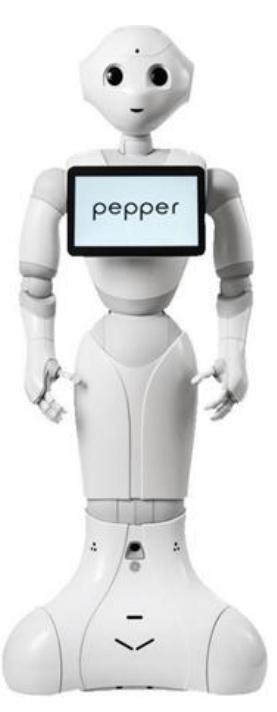

Figure 1. Pepper Bot

# **3.1.3. CAD Model - Design Process**

The CAD design process for this project was carried out using SolidWorks. Initially, several design iterations were created to explore different configurations and approaches. Each design was evaluated against the predefined criteria, such as functionality, stability, and manufacturability. Based on the results, modifications were continuously made to improve the design. This iterative process continued until a final design was achieved that met all project requirements and constraints.

The Design iteration (i) and (ii) failed in the static analyses of the designs. The base joints could not hold the required weight of 25kg that would be applied to the structure. The iteration shown in figure 6: Design Draft (iii) was manufacturable but lacked a platform for circuitry for control of the robot. Therefore, it was modified to create a more suitable design. The Design Draft (v) was fine mechanically but the manufacturability of the skirt was expensive and forced us to adopt a simpler design. Now to discuss the Design (v), it passed the static analysis, catered to our controllers' needs and was easy to manufacture but failed in the dynamic analysis due to instability, when performed in Coppelia Sim using URDF.

# **3.1.4. Parts**

Following CAD models were created in SolidWorks to design the required base. Figure 2 shows the final CAD model for base. As the motor bracket, Fiber glass skirt, mecanum wheels, and motor coupler are given in Figures 3, 4, 5, and 6 respectively.

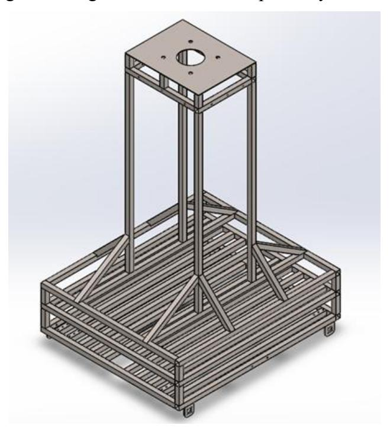

Figure 2. Base CAD

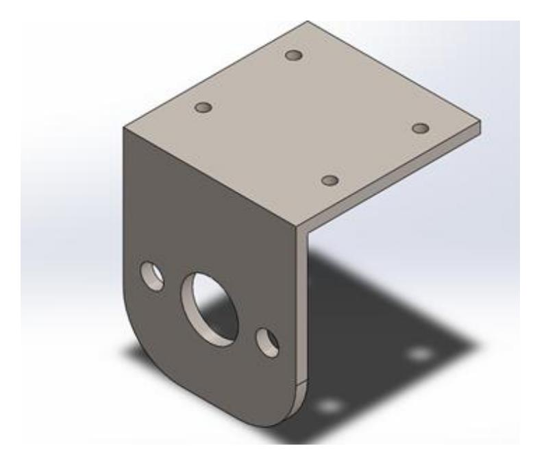

Figure 3. Motor Bracket

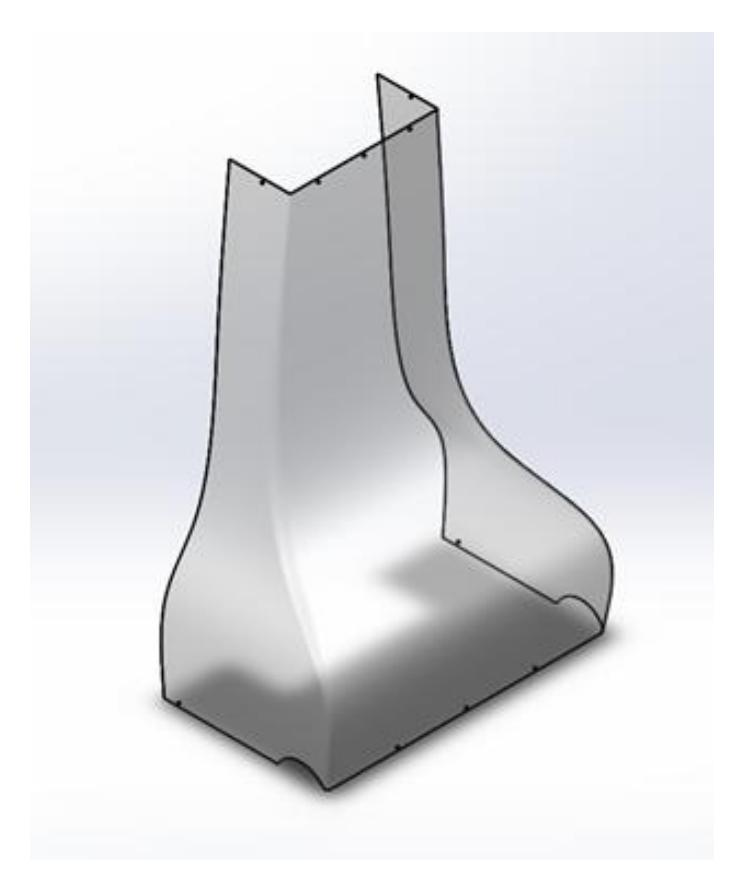

Figure 4. Fibre Glass Skirt

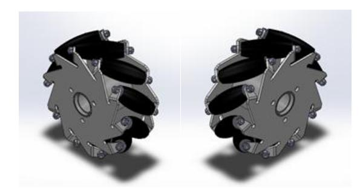

Figure 5. Left and Right Mecanum Wheels

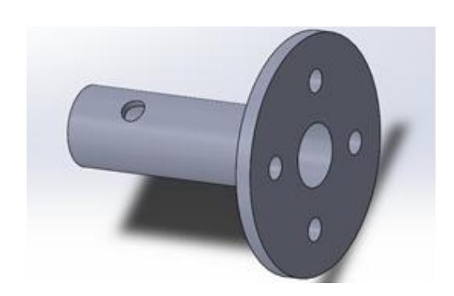

Figure 6. Motor Coupler

# **3.1.5. Final Design**

The rendered image of the final design and CAD model are given in fig 7 and 8 respectively.

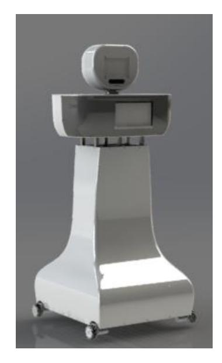

Figure 7, Rendered Image

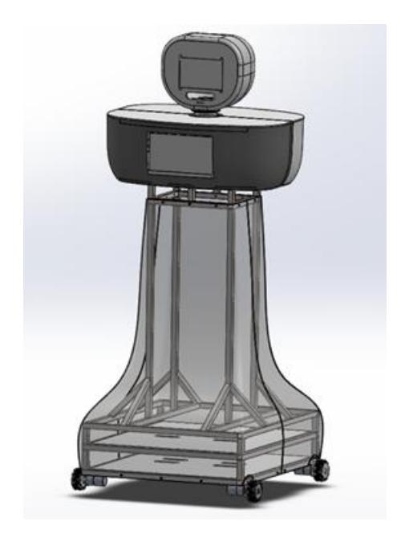

Figure 8, Final CAD model

# **3.1.6. Mathematical Calculations**

To mathematically calculate the factors like acceleration, required torque, load and stability analysis, motor power calculation, battery sizing and wheel slippage were calculated and are given below, but first let us first consider the known parameters of the robot:

Table 2. Available Data for Calculations

| Name of Parameters    | Values     |
|-----------------------|------------|
| Mass                  | 30kg       |
| Mecanum wheels radius | 78mm       |
| Torque of each motor  | 100kgf cm² |
| No. of drive wheels   | 4          |
| Robot height          | 1.589m     |
| Length                | 0.81m      |
| Width                 | 0.60m      |
| Center of mass height | 0.94m      |
| Estimated payload     | 25kg       |

| Rpm                  | 11      |
|----------------------|---------|
| Motor voltage        | 24V     |
| Motor current rating | 1A      |
| Stall current        | 3.6A    |
| Battery Voltage      | 24V     |
| Battery Capacity     | 5000mah |

# **3.1.6.1. Acceleration**

For Required Torque we need Acceleration, considering that we are giving about an average of 100pwm signal from Arduino mega to the motors. mathematically:

$$\frac{100}{255} = 0.392 Eq. 1$$

$$Voltage = 24V * 0.392 = 9.41V$$
 Eq. 2

Torque = 
$$100 \text{kgcm}^2 = 9.81 \text{Nm}$$
 Eq. 3

Torque at 9.41V = 9.81 \* 
$$\frac{9.41}{24}$$
 = 3.84Nm Eq. 4

Total Torque = 
$$4 * 3.84 = 15.36$$
Nm  $Eq. 5$ 

$$Force = \frac{Torque}{Radius}$$
 Eq. 6

Force 
$$=\frac{15.36}{0.078} = 197N$$
 Eq. 7

$$Acceleration = \frac{Force}{Mass}$$
 Eq. 8

$$Acceleration = \frac{197}{30} = 6.57 ms^{-2}$$
 Eq. 9

# **3.1.6.2. Required Torque**

To determine if available torque is sufficient for required torque.

Formulas:

$$Force = m * a$$
  $Eq. 10$ 

$$Torque: \tau = F * r$$
 Eq. 11

#### Calculations:

Table 3. Calculation Results

| Parameter            | Value                 |
|----------------------|-----------------------|
| Mass of robot        | 35 kg                 |
| Acceleration         | 6.57 m/s 2 |
| Total required force | 197.1 N               |
| Force per wheel      | 49.28N                |
| Wheel radius         | 0.078 m               |
| Torque required per  | 3.84 Nm               |
| wheel                |                       |
| Available motor      | 9.81 Nm               |
| torque               |                       |

Motors provide enough torque as the available torque is greater than the required torque.

# 3.1.6.3. Load and Stability Analysis

To determine tipping stability based on the center of gravity and base footprint. Formula Used:

Tipping angle = 
$$tan^{-1} \left( \frac{Base\ Widh}{Height\ of\ Centre\ of\ Gravity} \right)$$
 Eq. 12

Here base width is considered because it is smaller than base length.

Table 4. Parameters for Load & Stability Analysis

| Parameter                | Value           |
|--------------------------|-----------------|
| Base dimensions (L × W)  | 0.81 m × 0.60 m |
| Center of gravity height | 0.94 m          |
| Tipping angle (sideways) | 17.7°           |
| Payload capacity         | 25 kg           |

| CG position | Centered |
|-------------|----------|
|             |          |

It is suitable for indoor use as intended.

# **3.1.6.4. Motor Power Calculation**

Formulas:

Angular velocity: 
$$\omega = 2\pi * \frac{Rpm}{60}$$
 Eq. 13

$$Power: P = \tau * \omega Eq. 14$$

Calculation (per motor):

Table 5. Motor Calculations Parameters

| Parameter              | Value                    |
|------------------------|--------------------------|
| Motor torque           | 9.81 Nm                  |
| Motor speed            | 11 RPM ⇒ ω=1.15 rad/s |
| Power per motor        | 11.28 W                  |
| Total power (4 motors) | 45.12 W                  |
| Operating current      | 1.88 A                   |

Motors deliver sufficient power with efficient current drawing.

# **3.1.6.5. Battery Sizing and Runtime**

Formulas:

$$Energy(Wh)$$
:  $Energy = Power * Ah$   $Eq. 15$ 

Runtime: 
$$t = \frac{E}{P}$$
 Eq. 16

Values:

$$Energy = 24 * 5 = 120Wh$$
 Eq. 17

$$Power\ draw = 17.7W Eq. 18$$

Calculation:

$$t = \frac{120}{17.7} = 6.78 \,\text{hours}$$
 Eq. 19

Battery can run the robot for nearly 6.8 hours at this power level.

# **3.1.6.6. Wheel Slippage and Friction**

Formulas:

$$Traction\ Force = \mu * N$$
 Eq. 20

Calculation

Normal force per wheel = 
$$73.58N$$
 Eq. 21

According to ADA standard [33], average μ = 0.7

Max tractive force:

$$F_{max} = 0.7 * 73.58 = 51.5N Eq. 22$$

Required traction per wheel (as calculated before):

$$51.50N > 49.28N$$
 Eq. 23

As the available traction is greater than required traction. It is also acceptable.

# **3.1.7. Finite Element Analysis (FEA)**

To verify the structural safety and performance of the robotic base under various operational conditions, a series of Finite Element Analyses (FEA) were conducted using ANSYS Workbench. The analysis included:

- Static Structural Analysis
- Modal Analysis
- Eigenvalue Buckling Analysis

These simulations were conducted using the CAD model of the robotic base, the frame material was chosen to be mild steel, which has a typical yield strength of approximately 250 MPa.

# **3.1.7.1. Static Structural Analysis**

# Objective:

To evaluate whether the robotic base can safely withstand the combined weight of the robot and payload without permanent deformation or excessive displacement.

# Setup:

• Material: Mild Steel

• Material Properties:

Table 6. Structural Analysis Parameters

| Properties                | Units | Mild Steel |
|---------------------------|-------|------------|
| Mass Density              | Kg/m³ | 7850       |
| Young's Modulus           | GPa   | 206        |
| Poisson's Ratio           | -     | 0.3        |
| Yield Stress              | MPa   | 318        |
| Rupture Stress            | MPa   | 335        |
| Strain-Hardening Exponent | -     | 0.265      |
| Strength Coefficient      | -     | 880        |

- Boundary Conditions: Base was constrained at the wheel contact regions. A force of 250N was applied on top of the base. Gravity was applied downward.
- Meshing: Fine tetrahedral mesh was used for improved results.

# **3.1.7.2. Modal Analysis**

# Objective:

To determine the natural vibration frequencies of the base and avoid resonance with operational frequencies (e.g., motor-induced vibrations).

# Setup:

• Boundary Conditions: Same as static analysis.

• Number of Modes Extracted: First 6 modes

**3.1.7.3. Eigenvalue Buckling Analysis**

Objective:

To determine the critical load multipliers at which buckling would occur and assess

structural stability under compressive loads.

Setup:

• Material: Mild Steel

• Applied Load: 250 N

• Boundary Conditions: Same as static analysis.

• Number of Modes Evaluated: 20

**3.1.8. URDF Generation using SolidWorks Plugin**

To integrate the 3D CAD model of the robotic base into ROS 2 for simulation and

visualization, the robot's Unified Robot Description Format (URDF) file was generated using

the SolidWorks URDF Exporter plugin. This plugin, developed by the ROS Industrial

Consortium, allows users to convert SolidWorks assemblies directly into URDF-compatible

robot models. The process involved:

• Creating a detailed assembly of the robotic base in SolidWorks, with proper joint

definitions and link hierarchies.

• Assigning coordinate frames and defining joint types (e.g., fixed, continuous, revolute)

for each connection.

• Using the URDF Exporter plugin to automatically generate the URDF file, along with

associated mesh files package structure, and configuration files for simulation.

• Minor manual refinements were made to the exported URDF to ensure proper alignment

and compatibility with Coppelia Sim.

24

# **3.1.8.1. Dynamic Analysis in Coppelia Sim**

Some earlier versions of the robot had stability issues therefore a few iterations were made to acquire stability at needed parameters. As shown in the figure 9 below other models are toppling over at very low speeds.

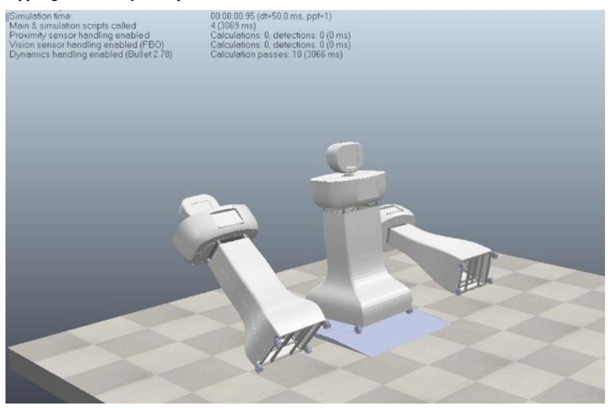

Figure 9. Stability Simulation in CoppeliaSim

Stability of the base is increased by modifying two parameters:

- Increasing area of the base
- Decreasing height of centre of mass

# **3.1.9. Mechanical Manufacturing**

This subsection discusses the mechanical manufacturing of hardware components as follows:

# **3.1.9.1. Base Frame Fabrication**

The main structural frame of the robot was fabricated using 16-gauge mild steel square rods, each measuring 0.75 inches × 0.75 inches. These rods were cut to size and welded together to form a strong rectangular chassis. After welding, mounting holes were drilled at appropriate locations to allow the attachment of brackets, wheels, electronics, and other modules. The completed frame was then cleaned and coated with two layers of anti-rust primer and paint for protection and aesthetics. To improve the visual appeal and provide a clean outer appearance, fiberglass sheets were cut and mounted around the lower perimeter to create a skirt, giving the base a sleek and finished look. The manufacturing processes are provided in the figures 10, 11, 12, 13 and 14.

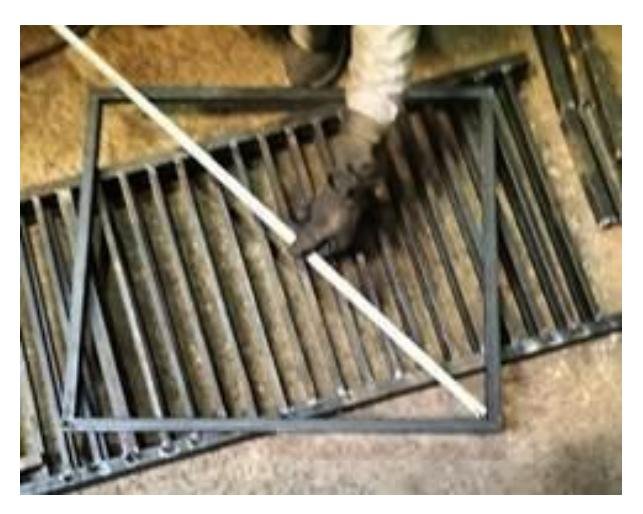

Figure 10. Base Foundation Manufacturing (i)

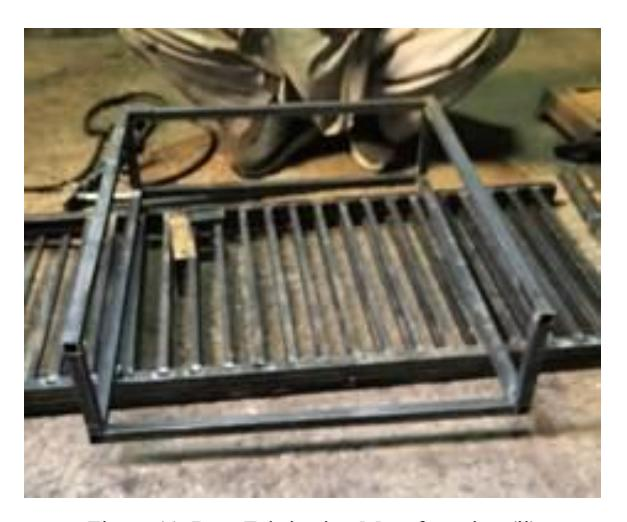

Figure 11. Base Fabrication Manufacturing (ii)

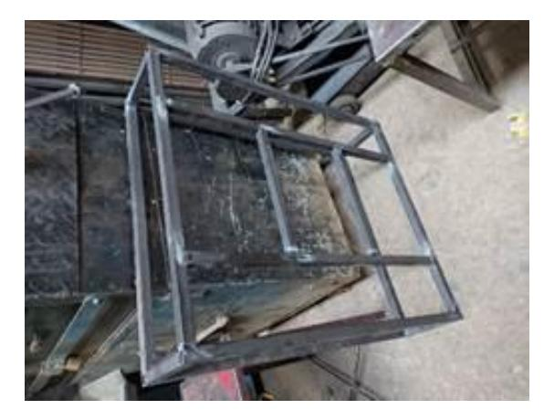

Figure 12. Base Foundation Manufacturing (iii)

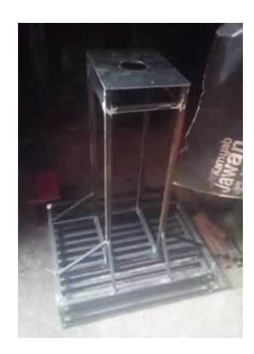

Figure 13. Base After Welding

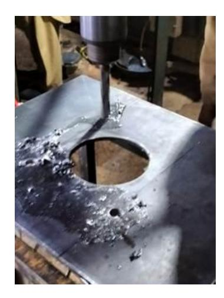

Figure 14. Drilling of Base Top to Fasten with Torso

# **3.1.9.2. Motor Coupler Fabrication**

The motor couplers that were supplied with the Mecanum wheels did not fit the shafts of the selected motors accurately, leading to alignment issues. To resolve this, custom motor couplers were designed and manufactured. These were machined to match the motor shaft diameter, and the wheel hub dimensions precisely, ensuring secure fitment and reliable torque transmission without slippage or misalignment. Fig 15 shows the drilling of holes in the coupler.

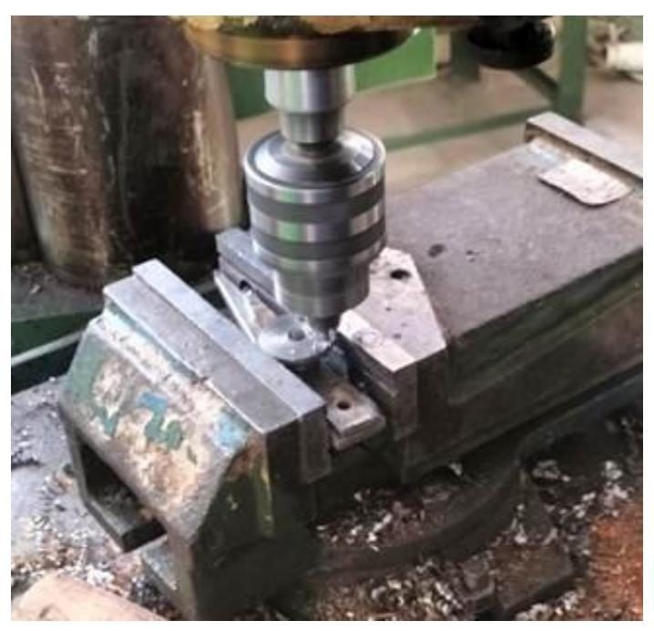

Figure 15. Motor Coupler Fabrication

# **3.1.9.3. Motor Bracket Manufacturing**

To securely mount the motors to the base frame, custom motor brackets were designed using CAD software. The bracket design was exported as DXF drawings, which were then used to laser cut the brackets from sheet metal. After cutting, the brackets were bent at a 90-degree angle using a bending machine to properly align the wheels. The figure 16 shows the motor brackets that were manufactured as a result.

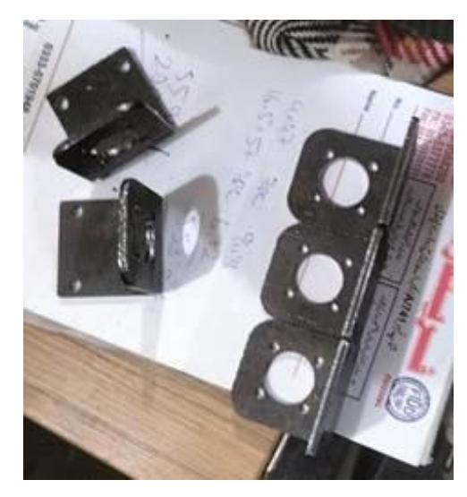

Figure 16. Fabricated Motor Coupler

# **3.1.9.4. Gimbal Mounting Plate**

A metal plate was needed to properly mount head on to the gimbal. The plate had accurately positioned holes to accommodate the gimbal mount and fasteners. This design was then machined using a CNC milling machine, which ensured high precision and smooth edges. The plate was installed on top of the gimbal, and it secured gimbal and head together. The cnc milling performed on the gimbal plate are shown in figure 17.

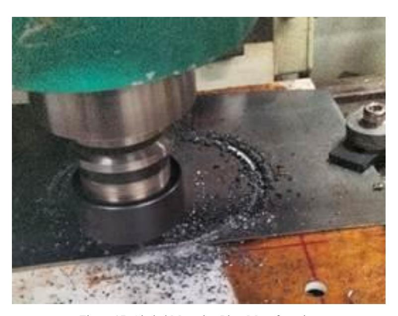

Figure 17. Gimbal Mounting Plate Manufacturing

# **3.2. Design Specification for a 2 DOF Neck Movement Mechanism**

Neck movement is an essential part of a humanoid robot which enables it to emulate human like movements, thereby improving social interactions and generate an adaptive response to environmental changes. This is further enhanced by pairing neck movement with face tracking mechanism whose purpose is so that the robot focuses on the person it is interacting with. This contributes to the interactivity of the robot, creating a more immersive experience between the robot and the user interacting with it.

# **3.2.1. Hardware Design for Neck Movement**

The humanoid robot features a 2 DOF neck mechanism, shown in figure 18, constructed using a servo powered gimbal assembly enabling the pitch and yaw movements. A 3D printed light weight robot head comprising of a camera and an LCD screen is mounted on the gimbal which serves as the face and eyes of the robot. The servos are controlled by an ESP32 microcontroller through a PCA9685 servo driver.

Figure 18. 2 DOF Gimbal assembly.

# **3.2.2. Face Tracking and Control Logic**

To enable dynamic neck movement, a face detection algorithm is implemented using OpenCV library and haarcascade classifier. The camera embedded in the robot's head continuously captures real-time video frames. These frames are then passed through a haarcascade classifier which detects faces. Once a face is detected, a bounding box is drawn around each detected region. In case of multiple faces, the face with the largest bounding box is taken into consideration for further processing assuming that person is the closest to the robot. The frame coordinates of the face are compared with the center of the camera frame and based on the offset, corrective values are generated which are fed passed through a PID controller and then to the ESP32 which adjusts the servos until the face is at the center of frame.

# **3.2.3. Look Around Function and Control Logic**

In case there is no face detected for four seconds, a look around routine runs in loop which sends random yaw values between 20 – 90 degrees and pitch values between 40 – 70 degrees to the ESP32 so that the robot looks around the environment in search of a person. When a person is detected, the loop will finish, and face tracking algorithm will take over.

# **3.3. Face animations**

Face animations enhance the interactivity and emotional expressiveness of the humanoid robot. The humanoid robot utilizes an LCD screen to express different emotions based on the environment.

# **3.3.1. Facial Expressions Logic**

The robot's facial expressions are based on simple visual feedback. When a face is detected, the robot displays a "sad" (figure 19) expression on the LCD screen and displays a "happy" (figure 20) expression otherwise. This emotional model helps the robot to simulate social engagement and connect with users.

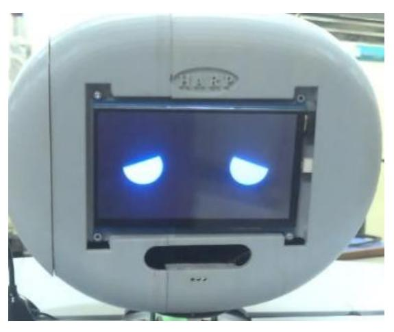

Figure 19. Robot "Sad" Expression

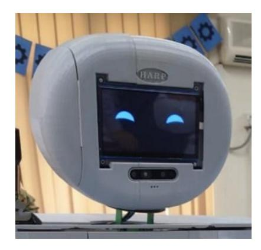

Figure 20. Robot "Happy" Expression

# **3.4. Behavior Recognition**

This chapter provides an overview of two key methods utilized for the implementation of sophisticated behavior recognition. To address this deliverable, pre-trained video classifier was used since the trained model had inadequate inference performance.

# **3.4.1. Development of Video Classifier (Self-Trained)**

In this section, a CNN-LSTM based video classifier was developed. The code was referenced from Keras's official tutorials for training a video classifier. However, different model architectures were tried but using a pre-trained CNN as a feature extractor, with video frames as an input and feeding these extractions to LSTM

# **3.4.1.1. Data Preparation**

The model was trained on a combination of two video datasets: KTH and dataset by Dao Duy Ngu from Kaggle. The KTH video database contained six types of human actions (walking, jogging, running, boxing, hand waving and hand clapping), however the boxing was discarded due as it seemed irrelevant, and each action had 100 videos. whereas the other video dataset had seven classes: sitting, sitting down, standing, standing up, walking, lying down, fall-down. Overall, nine classes were used namely, hand waving, clapping, walking, falling, running, sitting, standing up, lying down and standing but standing up was discarded towards the end it was causing false positives with standing and sitting.

# **3.4.1.2***.* **Data Augmentation**

To counter overfitting and low accuracy, there was a need to increase the size of the dataset. This was possible in two ways: finding more videos or applying data augmentation. To augment video data, a python library "Vidaug" was used to apply horizontal flip all videos, which resulted in doubling of dataset size.

# **3.4.1.3***.* **Data Pipeline**

The video data is made available by extracting the ZIP folder which contains the video folders of each type of class. The script splits the video files and arranges them in train, test, and validation sets. As the code proceeds, each video is then loaded, resized and passed through a pre-trained CNN model to extract its features, frame by frame. These frame features are arranged and organized into a fixed length of 3D arrays per videos, which are a sequence of feature vectors from videos. Masks are also utilized to check if the frames are valid, in case videos are too short. Moreover, labels are converted into integers using the "StringLookup". Hence the model receives the sequence of features, rather than videos and masks as input.

# **3.4.1.4***.* **Model Training**

The CNN used for feature extraction is EfficientNetB0, where each video is fed as sequence of up-to-30 frame-level feature vectors, where each 1280-dimensional. Subsequently, these sequences and their corresponding frame-validity masks are passed into a single-layered LSTM which has 32 units to capture temporal dynamics across frames. A dense layer with 32 ReLU-activated neurons follows. A final SoftMax output layer classifies the video into one of the predefined categories. Moreover, the model is trained using the Adam optimizer and sparse categorical cross-entropy loss for up to 50 epochs with a batch size of 64. A fixed 20% of the data is reserved for validation, and training is monitored using early stopping feature, while learning rate reduction on plateau. Finally, checkpointing saves the best-performing model based on validation accuracy. Flow shown in fig 21.

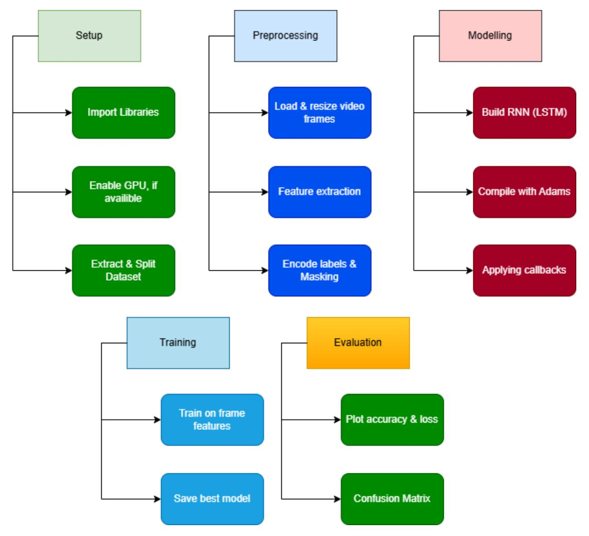

Figure 21. Training code workflow

# **3.4.1.5***.* **Training Results**

The model summary for feature-extractor CNN and LSTM model is as follows:

• Model: Feature Extractor. Displayed as Table 7

Table 7. Feature Exactor Parameters

| Layer (type)                | Output Shape        | Param #   |
|-----------------------------|---------------------|-----------|
| input_layer_1 (InputLayer)  | (None, 128, 128, 3) | 0         |
| efficientnetb0 (Functional) | (None, 1280)        | 4,049,571 |

• Total params: 4,049,571 (15.45 MB)

• Trainable params: 4,007,548 (15.29 MB)

• Non-trainable params: 42,023 (164.16 KB)

Model: Classifier (sequential model) parameters displayed in Table 8

Table 8. LSTM Model Summary

| Layer (type)        | Output Shape     | Param # | Connected to        |
|---------------------|------------------|---------|---------------------|
| input_layer_2       | (None, 30, 1280) | 0       | -                   |
| (InputLayer)        |                  |         |                     |
| masking (Masking)   | (None, 30, 1280) | 0       | input_layer_2[0][0] |
| input_layer_3       | (None, 30)       | 0       | -                   |
| (InputLayer)        |                  |         |                     |
| lstm (LSTM)         | (None, 32)       | 168,064 | masking[0][0],      |
|                     |                  |         | input_layer_3[0][0] |
| dropout (Dropout)   | (None, 32)       | 0       | lstm[0][0]          |
| dense (Dense)       | (None, 32)       | 1,056   | dropout[0][0]       |
| dropout_1 (Dropout) | (None, 32)       | 0       | dense[0][0]         |
| dense_1 (Dense)     | (None, 8)        | 264     | dropout_1[0][0]     |

Total params: 508,154 (1.94 MB)

Trainable params: 169,384 (661.60 KB)

Non-trainable params: 0 (0.00 B)

Optimizer params: 338,770 (1.29 MB)

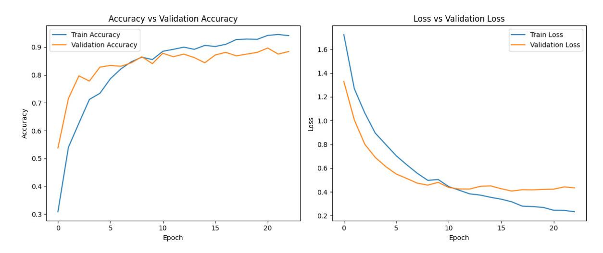

Figure 22. Model evaluation after training for more than 20 epochs

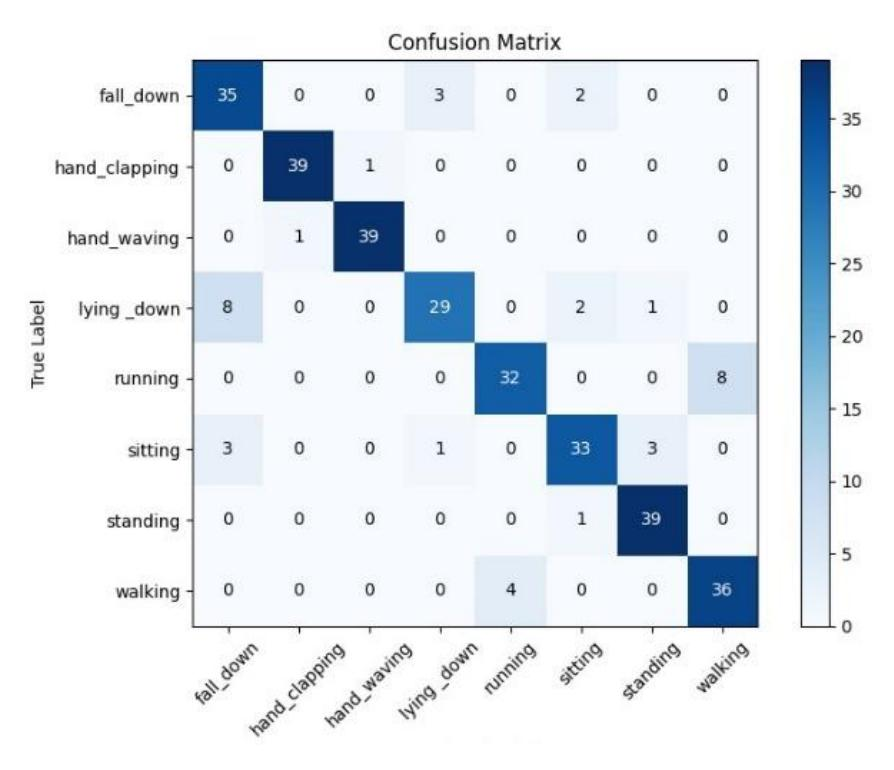

Figure 23. Confusion Matrix

# **3.4.1.6***.* **Inference**

A real-time video classification inference is intended to process information from the webcam/RealSense module and classify human behaviors. A dual-model pipeline is used, with a CNN feature extractor (EfficientNetB0) extracting spatial data from each frame received in

real time, and an LSTM sequence classifier modelling temporal dependencies over several frames. The technique crops and resizes frames to 128×128 resolution before storing them in a fixed-sized sliding buffer. Once the frames are ready, the system builds a batch of features with the CNN and feeds them into the LSTM model for classification. Class predictions using OpenCV are displayed on the video feed, along with real-time inference parameters like FPS and latency.

The code is optimized by using a "ThreadPoolExecutor" to enable asynchronous categorization without stopping the video feed. This significantly reduces the inference time between successive predictions; it includes GPU support with TensorFlow if available, but otherwise defaults to CPU, utilizing all available cores for parallelism.

However, this code gives false results which might be due to the reason that no videos from webcam were provided to train the model, hence no results can be displayed.

# **3.4.2. Implementation of A Pre-Trained Model**

# **3.4.2.1***.* **MoViNets: Mobile Video Networks for Efficient Video Recognition**

MoViNet (Mobile Video Network) are a collection of deep learning models with a purpose for efficient and inexpensive video classification. These are developed by Google, and they processspatial and temporal variables with a light, factorized 3D convolution, which allows very accurate human action recognition at cheap computational costs. Moreover, they are optimized for TensorFlow Lite, making MoViNet suitable for running in edge devices and lowend computer systems, providing excellent performance on hardware with limited computational resources without the need for sacrificing responsiveness or model correctness in video-based workloads.

# **3.4.2.2***.* **Reason for Using This Pre-Trained Model**

MoViNet video classifiers are one of the ideal solutions for real-time video classification because of their efficient architecture and ability to match short inference time with accuracy. Unlike typical 3D convolutional models, which are sometimes computationally expensive for practical applications, MoViNets use factorized 3D convolutions to capture both spatial and temporal data at a far reduced hardware cost. As a result they are suitable for applications that require speedy and accurate categorization, such as robotics, surveillance, and even mobile video analysis.

# **3.4.2.3***.* **Working of MoViNets**

MoViNet's architecture is built for efficient video classification with the usage of factorized 3D convolutions and an easy to stream design. Again, it processes spatial and temporal features while minimizing computation power, making it ideal for inferencing in edge deployment.

The model is trained on Kinetics-600 dataset which is a subset of Kinetics. Kinetics is a series of large-scale, high-quality datasets including URL linkages to up to 650,000 video clips that cover 400/600/700 human action classes, depending on the dataset version. The videos demonstrate both human-object interactions, such as playing instruments, and human-human interactions, such as shaking hands and hugging. If downloaded completely, this occupies 450 GBs of space.

At its model building function(s), MoViNet uses (2+1) D convolutions, where spatial and temporal components are separated. This results in a significant reduction in the computing load compared to the use of full 3D convolutions. To enable real-time streaming, MoViNet replaces ordinary 3D convolutions with causal convolutions and introduces a new approach, Stream Buffer. This buffer is able to cache intermediate activations across the frames, allowing the model to handle one frame at a time while keeping temporal context—becoming suitable for low-latency applications. The figure 24 shows the architecture of MoViNet model [34]

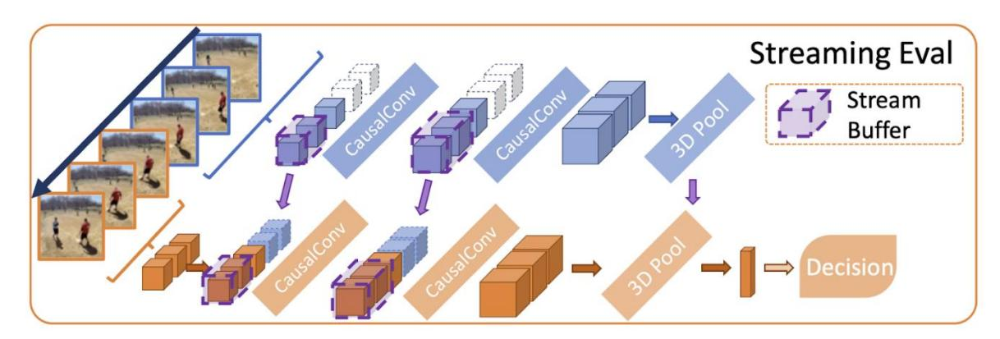

Figure 24. MoViNet architecture

The design is highly modular and easy to scale, consisting of numerous blocks with depth-wise separable convolutions, squeeze-and-excitation (SE) layers (which occur to be in larger models), and efficient activation functions. For deployment on low-end computers or embedded devices, adjustments are also applied: ReLU6 replaces hard-swish, and SE layers are deleted to simplify computations. These models are improved further with the use of post-training quantization (int8 or float16) to minimize model size and increase inference time, therefore becoming a TensorFlow Lite model.

# **3.4.2.4***.* **Inferencing**

This script performs real-time video classification using a TensorFlow Lite (TFLite) model, leveraging multithreading for efficient performance. It initializes a Video Classifier class that loads a .tflite model and associated label file. The model is assumed to use LSTM-like internal states, which are preserved and passed across frames to enable temporal video understanding. Flow of inference is in the figure 25.

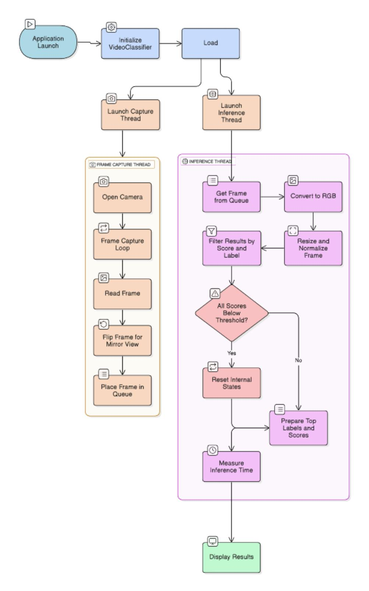

Figure 25. Inference Flow Diagram

# **3.5. Conversational Capabilities in HARP**

# **3.5.1. Background**

Technology is evolving and robots are becoming an important part of many aspects of our daily lives, especially in fields like healthcare, education, and personal assistance. Humanoid robots designed to look similar and act like humans are a growing area of interest. These robots aren't just about doing tasks, they're built to interact with people in a natural, human-like way. Their ability to have conversations with humans is one of the most exciting features of these robots.

Conversational ability is key to making a humanoid robot feel like a companion rather than just a tool. It means the robot can understand what you're saying and respond to you appropriately while engaging in a meaningful dialogue. For a humanoid assistive robot-like HARP, being able to have conversations with users is essential for making the interaction natural and intuitive. It's more than just giving commands; it's about having a back-and-forth dialogue that enhances the user experience.

# **3.5.2. The Role of Conversation in Humanoid Assistive Robots**

HARP is designed to engage people in a way that feels personal and meaningful. The ability to converse is a big part of that. If HARP can understand and respond to spoken language, it opens all sorts of possibilities for interaction. The conversation comes in helping with daily tasks, offering emotional support, and improving accessibility. In this way, a robot with conversational ability can become much more than just a machine; it becomes a helpful, engaging, and even comforting presence.

# **3.5.3. Why Conversational Capabilities Matter for HARP**

For HARP, the goal is to be more than just a robotic assistant, it's about creating an experience where users can interact with the robot in a way that feels natural and intuitive. The conversational ability provides better interaction, helps in handling complex requests and building emotional connections.

The ability to converse is a vital part of what makes HARP more than just a robot and turns it into a social assistant. By integrating conversational capabilities, HARP can interact with users in ways that are both practical and emotional. Whether it's answering questions, offering help, or providing some friendly companionship, conversational LLM makes HARP a much more useful and engaging companion.

# **3.5.4. Working of a Large Language Model (LLM)**

A Large Language Model is a type of artificial intelligence model trained to understand and generate human language. It is based on transformer architecture that allows it to process and relate large amounts of text. During training, the model learns language patterns by analyzing massive datasets containing text from books, websites, conversations, and other sources.

The LLM is trained to predict the next word in a sentence given the previous words. Over time, it teaches grammar, facts, reasoning patterns, and context awareness. When given an input prompt, the model processes it through multiple layers of attention and generates relevant output. In HARP, the LLM was used to interpret users and generate appropriate conversational responses, simulating natural and intelligent interaction.

# **3.5.5. LLM Pipeline**

To enable conversational capabilities in HARP, a pipeline is used that integrates three primary components: Whisper' for speech-to-text transcription, Gemini 2.0 Flash' for natural language understanding and response generation, and 'Piper' for text-to-speech synthesis. This system relies on cloud APIs to offload the heavy computation involved in transcription and language processing, which makes it suitable for real-time interaction while keeping onboard processing requirements minimal.

# **3.5.5.1. System Architecture**

Following flow occurs for conversation to occur using LLM in this project:

- **Audio Capture and Triggering:** When the conversational module is activated, the system begins listening for audio input through a connected microphone. Voice detection initiates the recording process. The robot captures the user's speech in real-time and stores the audio as a short clip once speech is detected.
- **Speech Recognition Using Whisper API:** The recorded audio is then sent to a cloudbased Whisper API for transcription. Specifically, the large-v3 model of Whisper is used due to its high accuracy and ability to handle diverse accents, noise, and natural speaking variations. Whisper returns a plain-text transcription of the audio input, which is then checked to make sure if it contains the hot word 'Hello' if the hot word is detected. HARP initiates the conversation. Then it records the user input as an audio file and again sends it to Whisper.
- **Natural Language Processing Using Gemini 2.0 Flash:** The transcribed text is forwarded to the Gemini 2.0 Flash model via API. Gemini serves as the core language understanding and response generation engine. This model processes the input text, interprets its context and intent, and generates an appropriate natural language response. Gemini Flash is chosen for its fast inference times and strong performance in conversational tasks, making it ideal for maintaining a smooth and responsive dialogue. It is restricted to 'English' language only. Its token is restricted to 150 token per prompt to keep the responses short and to the point. Instructions are set up to tailor the LLM to HARP.
- **Text-to-Speech Using Piper:** Once the response from Gemini is received, it is converted back into speech using Piper, an open-source text-to-speech system. The "amy-low" voice model is used to provide a natural and pleasant female voice, selected for its clarity and human-like tonal quality. The generated audio is played through the robot's onboard speakers, completing the interaction loop.

If the user input contains 'bye', HARP takes it as a termination that user does not want to talk anymore and again starts to look for hot word. The complete LLM pipeline architecture is shown in the flowchart in fig 26.

# **3.5.5.2. Component Selection and Justification**

- **Whisper (large-v3)**: Whisper is an open-source speech recognition model by OpenAI. The large-v3 version offers improved accuracy in transcription across various languages and environments, making it suitable for use in real-world, potentially noisy conditions such as homes, clinics, or public areas.
- **Gemini 2.0 Flash**: As a state-of-the-art large language model by Google, Gemini Flash provides fast response generation with high contextual awareness. It balances speed and quality, ensuring that interactions feel natural and are contextually accurate.
- **Piper TTS ("amy-low" voice)**: Piper is a lightweight yet high-quality text-to-speech engine. The "amy-low" voice was chosen for its calm and friendly tone, which enhances the approachability of the robot and contributes to a more comforting user experience, especially important in assistive contexts.

# **3.5.6. Advantages of This Approach**

- **Low onboard computation load**: Offloading transcription and language processing to the cloud allows the robot to operate with minimal onboard hardware, reducing costs and power consumption.
- **High accuracy and quality**: Using state-of-the-art models like Whisper large-v3 and Gemini Flash ensures high transcription accuracy and intelligent, context-aware replies.
- **Natural user experience**: The combination of accurate speech recognition, intelligent responses, and expressive voice output provides a smooth and engaging conversational interaction for users.

# **3.5.7. Limitations**

- **Internet dependency**: Since transcription and language generation are handled via cloud APIs, this approach depends on a stable internet connection. Any network delay or outage may affect the responsiveness of the system.
- **Latency**: Although Gemini Flash is optimized for speed, the total round-trip time (recording → cloud → response → TTS) may still introduce a short but noticeable delay in responses, depending on network conditions.

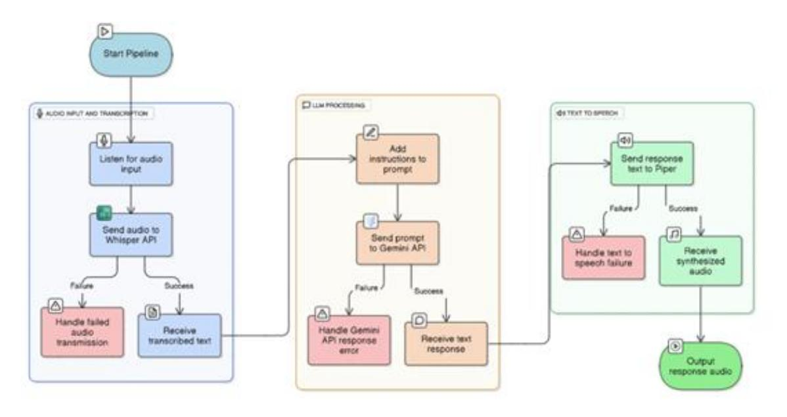

Figure 26, LLM pipeline Flowchart

# **3.6. Passive Visual SLAM of Four-Wheel Mecanum Robot**

# **3.6.1. Background**

Simultaneous Localization and Mapping (SLAM) is a crucial element to make robots autonomous in an unknown environment to have them carry out useful tasks for everyday human interaction and services. This is especially important for autonomous navigation in indoor environments where use of GPS is unavailable. The primary goal is to build a map of the receptionist's area and simultaneously determine its own location. The study explores Visual based SLAM and autonomous navigation using path finding algorithms.

# **3.6.2. Four Mecanum Wheel Omni Directional Kinematics**

The motion of our robot in the 2D cartesian plane is linear velocity in the x direction Linear velocity in y direction , and angular velocity around the z axis. The wheel arrangement is as follows:

Front Wheel Left: Wheel 1 with angular velocity

Front Wheel Right: Wheel 2 with angular velocity

Rear Wheel Left: Wheel 3 with angular velocity

Rear Wheel Right: Wheel 4 with angular velocity

To find angular velocities of every wheel inverse kinematics equation (23) [35], where the forward and inverse kinematics of a four-wheel mecanum robot is derived as:

$$\begin{bmatrix} \omega_{1} \\ \omega_{2} \\ \omega_{3} \\ \omega_{4} \end{bmatrix} = \stackrel{1}{\stackrel{R}{=}} \cdot \begin{bmatrix} 1 & -1 & -\frac{(L_{x} + L_{y})}{2} \\ 1 & 1 & \frac{(L_{x} + L_{y})}{2} \\ 1 & 1 & -\frac{(L_{x} + L_{y})}{2} \\ 1 & -1 & \frac{(L_{x} + L_{y})}{2} \end{bmatrix} \cdot \begin{bmatrix} Vx \\ Vy \\ \omega_{Z} \end{bmatrix}$$
Eq.23

Hence, the angular speed of each wheel of the robot is:

$$\omega^{1} = \left(\frac{1}{R}\right) \cdot \left(V_{x} - V_{\gamma} - \left(\frac{(L_{x} + L_{\gamma})}{2}\right) \cdot \omega\right)$$
 Eq. 24

$$\omega^{2} = \left(\frac{1}{R}\right) \cdot \left(V_{x} + V_{\gamma} + \left(\frac{(L_{x} + L_{\gamma})}{2}\right) \cdot \omega\right)$$
 Eq. 25

$$\omega^{3} = \left(\frac{1}{R}\right) \cdot \left(V_{x} + V_{\gamma} - \left(\frac{(L_{x} + L_{\gamma})}{2}\right) \cdot \omega\right)$$
 Eq. 26

$$\omega^{4} = \left(\frac{1}{R}\right) \cdot \left(V_{x} - V_{\gamma} + \left(\frac{(L_{x} + L_{\gamma})}{2}\right) \cdot \omega\right)$$
 Eq. 27

# **3.6.3. Motor Encoder**

The encoder attached to the motor is an incremental encoder which is a type of rotatory encoder which generates the signal when the motor shaft rotates. A revolving disk, as shown in figure 27, with alternating transparent and opaque segments (or magnetic marks) and a light or magnetic sensor that picks up on these variations are usually its components. The encoder generates two output signals, referred to as quadrature signals, which are square waves offset by 90 degrees and are designated channel A and channel B. A controller can use the number of pulses/ticks to calculate the shaft's rotational distance and the phase difference between channels A and B to identify the rotation's direction.

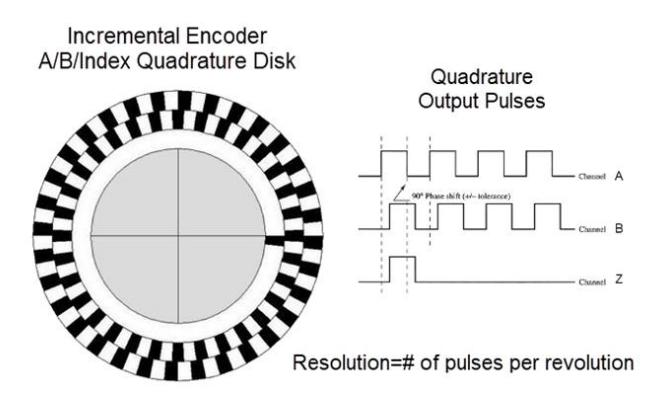

Figure 27. Encoder Motor Pulses

# **3.6.4. PID Controller**

A PID controller continuously modifies the motor input in response to encoder feedback, assisting each wheel in reaching the appropriate angular velocity. By counting the number of ticks over time, the encoder obtains the actual angular velocity, which is then contrasted with the intended velocity setpoint. To reduce the error between these two numbers, the PID controller uses three components: proportional (P), integral (I), and derivative (D). Based on the rate of change, the derivative term forecasts future error and stabilizes the wheel velocity at the desired value, while the proportional term reacts to the current error and the integral term considers the cumulative past error. The PID control signal equation is defined as:

$$u(t) = K_p e(t) + K_i \int_0^t e(\tau) d\tau + K_d \frac{d}{dt} e(t)$$
 Eq. 28

# **3.6.5. Visual Passive SLAM**

Lidar sensors are frequently used in traditional SLAM systems because of their great accuracy and vast range. However, the cost of lidar-based solutions is high, and their ability to capture environmental texture information is occasionally restricted. To accomplish localization and mapping, Visual SLAM, on the other hand, uses camera-based inputs, such as RGB, stereo, or RGB-D data. Visual SLAM offers extensive environmental elements for semantic comprehension, loop closure, and place recognition. It can be used for information-rich and reasonably priced robotic navigation.

# **3.6.5.1.** Intel RealSense D435i

An Intel RealSense D435i camera, in figure 28, offers synchronized RGB pictures (up to 1920×1080 @ 30 FPS), depth maps (up to 1280×720 @ 30 FPS), and 6-axis IMU data (gyroscope and accelerometer), which is used in this research to implement passive Visual SLAM. Even in low-texture surroundings, the D435i's active stereo depth sensing system which is augmented by a structured infrared (IR) projector—assists in determining depth. With a field of view of ~86° × 57°, a minimum sensing range of 0.1 m, and a depth accuracy of ~±2% at 2 meters, the RealSense D435i provides rich 3D perception, enabling the robot to detect obstacles, perceive depth, and create precise 2D/3D maps of its surroundings in real time.

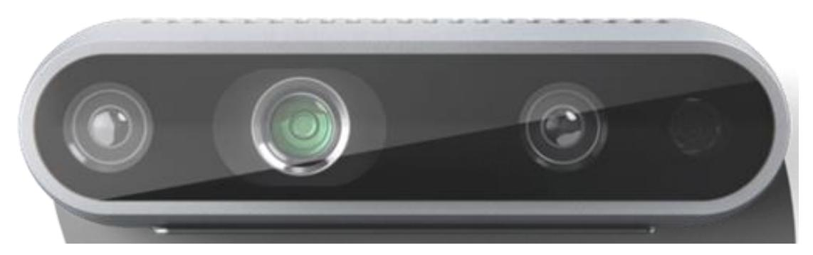

Figure 28. Intel Realsense Camera

# **3.6.5.2. RTAB MAP**

Real Time Appearance Based Mapping uses RGB-D SLAM which system is made up of two synchronized streams: a depth image that encodes the distance of each pixel from the camera and a high-resolution RGB image that records visual appearance. This is achieved by combining the RealSense D435i capabilities which has an RGB sensor, a stereo infrared system, and an active infrared projector that projects an invisible pattern onto the surroundings, the RealSense is able to detect depth. By providing the stereo cameras with more reference points to compare between images, this pattern enhances depth accuracy, particularly in low-texture areas. The RealSense camera continuously creates synchronized RGB pictures and matching depth maps while the robot travels. Real-time fusion of these results in densely colored point clouds, where each 3D point has both visual and geometric information.

Figure 29. RTAB 3D Map

# **3.6.5.3. Conversion to 2D Occupancy Grid Map**

An occupancy grid map is created for navigation purposes by projecting this 3D point cloud onto a 2D plane, as displayed in figure 30. The height data is compacted in this procedure, and regions are categorized as occupied, free, or unknown based on whether points are present in each location. The navigation system uses this 2D map, which is sent to ROS as a normal occupancy grid message, to plan routes and steer clear of obstructions. The RealSense D435i and RTAB-Map work together to give the robot the ability to navigate on its own by utilizing precise environmental awareness derived from RGB-D sensing**.**

Figure 30. 2D Grid Map

# **3.6.5.4. Path Finding and Navigation**

After being transformed into a 2D occupancy grid map, the 3D point cloud becomes an essential tool for robot's navigation and pathfinding. Based on whether there are points in a certain area, the 2D occupancy grid classifies the environment as a grid of cells that are either occupied, free, or unknown. The robot can plan routes while avoiding obstacles thanks to this map, which forms the basis of its navigation system.

Path finding algorithms like A\* or Dijkstra's, which are intended to discover the shortest path between two locations on a grid while avoiding obstacles, are commonly used by robots for pathfinding. Here, the 2D occupancy grid clearly shows the robot's empty area (where it may travel) and occupied cells (where it cannot). Based on the grid data, these algorithms calculate the cost of going between cells, assigning higher cells to another based on the grid data, with higher costs assigned to occupied or potentially dangerous areas.

# **3.6.5.5. A\* Path Planning Algorithm**

A popular graph-based path planning technique in robotics, the A\* (A-star) algorithm strikes a balance between processing efficiency and optimality. It works especially well for navigation on a 2D occupancy grid map, where the robot must avoid obstacles and determine the safest path from where it is now to where it wants to go.

Each connected node (or cell) on the map represents a possible location the robot could inhabit, and A\* interprets the map as such. The robot's current position (the start node) serves as the starting point for the algorithm, which then moves through free cells and steers clear of those that are designated as occupied or unknown to find the most efficient route to the destination (the goal node). A\* is very efficient because of its cost formula to traverse between nodes. It uses g cost which is the actual cost of the start node from the current node '*n*' and "*h*" cost which is the heuristic estimate of the cost of node to the goal. Dijkstra's algorithm only makes use of g costs which makes it less reliable as it takes more searching time to find the optimal time and hence computationally expensive. The total cost function of A\* is defined as:

$$f(n) = g(n) + h(n) Eq. 29$$

Depending on the grid layout, the heuristic is often computed using either the Manhattan or Euclidean distance between the current node and the target. A\* finds a short and efficient path by giving priority to nodes with the lowest value. A\* keeps two sets while it explores. An open set with nodes that need to be assessed and closed set with nodes that have undergone evaluation. If a better path is identified, it updates the costs of the neighbors (adjacent cells), adds them to the open set if they haven't been visited, and repeatedly chooses the node with the lowest f(n) from the open set. This procedure continues until the objective is attained or all viable pathways have been considered. After identifying the objective, A\* reconstructs the best route by going back through the nodes with the lowest cost. The motion controller of the robot is then instructed to follow this path, frequently with extra smoothing or dynamic obstacle avoidance added as it is being executed.

# **3.6.5.6. 4-Wheel-Mecanum Drive A\* Simulation**

ROS Noetic, Gazebo, and RViz were used to integrate the A\* implementation into a simulation environment in order to test the path planning algorithm. With its four-wheel mecanum drive platform, the simulated robot model can travel in any direction without rotating its base. This allows it to go forward, backward, sideways, and diagonally. For maneuvering through intricate places, this talent is perfect. The simulation showed the benefit of omnidirectional mobility in navigating around obstacles and confirmed the A\* planner's efficacy in managing a variety of navigation circumstances. This is an important step toward real-world deployment since the combination of Gazebo and RViz provides a robust visualization and debugging platform to view both the pathfinding logic and the subsequent robot behavior.

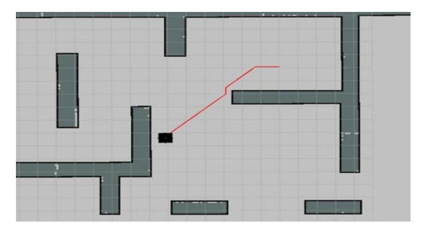

Figure 31. A start navigation omni directional simulation

# **3.6.6. Physical Implementation**

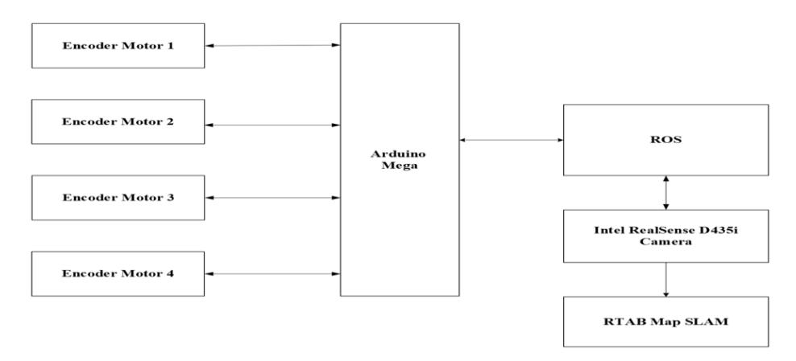

Figure 32. Proposed System

ROS is launching Intel RealSense D435i along with RTAB SLAM package to create a static map of the environment for path navigation. After creating a map, the robot can enter localization mode (find itself with respect to its current coordinates in the environment). ROS is sending instructions and communication protocols to the microcontroller Arduino Mega which sends instructions to motors to be able to move along the map to the desired coordinates. Arduino Mega sends speed controls instructions to encoder motors and is constantly checking feedback from encoders to measure speed and adjust minimize errors to get desired speed to make sure smooth path traversal for navigation. The overall system is shown in figure 32.

# **3.6.6.1. RTAB Mapping with RealSense**

Using ROS Noetic running on an external computer, RTAB-Map SLAM was physically deployed on a genuine 4-wheel mecanum robot. The robot was fitted with an Intel RealSense D435i depth camera that was positioned high enough to record obstacles and environmental elements within a practical range. Using the rtabmap\_ros package, the onboard SLAM system received synchronized RGB, depth, and IMU data streams from the camera. With this configuration, the robot was able to map the surroundings in real time as it walked, creating a 2D occupancy grid read for navigation.

The ROS system and microcontroller Arduino Mega oversaw powering the motors connected to control robot movement. Using inverse kinematics appropriate for a mecanum arrangement, the microcontroller translated velocity commands broadcast by ROS to the /start\_control topic into individual wheel speeds. Every wheel had encoders to measure angular speeds, which the microcontroller computed and reduced errors by using PID. Manual key press commands were used to traverse the robot during mapping session.

While RTAB-Map added new keyframes to the SLAM graph and continually updated the robot's location using visual odometry, the RealSense D435i recorded visual and depth data as the robot moved. With just RGB-D sensing and wheel odometry, the robot was able to create a reliable and comprehensive map of indoor spaces, enabling full autonomy-ready mapping. The integration of perception, motion, and control for SLAM in the physical environment was completed with the use of ROS Serial, which offered a straightforward and effective communication bridge between ROS and Arduino Mega Microcontroller.

# **3.6.6.2. Static Map Localization and Path Planning Navigation**

After creating a static 2D occupancy grid map with RTAB-Map, the robot was configured to use the localization mode provided into RTAB-Map to locate itself and navigate on its own in this familiar area. RTAB-Map loads a stored database of a previously mapped area and blocks fresh map updates when it is launched in localization mode. RTAB-Map aims to estimate the robot's posture by matching current camera frames with keyframes in the database rather than adding new nodes to the SLAM graph. The A\* algorithm was used to determine the best route on the 2D occupancy grid created from the previously saved 3D map for path planning and navigation. This grid served as the planning environment and was released as a ROS nav\_msgs/OccupancyGrid. Goals are sent to the robot using RViz or a custom interface, and A\* calculates a sequence of waypoints that avoid known obstacles. The robot can travel smoothly and effectively over complicated courses, such as lateral and diagonal trajectories, thanks to the mecanum base's omnidirectional drive.

# **3.7. Integration of subsystems with ROS2**

Robotics Operating System 2 (ROS 2) is a framework developed for programming robots. It provides a set of tools, libraries, and communication infrastructure which facilitates the development of robots. The ROS 2 environment serves as the central control system for all the different modules enabling real time data exchange between them through its publish/subscribe communication system. The use of ROS 2 enhances robot's modularity, communication between subsystems and overall robustness of the system. In our robot, sensors (e.g. camera), perception algorithms (e.g. face detection), and actuators (e.g. motor control, neck control, display) are each implemented as ROS 2 nodes. Each node utilizes the ROS 2 client library to create publishers and subscribers and in this way each submodule is decoupled yet interconnected via ROS 2 topics. The ROS 2 communication and environment architecture is shown in figure 33. The GitHub repository for HARP's ROS2 environment is given in Appendix.

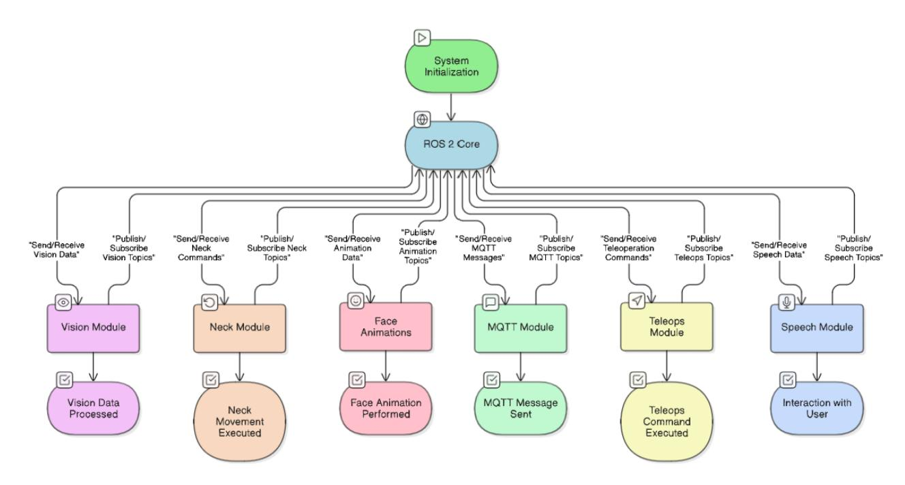

Figure 33, ROS 2 Environment Architecture Flowchart.

The following modules were developed and integrated into the ROS 2 framework:

# **3.7.1. Vision Module**

Vision module is one of the core modules of the robot, responsible for processing visual input and providing relevant information to other subsystems. It captures real-time video feedback from the camera using OpenCV. This video feedback is processed by different functions to obtain specific types of information which is subsequently published to ROS 2 topics. Figure 34 shows the flow diagram depicting the working of the vision module.

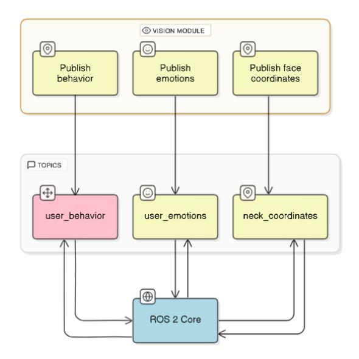

Figure 34. Vision Module Flowchart

The main functions of the vision module include:

# **3.1.7.1. Face tracker**

The face tracking function utilizes OpenCV and haarcascade classifier to detect faces from the camera feed and create a rectangular bounding box across each face. The coordinates of the box are compared with the center of the frame and their difference is sent over the ROS 2 topic *neck\_coordinates*.

# **3.1.7.2. Emotion detection**

An open-source emotion recognition library called DeepFace has been used to detect user emotions from the camera feed obtained via OpenCV. To prevent emotion recognition from running continuously, A ROS 2 service was used which would only call the emotion detection function when another subsystem requested it. This improved the response time of the robot by reducing resource consumption caused due to running DeepFace continuously.

# **3.7.2. Neck Module**

The neck module is responsible for performing PID operations on the incoming face values and sending the correction values, serially to ESP32. It is subscribed to the ROS 2 topic *neck\_coordinates* and continuously listens for face coordinates sent to the topic from the vision module. The face tracking and look around logic as discussed in section 1.2. and 1.3. has been implemented in neck module. Additionally, depending upon the function running, the neck module sends an emotion string (e.g. "happy" or "sad") over the topic *user\_emotions* to change the facial expressions of the robot. This algorithm is illustrated in figure 35, illustrating how neck modules interact with the ROS 2 topics to control the neck hardware.

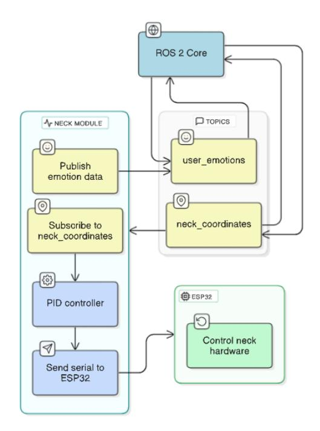

Figure 35. Neck Module Integration with ROS2

# **3.7.2.1. PID Controller Calculations**

The purpose of PID controller is to minimize the error between the desired value (center of frame) and the present detected face value. This is necessary to prevent abrupt changes and jerk motion of neck when tracking a face. The error values are used to compute correction values that adjust the yaw and pitch angle of the robot neck's servos. The PID equations are as follows: For yaw angle:

$$\Delta\theta_{yaw} = K_p \cdot e_x + K_d \cdot (e_x - e_{x,prev}) + K_i \cdot (e_x + e_{x,prev})$$
 Eq. 30

For pitch angle:

$$\Delta\theta_{pitch} = K_p \cdot e_y + K_d \cdot (e_y - e_{y,prev}) + K_i \cdot (e_y + e_{y,prev})$$
 Eq. 31

Where:

*ex* and *ey* are current errors and *ex, prev* and *ey, prev* are previous errors in x and y direction respectively. *Kp Ki* and *Kd* are the proportional, integral and differential constants respectively. PID Constants:

The PID constants used for yaw and pitch angle correction respectively are:

$$K_p = 1.5K_d = 0.5K_i = 0.1$$
 Eq. 32

$$K_p = 0.7K_d = 0.6K_i = 0.1$$
 Eq. 33

Servo Constraints:

Servo angles were constraint to keep the neck within safe operating range and prevent overload on the servo motors:

$$20 \circ \le \theta_{yaw} \le 90$$
 Eq. 34

$$40^{\circ} \le \theta_{\text{pitch}} \le 70^{\circ}$$
 Eq. 35

# **3.7.3. Face Animations**

The face animations module displays eyes expression on the LCD screen attached to the face of the robot. For the animations, a GitHub repository [\[1\]](https://github.com/mjyc/tablet-robot-face) was modified and integrated with ROS 2 which would read string expression data such as *"happy"* or *"sad"* from the *user\_emotions* topic and trigger the expression change function implemented in the modified html file. A PyQT library was used for creating the GUI interface and displaying the html file on the Robot's LCD screen showcasing a happy expression when face is detected and a sad expression when look around function is running. This algorithm contributed to the interactivity of the robot and increased crowd engagement. The flow diagram of this module's functionality is given in figure 36.

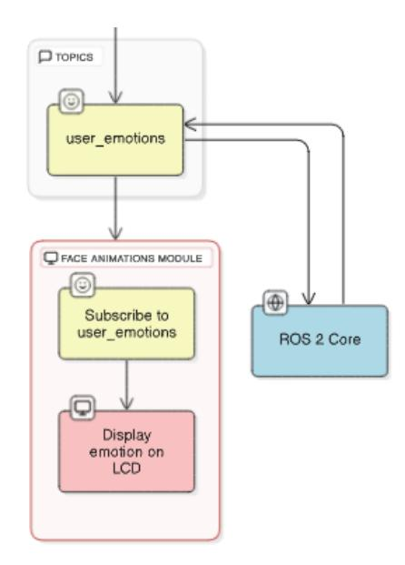

Figure 36. Face Animation Module

# **3.7.4. MQTT Module**

MQTT is a lightweight messaging protocol that allows communication between different devices. The communication method is like ROS 2's topic pub/sub method. The devices involved connect to each other via MQTT broker and are subscribed to MQTT topics.

In HARP, the MQTT module is subscribed to MQTT topic "FYDP/motion" and continuously reads motion data published to it. This motion data is then sent over to the ROS 2 topic *motion\_command* for further processing.

# **3.7.5. Teleops Module**

The teleops module is responsible for interacting with the mecanum wheel robot base. The module is subscribed to the ROS 2 topic *motion\_command* from which the direction and movement data is received from other modules. This data is sent serially to an Arduino Mega connected to the laptop which controls the mecanum wheeled robot. The flow diagram illustrating the working of teleops and MQTT module is shown in figure 37.

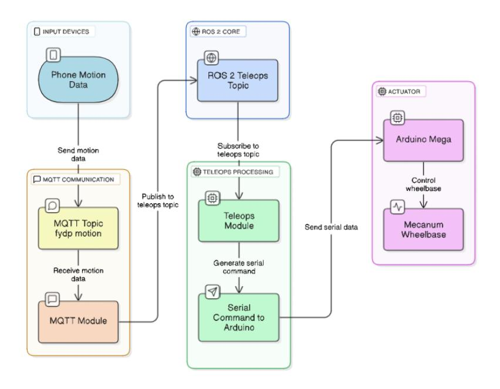

Figure 37. ROS 2 MQTT and Teleops functionality.

# **3.7.6. Speech Module**

Another core module of the robot is the speech module. The speech module integrates three primary subsystems: Speech-To-Text, Text-to-Speech and Large Language Module (LLM) based response generation algorithm which allows users to speak to the robot and get a response. Enhancing the robot's interaction with the environment and the users. Figure 38, illustrates the speech module functionality.

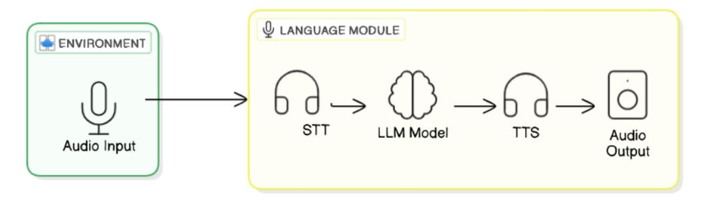

Figure 38. Speech Module

# **Chapter 4 – RESULTS**

# **4.1. Ansys Workbench Analysis Results**

The following results were obtained from static and nodal analyses.

# **4.1.1. Static Structural**

The results of static analysis are as follows.

# **4.1.1.1. Results**

Table 9. Static Analysis Results

| Parameter                             | Value                     |
|---------------------------------------|---------------------------|
| Maximum directional deflection        | 0.00011169 m (≈0.11 mm)   |
| Maximum total deformation             | 0.00089963 m (≈0.90 mm)   |
| Maximum equivalent strain             | 0.00035972                |
| Maximum equivalent (von Mises) stress | 5.96 × 10⁷ Pa (≈59.6 MPa) |
| Yield strength of mild steel          | 250 MPa                   |
| Factor of safety                      | = 4.2                     |

# **4.1.1.2. Interpretation**

The structure experienced very low deformation under the maximum expected loading. The von Mises stress is significantly below the yield strength of mild steel, resulting in a high factor of safety (~4.2). This confirms that the base is structurally sound for static loads in realworld use. The directional deformation, total deformation, equivalent elastic strain, maximum principal elastic strain, equivalent stress and maximum principal stress resulted because of static structural analysis, and the results are given in the figure 39, 40, 41, 42, 43 and 44 respectively.

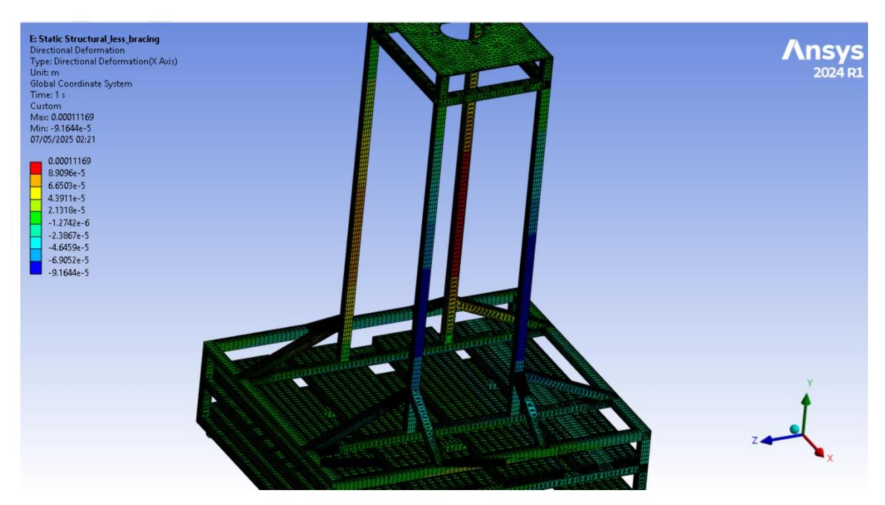

Figure 39, Directional Deformation

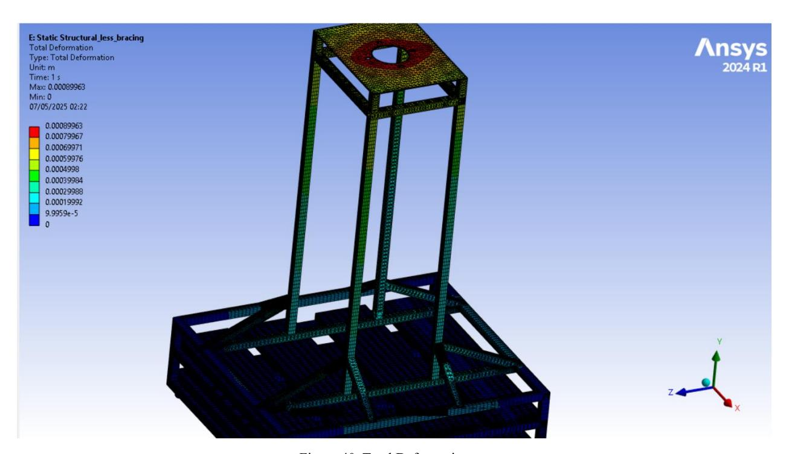

Figure 40, Total Deformation

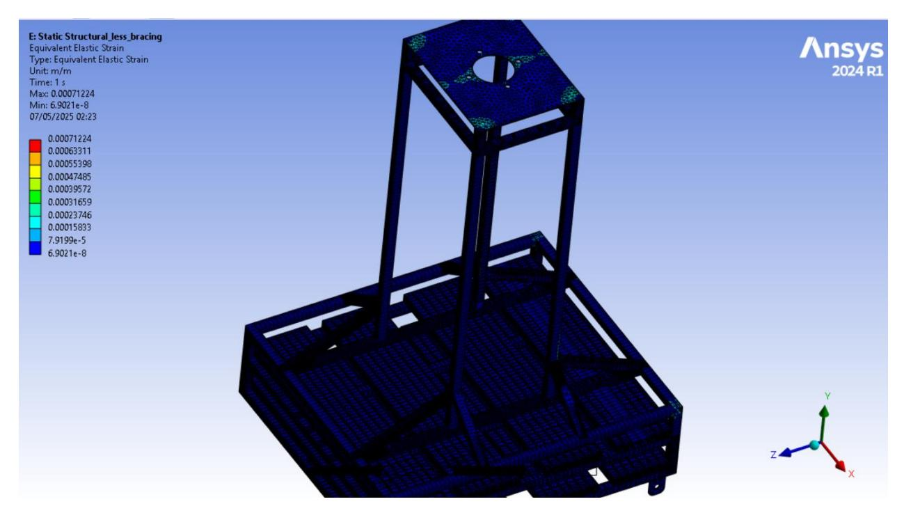

Figure 41, Equivalent Elastic Strain

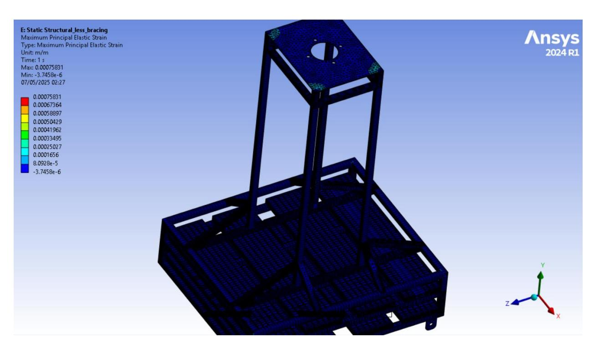

Figure 42, Maximum Principal Elastic Strain

Figure 43, Equivalent Stress

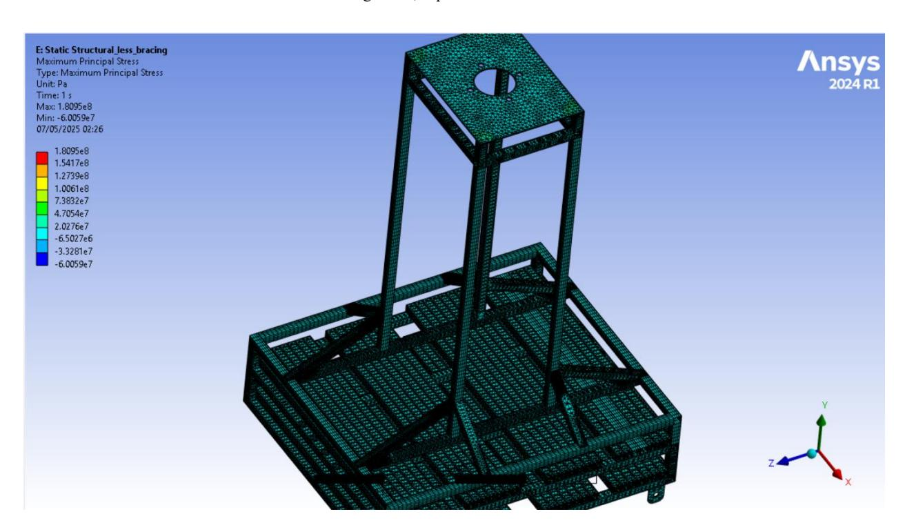

Figure 44, Maximum Principal Stress

# **4.1.2. Modal Analysis**

The results of modal analysis are as follows.

# **4.1.2.1. Results**

Table 10. Modal Analysis Natural Frequencies

| Mode | Natural Frequency (Hz) |
|------|------------------------|
| 1    | 20.317                 |
| 2    | 23.627                 |
| 3    | 46.105                 |
| 4    | 66.378                 |
| 5    | 90.504                 |
| 6    | 95.668                 |

# **4.1.2.2. Interpretation**

The lowest natural frequency is 20.317 Hz, which is much higher than the frequencies associated with the typical motion of the robot. This ensures the design is free from resonance and dynamic instability during operation. The first 2 modes occurring at frequencies of 20.317Hz and 23.627Hz are given in the fig 45 and 46 respectively.

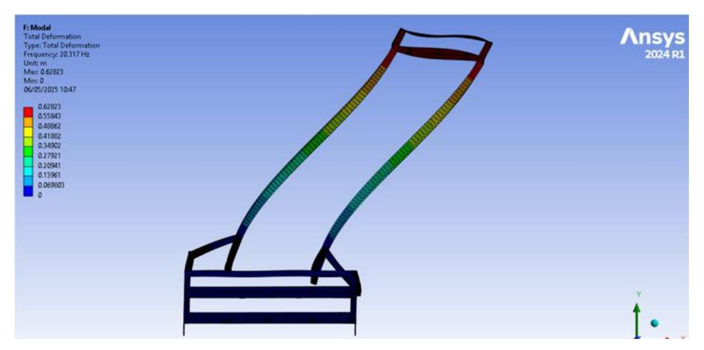

Figure 45, Mode 1 (20.317Hz)

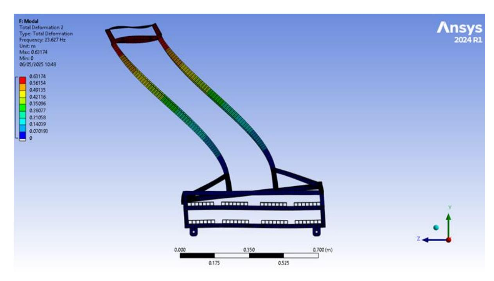

Figure 46, Mode 2 (23.627Hz)

# **4.1.3. Eigenvalue Buckling Analysis**

# **4.1.3.1. Results**

Table 11. Eigenvalue Buckling Load Factors

| Mode | Buckling Load Factor (BLF) |
|------|----------------------------|
| 1    | -254.32                    |
| 2    | 162.42                     |
| 3    | 174.54                     |
| 4    | 175.41                     |
| 5    | 197.11                     |
| 6    | 197.26                     |
| 7    | 211.36                     |
| 8    | 224.46                     |
| 9    | 226.94                     |
| 10   | 233.1                      |
| 11   | 243.02                     |
| 12   | 244.2                      |
| 13   | 244.84                     |
| 14   | 246.14                     |
| 15   | 246.64                     |
| 16   | 260.21                     |
| 17   | 266.17                     |
| 18   | 276.86                     |
| 19   | 278.26                     |
| 20   | 280.93                     |

# **4.1.3.2. Interpretation**

The first value is negative, so it is a non-physical value. The first positive buckling load factor is 162.42, meaning the structure would only begin to buckle if the applied load were

multiplied by 162.42 i.e., over 40,000 N. This confirms exceptional structural stability and no risk of buckling under any realistic loading scenario.

# **4.1.4. Conclusion of FEA**

All simulation results confirm that the robotic base design is mechanically safe, dynamically stable, and resistant to buckling under maximum expected operational loads. This provides strong validation of the CAD design and confidence in real-world performance. The overall design can be seen in figure 47.

# **4.2. Other Results**

Most of the results are hard to show here since they are of a dynamic nature, i.e. they would only be understandable if they is presented in the form of a video. The link for the video folder is shared in the appendix.

# **4.3 Final Look**

Figure 47. Final Fabricated Design of HARP

# **Chapter 5 – CONCLUSION & FUTURE WORK**

# **5.1. Conclusion**

This project has effectively shown HARP to become a more resilient and sophisticated system capable of having advanced interactivity and autonomous mobility. An essential accomplishment has to be the incorporation of a 2-DOF servo-driven gimbal, facilitating neck movements that improve human-robot interaction. Human-robot verbal communication is done with Gemini LLM, which uses the Whisper API and the Piper library.

The design and manufacturing of an omnidirectional base has facilitated seamless and versatile movement along all directions, making it more precise and agile while moving. The system utilizes HAR using the MoViNet model, capable of enabling HARP to recognize and respond to human behaviors. Furthermore, navigation is facilitated by working on passive SLAM via the RTAB-Map package, which enables the navigation and localization inside maps using a depth camera.

Combined, these elements create a unified platform that integrates mechanical design, sophisticated AI models, and perceptive intelligence, rendering it an ideal final year design project for mechatronics engineering. Ultimately, HARP is optimally situated for utilisation in social robots, assistive technologies, and autonomous service systems. The HARP in its final form is visually presented in fig 47.

# **5.2. Future Work**

As for the future development of HARP, it has been decided and suggested that three major areas are to be explored. This is to say, depth cameras are a good choice in mapping, dynamic SLAM will be added to better navigation in surroundings with moving objects and people (dynamic obstacles), providing considerably more robust mapping and localization.

Moreover, robotic arms shall be incorporated such that HARP can have object manipulation capabilities. This will let it execute tasks such as picking up objects, opening doors, and shaking hands with people (even with robots), boosting its utility in assistance and service robots.

The use of Vision-Language Models (VLMs) will enable HARP to comprehend and react to intricate multi-modal directives. This will improve contextual awareness and enable more natural, intelligent interactions through combined visual and verbal processing. More importantly, this will also minimize the computational load on HARP as API of VLM would be introduced.

These changes will surely advance HARP's ability to work autonomously in dynamic, humancentric contexts, enabling it to become more aware and assistive.

# **REFERENCES**

- [1] S. Saeedvand, M. Jafari, H. S. Aghdasi, and J. Baltes, "A comprehensive survey on humanoid robot development," The Knowledge Engineering Review, vol. 34. Cambridge University Press (CUP), 2019. doi: 10.1017/s0269888919000158.
- [2] R. T. Yunardi, D. Arifianto, F. Bachtiar, and J. I. Prananingrum, "Holonomic Implementation of Three Wheels Omnidirectional Mobile Robot using DC Motors," *Journal of Robotics and Control (JRC)*, vol. 2, no. 2, 2021, doi: https://doi.org/10.18196/jrc.2254.
- [3] H. Taheri and C. X. Zhao, "Omnidirectional mobile robots, mechanisms and navigation approaches," *Mechanism and Machine Theory*, vol. 153, p. 103958, Nov. 2020, doi: https://doi.org/10.1016/j.mechmachtheory.2020.103958.
- [4] K. Shabalina, A. Sagitov, and E. Magid, "Comparative Analysis of Mobile Robot Wheels Design," *IEEE Xplore*, Sep. 01, 2018. https://ieeexplore.ieee.org/abstract/document/8648593
- [5] Omar Yaseen Ismael and J. Hedley, "Analysis, Design, and Implementation of an Omnidirectional Mobile Robot Platform," American Scientific Research Journal for Engineering, Technology, and Sciences, vol. 22, no. 1, pp. 195–209, Jul. 2016.
- [6] K. Shabalina, A. Sagitov, and E. Magid, "Comparative Analysis of Mobile Robot Wheels Design," IEEE Xplore, Sep. 01, 2018. https://ieeexplore.ieee.org/abstract/document/8648593
- [7] M. West and H. Asada, "Design and control of ball wheel omnidirectional vehicles," Proceedings of 1995 IEEE International Conference on Robotics and Automation, 1995, doi: https://doi.org/10.1109/ROBOT.1995.525547.
- [8] J. Wu, Chaoshun Lv, L. Zhao, R. Li, and G. Wang, "Design and implementation of an omnidirectional mobile robot platform with unified I/O interfaces," Aug. 2017, doi[: https://doi.org/10.1109/icma.2017.8015852.](https://doi.org/10.1109/icma.2017.8015852)
- [9] Aneesh Khole, A. Thakar, Shreyas Shende, and Varad Karajkhede, "A Comprehensive Study on Simultaneous Localization and Mapping (SLAM): Types, Challenges and Applications," vol. 1, pp. 643–650, Jun. 2023, doi: https://doi.org/10.1109/icscss57650.2023.10169695.
- [10] A. Macario Barros, M. Michel, Y. Moline, G. Corre, and F. Carrel, "A Comprehensive Survey of Visual SLAM Algorithms," *Robotics*, vol. 11, no. 1, p. 24, Feb. 2022, doi: https://doi.org/10.3390/robotics11010024.
- [11] Daniel Paul Romero-Marti, Jose Ignacio Nunez-Varela, C. Soubervielle-Montalvo, and A. Orozco-de-la-Paz, "Navigation and path planning using reinforcement learning for a Roomba robot," Nov. 2016, doi: https://doi.org/10.1109/comrob.2016.7955160.
- [12] J. Mai, J. Chen, B. Li, G. Qian, M. Elhoseiny, and B. Ghanem, "LLM as A Robotic Brain: Unifying Egocentric Memory and Control," *arXiv (Cornell University)*, Jan. 2023, doi: https://doi.org/10.48550/arxiv.2304.09349.
- [13] H. Kang, M. B. Moussa, and N. Magnenat-Thalmann, "Nadine: An LLM-driven Intelligent Social Robot with Affective Capabilities and Human-like Memory," *arXiv.org*, 2024. https://arxiv.org/abs/2405.20189 (accessed Oct. 09, 2024).
- [14] J. Li *et al.*, "MMRo: Are Multimodal LLMs Eligible as the Brain for In-Home Robotics?," *arXiv.org*, 2024. https://arxiv.org/abs/2406.19693 (accessed Oct. 09, 2024).
- [15] H. Ali, P. Allgeuer, C. Mazzola, G. Belgiovine, B. C. Kaplan, and S. Wermter, "Robots Can Multitask Too: Integrating a Memory Architecture and LLMs for Enhanced Cross-Task Robot Action Generation," arXiv.org, 2024. https://arxiv.org/abs/2407.13505 (accessed Oct. 09, 2024).
- [16] Tsiourti, C., Weiss, A., Wac, K., & Vincze, M. (2019). Multimodal Integration of Emotional Signals from Voice, Body, and Context: Effects of (In)Congruence on Emotion Recognition and Attitudes Towards Robots. International Journal of Social Robotics, 1-19. [https://doi.org/10.1007/S12369-019-00524-Z.](https://doi.org/10.1007/S12369-019-00524-Z)
- [17] Chuah, S., & Yu, J. (2021). The future of service: The power of emotion in human-robot interaction. Journal of Retailing and Consumer Services[. https://doi.org/10.1016/J.JRETCONSER.2021.102551.](https://doi.org/10.1016/J.JRETCONSER.2021.102551)
- [18] Korcsok, B., Konok, V., Persa, G., Faragó, T., Niitsuma, M., Miklósi, Á., Korondi, P., Baranyi, P., & Gácsi, M. (2018). Biologically Inspired Emotional Expressions for Artificial Agents. Frontiers in Psychology, 9[. https://doi.org/10.3389/fpsyg.2018.01191.](https://doi.org/10.3389/fpsyg.2018.01191)
- [19] Quiroz, M., Patiño, R., Amado, J., & Cardinale, Y. (2022). Group Emotion Detection Based on Social Robot Perception. Sensors (Basel, Switzerland), 22[. https://doi.org/10.3390/s22103749.](https://doi.org/10.3390/s22103749)
- [20] Heredia, J., Lopes-Silva, E., Cardinale, Y., Diaz-Amado, J., Dongo, I., Graterol, W., & Aguilera, A. (2022). Adaptive Multimodal Emotion Detection Architecture for Social Robots. IEEE Access, 10, 20727-20744[. https://doi.org/10.1109/ACCESS.2022.3149214.](https://doi.org/10.1109/ACCESS.2022.3149214)

- [21] Stock-Homburg, R. (2021). Survey of Emotions in Human–Robot Interactions: Perspectives from Robotic Psychology on 20 Years of Research. International Journal of Social Robotics, 14, 389 - 411[. https://doi.org/10.1007/s12369-021-00778-6.](https://doi.org/10.1007/s12369-021-00778-6)
- [22] D'Onofrio, G., Fiorini, L., Sorrentino, A., Russo, S., Ciccone, F., Giuliani, F., Sancarlo, D., & Cavallo, F. (2022). Emotion Recognizing by a Robotic Solution Initiative (EMOTIVE Project). Sensors (Basel, Switzerland), 22[. https://doi.org/10.3390/s22082861.](https://doi.org/10.3390/s22082861)
- [23] Devaram, R., Beraldo, G., Benedictis, R., Mongiovì, M., & Cesta, A. (2022). LEMON: A Lightweight Facial Emotion Recognition System for Assistive Robotics Based on Dilated Residual Convolutional Neural Networks. Sensors (Basel, Switzerland), 22. [https://doi.org/10.3390/s22093366.](https://doi.org/10.3390/s22093366)
- [24] Ruiz-Garcia, A., Elshaw, M., Altahhan, A., & Palade, V. (2018). A hybrid deep learning neural approach for emotion recognition from facial expressions for socially assistive robots. Neural Computing and Applications, 29, 359 - 373[. https://doi.org/10.1007/s00521-018-3358-8.](https://doi.org/10.1007/s00521-018-3358-8)
- [25] Pérez-Gaspar, L., Morales, S., & Trujillo-Romero, F. (2016). Multimodal emotion recognition with evolutionary computation for humanrobot interaction. Expert Syst. Appl., 66, 42-61[. https://doi.org/10.1016/j.eswa.2016.08.047.](https://doi.org/10.1016/j.eswa.2016.08.047)
- [26] Subramanian, B., Kim, J., Maray, M., & Paul, A. (2022). Digital Twin Model: A Real-Time Emotion Recognition System for Personalized Healthcare. IEEE Access, 10, 81155-81165[. https://doi.org/10.1109/access.2022.3193941.](https://doi.org/10.1109/access.2022.3193941)
- [27] Papadopoulos, I., Koulouglioti, C., Lazzarino, R., & Ali, S. (2020). Enablers and barriers to the implementation of socially assistive humanoid robots in health and social care: a systematic review. BMJ Open, 10[. https://doi.org/10.1136/bmjopen-2019-033096.](https://doi.org/10.1136/bmjopen-2019-033096)
- [28] Papadopoulos, I., Koulouglioti, C., & Ali, S. (2018). Views of nurses and other health and social care workers on the use of assistive humanoid and animal-like robots in health and social care: a scoping review. Contemporary Nurse, 54, 425 - 442. [https://doi.org/10.1080/10376178.2018.1519374.](https://doi.org/10.1080/10376178.2018.1519374)
- [29] Mlakar, I., Kampič, T., Flis, V., Kobilica, N., Molan, M., Smrke, U., Plohl, N., & Bergauer, A. (2022). Study protocol: a survey exploring patients' and healthcare professionals' expectations, attitudes and ethical acceptability regarding the integration of socially assistive humanoid robots in nursing. BMJ Open, 12[. https://doi.org/10.1136/bmjopen-2021-054310.](https://doi.org/10.1136/bmjopen-2021-054310)
- [30] Abdi, J., Al-Hindawi, A., Ng, T., & Vizcaychipi, M. (2018). Scoping review on the use of socially assistive robot technology in elderly care. BMJ Open, 8[. https://doi.org/10.1136/bmjopen-2017-018815.](https://doi.org/10.1136/bmjopen-2017-018815)
- [31] Lukasik, S., Tobis, S., Kropińska, S., & Suwalska, A. (2020). Role of Assistive Robots in the Care of Older People: Survey Study Among Medical and Nursing Students. Journal of Medical Internet Research, 22. [https://doi.org/10.2196/18003.](https://doi.org/10.2196/18003)
- [32[\]Meet Pepper: The Robot Built for People | SoftBank Robotics America](https://us.softbankrobotics.com/pepper)
- [33] *ANSI A326.3-2017, American National Standard Test Method for Measuring Dynamic Coefficient of Friction of Hard Surface Flooring Materials*, Tile Council of North America, 2017.
- [34[\] Video Classification on Edge Devices with TensorFlow Lite and MoViNet —](https://blog.tensorflow.org/2022/04/video-classification-on-edge-devices.html) The TensorFlow Blog
- [35] R. Villavicencio and C. Guedes Soares, "Numerical modelling of the boundary conditions on beams struck transversely by a mass," *International Journal of Impact Engineering*, vol. 38, no. 5, pp. 440–449, May 2011, doi: 10.1016/j.ijimpeng.2010.12.006.

# **APPENDIX**

# **GitHub Repository along with demos:**

https://github.com/CEME-HARP/FYDP\_HARP