#### **HUMANOID ASSISTIVE ROBOTIC PLATFORM**


**COLLEGE OF ELECTRICAL AND MECHANICAL ENGINEERING NATIONAL UNIVERSITY OF SCIENCES AND TECHNOLOGY RAWALPINDI 2026**

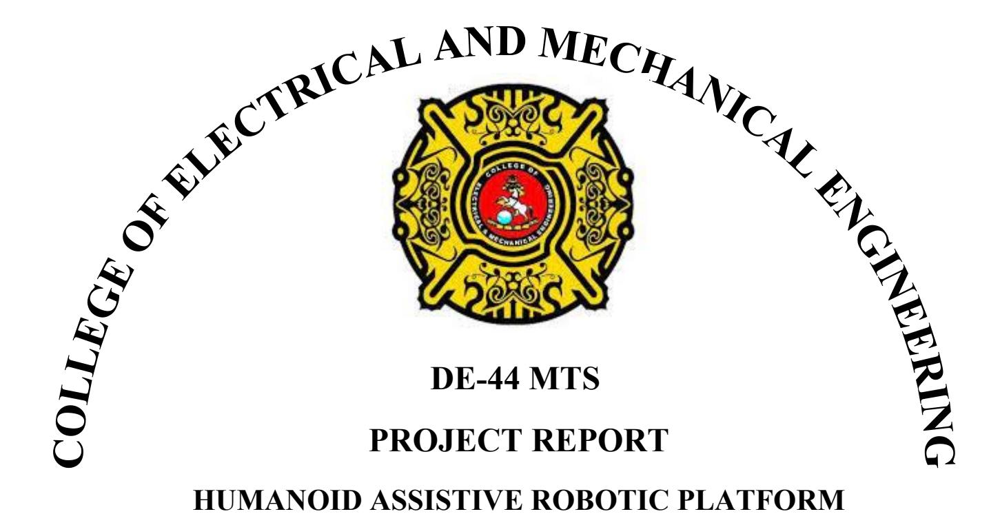

Submitted to the Department of Mechatronics Engineering in partial fulfillment of the requirements

for the degree of

**Bachelor of Engineering**

**in**

**Mechatronics**

**2026**

Snr Lecturer Usman Asad Noor-Ul-Ain Dr. Kanwal Naveed Muhammad Abdullah

**Sponsoring DS: Submitted By:**

 Muhammad Zubair Aqib Ali

## <span id="page-2-0"></span>**ACKNOWLEDGMENTS**

We wish to start by giving our most humble thanks to Allah Almighty whose many blessings enabled us to embark on and successfully complete this massive research, design and development project on the humanoid robot project.

We also wish to express our utmost gratitude to our supervisor, Snr Lec Usman Asad, who has consistently been supportive, gave us useful advice and provided insightful feedback on this thesis. His knowledge, drive, and support were crucial in helping us to develop our research and develop the passion to become the best.

Moreover, we owe a heartfelt gratitude to our co-supervisor, Dr Kanwal Naveed, whose assistance and guidance were invaluable, as well as their positive feedback and support. Their experience and encouragement had a significant impact on the expansion of our knowledge and the quality of our work in general.

And lastly, we owe it all to our parents who have always been supportive, encouraging and have believed in us. Their encouragement, patience, and wisdom were a source of strength to us throughout this difficult project of completing this final year project.

## <span id="page-3-0"></span>**ABSTRACT**

In this project, the Humanoid Assistive Robotic Platform (HARP) is aimed at improving as an intelligent receptionist capable of autonomous movement, an IoT-based control mechanism, and sophisticated world perception. The ultimate aim is to design a socially interactive humanoid system capable of sensing the surrounding world, deciphering user intentions, and accomplishing assistance tasks within a reception situation in the real world. The revised HARP incorporates various sensing units such as vision and proximity sensors, which allows it to move around autonomously and avoid obstacles and detect people within its area of operation. The three approaches of the computer vision, machine learning, and sensor fusion are used together to enhance the perceiving and decision-making functions of the robot. The system is to welcome the visitors, give them some simple information and direct them where they should go in an indoor setting. This thesis presents a costefficient, modular, and scalable humanoid platform that will fill the gap between service automation and intelligent assistive robotics.

# **TABLE OF CONTENTS**

| Contents                                                 |     |
|----------------------------------------------------------|-----|
| ACKNOWLEDGMENTS                                          | iii |
| ABSTRACT                                                 | iv  |
| LIST OF FIGURES                                          | ix  |
| LIST OF TABLES                                           | xi  |
| LIST OF ACRONYMS                                         | xii |
| CHAPTER 1 – INTRODUCTION                                 | 1   |
| 1.1 Overview                                             | 1   |
| 1.2 Motivation                                           | 1   |
| 1.3 Problem Statement                                    | 1   |
| 1.4 Objectives of This Project.                          | 2   |
| 1.5 Organization of the Thesis                           | 2   |
| CHAPTER 2 – LITERATURE REVIEW                            | 4   |
| 2.1. Recent Advances in Humanoid Robots                  | 5   |
| 2.2. Holonomic Robot Base (HARP Existing Design)         | 5   |
| 2.2.1. Visual SLAM                                       | 6   |
| 2.2.2. Dynamic Path Planning & Tracking                  | 6   |
| 2.2.3. Obstacle Detection & Avoidance                    | 7   |
| 2.3. Connected Robotics & Human-Centered Social Robotics | 8   |
| 2.3.1. Humanoid Robots and Assistive Robotics            | 9   |
| 2.3.2. IoT in Robotics.                                  | 9   |
| 2.3.3. Communication Protocols in IoT                    | 10  |
| 2.3.3.1. ROS 2 in Humanoid Robotics                      | 12  |
| 2.3.3.2. ROS 2 as HARP's Operational Core                | 12  |
| 2.3.3.3. Modularity and Concurrency in ROS 2             | 13  |

| 2.3.4. Security in IoT Robotic Systems13                                     |  |
|------------------------------------------------------------------------------|--|
| 2.3.4.1. Security Risks in IoT Architecture14                                |  |
| 2.3.4.2. ROS 2's Advancements in Security15                                  |  |
| 2.4. World Perception and Object Recognition15                               |  |
| 2.4.1. Object Detection and Recognition16                                    |  |
| 2.4.2. Perception17                                                          |  |
| 2.4.3.<br>Deep learning18                                                    |  |
| 2.4.3.1. Single stage and two-stage detectors19                              |  |
| 2.4.3.2. YOLOv520                                                            |  |
| 2.4.3.3. YOLOv821                                                            |  |
| CHAPTER 3 – ENHANCED PERCEPTION FRAMEWORK AND IT<br>ADMINISTRATIVE CONTROL22 |  |
| 3.1 Overview22                                                               |  |
| 3.2 IoT Infrastructure and Web-Based Application22                           |  |
| 3.2.1 Role of IoT in Assistive Robotics23                                    |  |
| 3.2.2 System Architecture Communication Bridge23                             |  |
| 3.2.3 Visitor Logging & Database Integration24                               |  |
| 3.2.4 Real-Time Telemetry & status Monitoring25                              |  |
| 3.2.5 Humanoid Voice Synthesis (TTS)26                                       |  |
| 3.2.6 The HRI Dashboard26                                                    |  |
| 3.2.7 Communication Protocol (ROS Bridge)27                                  |  |
| 3.2.7.1 Advanced Integration Gemini 3 Live27                                 |  |
| 3.2.7.2 Managing latency in the WSL2 Environment28                           |  |
| 3.2.7.3 Optimized HRI Pipeline28                                             |  |
| 3.3 Persistent Data Management (SQLite)29                                    |  |

| 3.3.1 Database Implementation for visitor logging29     |  |
|---------------------------------------------------------|--|
| 3.3.2 Data Schema and Normalization29                   |  |
| 3.3.3 Integration with ROS230                           |  |
| 3.4 Computer Vision System in HARP31                    |  |
| 3.4.1 Object Detection with YOLOv832                    |  |
| 3.4.1.1 How YOLOv8 Object Detection Work32              |  |
| 3.4.1.2 Flowchart Object Detection Pipeline33           |  |
| 3.4.1.3 Running Object Detection Code33                 |  |
| 3.4.1.4 Basic image Detection,33                        |  |
| 3.4.1.5 Real-Time Webcam Detection34                    |  |
| 3.5 Object Tracking with YOLOv834                       |  |
| 3.5.1 Why tracking is different from detection35        |  |
| 3.5.2 Algorithms built into YOLOv8 Tracking37           |  |
| 3.5.3 Image Segmentation37                              |  |
| 3.5.3.1 Running Segmentation code Walkthrough38         |  |
| 3.6 Human Landmark Detection with MediaPipe39           |  |
| 3.6.1 MediaPipe solutions used in HARP41                |  |
| 3.6.2 MediaPipe Pose Estimation43                       |  |
| 3.7 Performance Results45                               |  |
| CHAPTER 4 – RESULTS48                                   |  |
| 4.1 Object Detection Performance Analysis47             |  |
| 4.1.1 Real-Time Object Tracking Evaluation48            |  |
| 4.1.2 Gesture Recognition and Human-Robot Interaction49 |  |
| 4.2 Communication Architecture Performance50            |  |
| CHAPTER 5 – CONCLUSION & FUTURE WORK52                  |  |

<span id="page-7-0"></span>

| 5.1 Conclusion52  |  |
|-------------------|--|
| 5.2 Future Work53 |  |
| REFERENCES53      |  |

## **LIST OF FIGURES**

| Figure 1- IoT Communication Protocols10                                            |
|------------------------------------------------------------------------------------|
| Figure 2- Comparison of IoT protocols Communication11                              |
| Figure 3- Structure of the proposed four-layered architecture13                    |
| Figure 4- The standard process of Object detection17                               |
| Figure 5- Micro-ROS agent is listening for connection from ESP3224                 |
| Figure 6- System Health25                                                          |
| Figure 7- HARP Human Robot Interaction27                                           |
| Figure 8-Structured data storage with in the SQLite database29                     |
| Figure 9- Object detection in IOT Lab31                                            |
| Figure 10- Person Detection in Market using YOLOv832                               |
| Figure 11- Object Detection using YOLOv832                                         |
| Figure 12- Flowchart Object detection33                                            |
| Figure 13- Object Tracking of Vehicles35                                           |
| Figure 14- Flowchart object tracking37                                             |
| Figure 15- Segmented vs Original38                                                 |
| Figure 16- Hand Landmark Detection using Mediapipe40                               |
| Figure 17- Detection on Street Video44                                             |
| Figure 18- Detection, Count & Tracking all Vehicles on Highway44                   |
| Figure 19- HARP Control by Media pipe using Hand Gesture45                         |
| Figure 20- Media pipe on open hand46                                               |
| Figure 21-Media pipe on closed hand46                                              |
| Figure 22- Detection of a human subject using the vision-based perception system47 |
| Figure 23- Detection of a mobile phone object48                                    |
| Figure 24- Tracking of a mobile phone after detection48                            |

| Figure 25- Closed-hand gesture used to stop the robot, ensuring intuitive and user-friendly<br>control49 |  |
|----------------------------------------------------------------------------------------------------------|--|
| Figure 26- Gesture based control to initialize HARP49                                                    |  |
| Figure 27- The finalized HARP Human-Robot Interation (HRI) Web Dashboard50                               |  |
| Figure 28- HARP HRI node terminal logs interfacing with the Gemini 3 Flash model51                       |  |

## <span id="page-10-0"></span>**LIST OF TABLES**

| Table 1- Comparison Table Evaluating Various Robotic Path Planning Algorithms7    |
|-----------------------------------------------------------------------------------|
| Table 2- Comparison between Stateless Detection and Stateful Tracking36           |
|                                                                                   |
| Table 3- Comparison between ByteTrack and BoT-SORT Tracking Algorithms37          |
|                                                                                   |
| Table 4- Overview of MediaPipe Solutions, Feature Detection Capabilities and HARP |
| Project Applications41                                                            |
|                                                                                   |

## **LIST OF ACRONYMS**

DDS- Data Distribution Service

DoS- Denial of Service

QoS- Quality of Service

IoT- Internet of Things

LPWANs- Low Power Wide Area Networks

WPANs- Wireless Personal Area Networks

CoAP- Constrained Application Protocol

LiDAR- Light Detection and Ranging

IMU- Inertial Measurement Unit

YOLO- You Only Look Once

DETR- Detection Transformer

AP- Average Precision

MOTA- Multiple Object Tracking Accuracy

CNN- Convolutional Neural Network

R-CNN - Region-based Convolutional Neural Network

HARP Humanoid Assistive Robotic Platform

ROS 2 Robot Operating System 2

MQTT Message Queuing Telemetry Transport

SLAM Simultaneous Localization and Mapping

RPN Region Proposal Network

MTU Maximum Transmission Unit

NFC Near Field Communication

RFID Radio Frequency Identification

WPAN Wireless Personal Area Network

LPWAN Low-Power Wide-Area Network

HRI Human–Robot Interaction

STT Speech-to-Text

TTS Text-to-Speech

FPS Frames Per Second

## <span id="page-13-0"></span>**Chapter 1- INTRODUCTION**

## **1.1 Overview**

Humanoid robots represent a sophisticated fusion of form and motion, designed to operate within environments tailored specifically for human interaction. These platforms are increasingly vital in addressing challenges in healthcare, rehabilitation, and social assistance. The Humanoid Assistive Robotic Platform (HARP) is an ongoing research initiative focused on creating an intelligent, interactive assistant. The latest version of HARP enhances the operation of the system by incorporating advanced features of Visual SLAM (high level), independent path-tracking modules, and an efficient IoT-based administrative system to facilitate the smooth operation of the system in dynamic environments.

## **1.2 Motivation**

HARP can be taken as a final year project due to its interdisciplinary nature of Mechatronics Engineering, which involves the necessity to combine computer vision, embedded systems, and autonomous software architecture. In addition to technical innovation, the project has been driven by the desire to have human-centered systems that enhance the standard of living of individuals who have physical, or cognitive disabilities. Through ROS 2 framework, the project contemplates the usage of low-cost vision-based robots capable of navigation and interaction in the real world setting naturally without the need to use expensive active sensing devices.

## **1.3 Problem Statement**

Although recent developments have been made in the area of robotic systems, most of the currently available platforms still exhibit significant limitation that can restrict their efficacy and practical application. The complexity of navigation is among the main obstacles since robots cannot always keep proper localization and navigate in cluttered and ever-changing indoor spaces. Moreover, most robotic platforms depend extensively on costly and energy-intensive active sensors, like LiDAR, rather than implementing more scalable and cost-effective vision-based sensing solutions. The other significant problem is the absence of centralized and safe control systems that will enable the caregivers or the administrators to monitor, manage, and command robotic units remotely. Also, the perception of the present socially assistive robots may be limited and the object recognition, interpretation of the environment, and safe interaction with humans cannot be achieved. These shortcomings demonstrate the necessity of a more efficient, intelligent, and cost-effective robotic solution.

## **1.4 Objectives of This Project**

The primary goal of this project is to enhance the HARP system and make it smarter, more dependable, and socially conscious. The purpose of the project is to come up with a visionbased SLAM system, which will enable the robot to map and locate its position in realtime using cameras. It is also concerned with the enhancement of path tracking and obstacle avoidance to enable the robot to navigate in dynamic indoor environments in a movement that is smooth and safe. The other goal is to develop an IoT-based web-based application, which allows the caregivers or administrators to remotely monitor and control the robot by providing secure communication with the ROS 2 system. Moreover, the project will elevate the perception capabilities of the robot by introducing object detection and recognition models, which will enable it to be more aware of its environment and engage individuals and objects in a safer and more intelligent way.

## **1.5 Organization of the Thesis**

The thesis is further written in the following fashion:

 **Chapter 2:** Comprises the literature review which discusses the latest research and advancements made in the field of social robots.

**Chapter 3:** A detailed methodology that helps the reader understand how the solution was made in the project.

**Chapter 4:** Displays the results.

**Chapter 5:** Conclusion and future work.

## **Chapter 2 – LITERATURE REVIEW**

Our project is an assistive robot which is designed to perceive its environment, interact with human beings and control the devices which are connected which is why it will be a useful social assistant.

The increasing application of intelligent service robots in offices, hospitals and in general places of people have created the need to have humanoid systems that will assist human beings in their day-to-day tasks. Traditional services are likely to employ human resource in executing tedious tasks such as reception of visitors, giving directions or supervising environmental systems, which can be time consuming and prone to errors. By combining autonomous movement, environmental perception, and IoT-based control into a single platform, the HARP assistive humanoid robot can be used to address these challenges. The logic behind the current project will be to construct a social interactive and low-cost robot that can add to the convenience of humans, the efficiency of operations, and demonstrate the potential of humanoid robots as intelligent assistants in the real-life indoor environment.

The primary aim is to make the existing Humanoid Assistive Robotic Platform (HARP) smarter and turn it into a smart receptionist, capable of operating autonomously in the indoor environment. The project will integrate a variety of new capabilities that combine to enable HARP to feel, think and talk to the world in a socially intelligent manner. The autonomous navigation is one of the aims, where the robot can safely navigate around its environment, with the assistance of vision and proximity sensors in path planning and obstacles avoidance. The other objective is to create a better world perception that employs computer vision, sensor fusion, and machine learning algorithms to recognize people, objects and interpret the environmental signals. The system is also to incorporate the connectivity of IoT where smart devices such as lights, doors and air conditioning systems can be monitored and managed by HARP to achieve a responsive and intelligent workspace. In addition, the project will focus on enhancing human-robot interaction (HRI) in a manner that the robot can greet the visitors, respond to simple questions, and guide the visitors through a reception area. Lastly, the system architecture will be modular, and capable of expansion with minimum cost and expansion can be carried out in the future and can be extended to assistive and service-based applications.

## **2.1 Recent Advances in Humanoid Robots**

The recent advances in humanoid robots have greatly increased the functionality of assistive robots and made them more interactive, intelligent and adaptive to human environments. Recent developments in the field of human robot interaction (HRI) now allow robots to have realistic expressions and gestures to enhance social activity in a customer service or healthcare environment. In the meantime, gains in autonomous learning and physical control as illustrated by robots such as the Tesla Optimus, enable humanoids to replicate intricate human movements in accuracy and balance. State-of-theart AI systems, including Google Deep Minds Gemini and Vision-Language-Action systems, have enhanced robots to execute complicated tasks, comprehend the environment, and engage with objects and individuals in a better way.

## **2.2 Holonomic Robot Base (HARP Existing Design)**

Mobility is the main aspect of any autonomous platform. In contrast to other classical differential drive systems, holonomic robots with mecanum or omni-wheels have the special capability of moving freely in any direction without reorientation. This is not a mere technical whim, but a requirement of service and assistive robots such as the HARP, which must be able to perform in small corridors, in congested lobbies and active human environments.

Holonomic motion provides a more natural interaction that allows the robot to have a natural position when it is in front of a person or to move gracefully around objects without clumsy maneuvers. Although this benefit is well-reported in service robotics [1], it also poses such challenges as wheel slippage and the complexity of control [2]. However, with the addition of modern kinematic models and closed-loop PID control, these platforms provide the accuracy and agility required in human-assistive situations.

## **2.2.1 Visual SLAM**

The fluidly moving robot should also be aware of its position and this is where the Simultaneous Localization and Mapping (SLAM) come in. The earlier models of SLAM, including RTAB-Map, provided the foundation of the inexpensive real-time mapping using RGB-D cameras. These systems enable the robots such as the HARP to develop usable occupancies maps of their areas [3]. Nevertheless, their use of the assumptions about the static world soon becomes a bottleneck in the real-world implementations, where individuals and objects are always moving. Recent studies in SLAM have been oriented towards strong, visual inertial fusion and dynamic scene management. Such algorithms like ORB-SLAM3 allow precise localization even in big and cluttered spaces because IMU data are combined with visual pipeline [4]. Another development such as DynaSLAM takes a step further by ignoring moving human beings and objects to maintain the integrity of a map [5]. In case of a humanoid receptionist robot, this implies good navigation within busy areas without becoming lost in the scene due to passing elements. The future of the SLAM studies is evidently towards facilitating long-term autonomy where robots are capable of working smoothly in dynamic, unforeseeable indoor environments which would be the requirements of HARP in the future.

## **2.2.2 Dynamic Path Planning & Tracking**

This is where dynamic path planning comes in. Unlike the static planners, dynamic planners are continuously changing, re-calculating routes each time they get new information. Incremental algorithms such as D ∗ Lite [6] and LPA\*. [7] are an improvement of A\* which offers a good way of updating paths when the map changes. But more recent robotics tend to use two-layered designs:

An international strategist A global planner (A\* or D\* Lite) plans the base route.

A local planner to make moment to moment changes.

In the local planners, most innovation has occurred. Dynamic Window Approach (DWA) [8] assumes the potential velocities to avoid collisions and the Timed Elastic Band (TEB) [9] redefines navigation as an optimization problem of trajectories that result in smooth dynamically, feasible motions optimal for holonomic robot. To be more precise, the future states of the robot may be predicted using Model Predictive Control (Hess et al.), [10] and optimal control commands may be calculated, albeit at the higher computational cost.

Deep reinforcement learning is also used in new methods to learn directly collision avoidance policy using experience [11]. However, these are still experimental and less predictable when used in safety-critical environments.

The tradeoff between A\* and a combination of TEB or MPC in the case of HARP may be practically achieved by the combination of the world routes and the local changes with the ability of the holonomic base to provide a smooth sideways motion. This layered approach will ensure both maneuverability and agility.

*Table 1- Comparison Table Evaluating Various Robotic Path Planning Algorithms*

| Planner  | Type   | Strengths                       | Limitations              | Suitability for<br>HARP              |
|----------|--------|---------------------------------|--------------------------|--------------------------------------|
| A*       | Global | Optimal path in<br>static map   | Not dynamic              | Baseline<br>planning                 |
| D* Lite  | Global | Efficient<br>replanning         | Complex<br>updates       | Dynamic global<br>layer              |
| TEB      | Local  | Smooth,<br>dynamic feasible     | Parameter tuning         | Best fit for local<br>control        |
| DWA      | Local  | Fast, simple                    | Jerky paths              | Backup local<br>planner              |
| MPC      | Local  | Predictive,<br>Precise          | Computationally<br>heavy | High precision<br>Tracking<br>Future |
| RL-based | Local  | Adaptive in<br>unseen scenarios | Needs large<br>Training  | exploration                          |

## **2.2.3 Obstacle Detection & Avoidance**

Perception cannot be done without path planning. It is impossible to design a robot to respond to a dynamic world without first identifying the obstacles to it, both static and dynamic. The local obstacle avoidance problem was structured with traditional methods, such as the D\* Lite [12] or Incremental A\* [13]. However, they have problems like oscillation and local minima in disorganized places.

The latest assistive robots are based on sensor fusion and semantic awareness. Combined with depth cameras, IMUs, and wheel encoders, these provide good geometric information, whereas computer vision models (e.g., YOLOv8 [14]) provide semantic overlay that differentiates between humans, furniture, and other objects. This semantic interpretation does not only enable robots to avoid an obstacle, but also to identify what it is dealing with a moving person in a different way than a wall that stands still.

Moreover, the new area of human-aware navigation proposes the algorithms that directly consider social comfort and proxemics MPC [15]. These methods enable service robots to not only crowd people but also observe personal space and move in a manner that seems natural to human co-workers.

In this case, which is the example of HARP, there will be no longer a question of safety when it comes to obstacle avoidance, but a question of social acceptance.

## **2.3 Connected Robotics & Human-Centered Social Robotics**

The combination of the Internet of Things (IoT) technologies and robotics has resulted in great progress in the creation of Humanoid Assistive Robotic Platforms (HARPs). These robots will help in carrying out different administrative procedures, including reception services, as they can communicate with humans and carry out specific actions. Efficiency in controlling and monitoring of such robots has necessitated the invention of mobile and web applications that help in remote interactions. Nevertheless, secure communication among these applications and the robotic platform is a critical issue. This literature review examines the current studies on IoT-based humanoid robot applications with emphasis on communication protocols, the integration with Robot Operating System 2 (ROS 2) and security issues.

The introduction of robotic platforms to the global networks has become the characteristic feature of the modern world of service robotics and has opened the era of the Internet of Robotic Things. This is essential to the creation of advanced Humanoid Assistive Robotic Platforms (HARP) that will be used in social applications like a receptionist robot in our case scenario. A receptionist robot will serve as a main gateway to an organization that needs unlimited connectivity at a distance to the administrative control and real-time monitoring to provide smooth human-robot interaction (HRI) and operational integrity.

This section examines at the underlying technologies needed to design and develop an IoTbased administrative control application to operate on a ROS 2 powered HARP. Particularly, it addresses the needs of remote robotic control and monitoring using the IoT the architectural need of ROS 2 as the main middleware role of the lightweight MQTT protocol as the communication channel the modular design of the network that unites these elements as well as the essential security measures that are necessary to secure the administrative control channel. The main goal of this review is to create a secure, reliable, and scalable system to convert a local HARP into a full-fledged social robot.

## **2.3.1 Humanoid Robots and Assistive Robotics**

Humanoid robots are built to resemble human appearance and behavior that allow them to relate with humans in a natural way. The robots could be used in administrative facilities to greet guests, give information and help them navigate around the office. Studies have demonstrated that humanoid robots have the potential of improving the user experience and efficiency in operations within diverse settings such as healthcare and hospitality industries. As an example, PAL Robotics' ARI robot is intended to be used socially and in research where there are demonstrated high human-robot interaction features.

The use of humanoid robots in practice, regardless of their potential, is fraught with some problems of flexibility, acceptance by the users and compatibility with the current systems.

These challenges need a holistic approach that involves user-friendly user interfaces, welldeveloped communication systems, and operational security measures.

## **2.3.2 IoT in Robotics**

The integration of IoT and robotics has created the Internet of Things (IoRT), whereby robots are connected to other devices and systems via the internet. This integration enables real-time exchange of data, remote monitoring and control. The IoT in healthcare, agricultural automation and industrial automation have shown enhanced efficiency and decision-making procedures.

IoT provides capabilities like remote diagnostics, performance analytics and over-the-air updates in the context of humanoid robots. Nonetheless, the introduction of IoT in robotics brings in the complexities of network reliability, data consistency, and system interoperability.

## **2.3.3 Communication Protocols in IoT**

The use of communication protocols is essential to the functioning of IoT networks since they establish the rules and standards that make communication between the connected devices effective. To choose the right IoT protocol, it is necessary to pay much attention to a variety of parameters, such as range of application, power usage, information bandwidth, latency, and Quality of Service all in the context of security requirements. IoT devices are generally networked using communication network standards and protocols to communicate with each device typically over cloud-based networks using the Internet Protocol (IP) or locally using technologies like Bluetooth and Near Field Communication (NFC). Although IP-based connections have unlimited range they demand more power and processing capacity as compared to local connections such as Bluetooth which are easier to use with less power and memory requirement but limited range. Traditional network protocols employed by devices have to contend with the limitations of restricted processing devices, range and reliability besides it should integrate with the existing internet infrastructure.

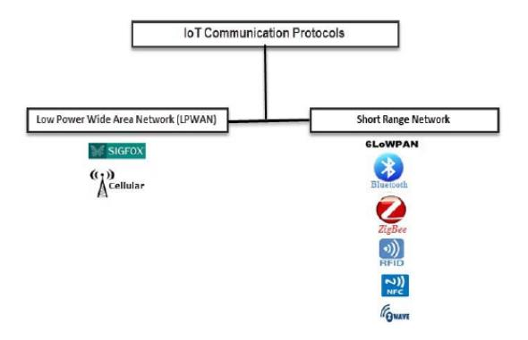

**Fig 1-** IoT Communication Protocols [23]

The former, Low Power Wide Area Networks (LPWANs) has a longer range of several kilometers but lower data rates, and includes the protocols 6LoWPAN, LoRaWAN, Sigfox, NB-IoT. [22] [23]

The second category Wireless Personal Area Networks (WPANs) have a range of up to 100 meters and a data rate of up to 250 kbps in Zigbee or up to 3 Mbps with Bluetooth Low Energy, so they can be used in short-range IoT applications.

|                    | 6LoWPAN                                                                     | ZigBee                                   | BlueTooth                    | RFID                                          | NFC                                           | SigFox                              | Cellular                                                                           | Z-Wave                                     |
|--------------------|-----------------------------------------------------------------------------|------------------------------------------|------------------------------|-----------------------------------------------|-----------------------------------------------|-------------------------------------|------------------------------------------------------------------------------------|--------------------------------------------|
| Characteristics    | GLoWPAN                                                                     |                                          | LE **                        | •)))                                          | NFC                                           | <b></b> SIGFOX                      | <b>((,))</b>                                                                       | <b>WAVE</b>                                |
| Standard           | IEEE 802.15.4<br>[18]                                                       | IEEE802.15.<br>4<br>[18]                 | IEEE<br>802.15.1<br>[18]     | RFID [18]                                     | ISO/IEC 14443<br>A&B,JIS X-6319-<br>4<br>[30] | SigFox<br>[20]                      | 3GPP and<br>GSMA,<br>GSM/GPRS/E<br>DGE (2G),<br>UMTS/HSPA<br>(3G), LTE (4G)<br>[7] | Z-Wave<br>[18]                             |
| Frequency<br>Bands | 868Mhz(EU)<br>915Mhz(USA)<br>2.4Ghz(Global)<br>[12]                         | 2.4 GHz<br>[19]                          | 2.4 Ghz<br>[15]              | 125 kHz,<br>13.56 MHz,<br>902-928 MHz<br>[31] | 125Khz<br>13.56Mhz<br>860Mhz<br>[15]          | 868MHz (EU)<br>902MHz(USA)<br>[20]  | Common<br>Cellular bands<br>[31]                                                   | 868 MHz -<br>908 MHz<br>[12]               |
| Network            | WPAN<br>[23]                                                                | WPAN<br>[23]                             | WPAN<br>[23]                 | Proximity<br>[10]                             | P2P Network<br>[23]                           | LPWAN<br>[10]                       | WNAN<br>[20]                                                                       | WPAN<br>[23]                               |
| Topology           | Star<br>Mesh Network<br>[16]                                                | Star ,Mesh<br>Cluster<br>Network<br>[19] | Star –Bus<br>Network<br>[16] | P2P Network<br>[04]                           | P2P Network<br>[14]                           | Start Network<br>[20]               | NA<br>[05]                                                                         | Mesh<br>Network<br>[19]                    |
| Power              | (1-2 years<br>lifetime on<br>batteries)<br>Low power<br>consumption<br>[14] | 30 mA<br>Low power<br>[26]               | 30 mA<br>Low Power<br>[26]   | Ultra-low power                               | 50 mA<br>low power<br>Very Low<br>[30]        | 10 mW -<br>100 mW<br>[20]           | High power<br>consumption<br>[05]                                                  | 2.5 mA<br>Low power<br>consumption<br>[14] |
| Data Rate          | 250 kbps<br>[15]                                                            | 250 kbps<br>[16]                         | 1Mbps<br>[15]                | 4 Mbps<br>[18]                                | 106<br>212 or 424 kbps<br>[15]                | 100 bps(UL),<br>600 bps(DL)<br>[20] | NA<br>[05]                                                                         | 40kbps<br>[17]                             |

**Fig 2-** Comparison of IoT protocols Communication [23]

<span id="page-23-0"></span>In IoT systems, communication is key. Data Distribution Service (DDS) and Message Queuing Telemetry Transport (MQTT) are two popular protocols of middleware applied in robotics. DDS is a real-time, scalable and high-performance data distribution protocol, and is therefore suitable to complex robotic systems that demand low-latency communication. [24]

MQTT, by contrast, is a simple, publish-subscribe messaging protocol, but it is extensively used in the IoT because of its simplicity and efficiency. It is especially suitable in situations, where there is limited or intermittent bandwidth.

MQTT is a power-efficient, reliable, and lightweight communication protocol with the publish/subscribe architecture that is commonly used in the Internet of Things (IoT) because it ensures decoupling between clients and allows them to exchange data in an

event-driven manner. MQTT is primarily TCP/IP based in the application layer with a central broker to control clients [25].

connections, message filtering, persistence and delivery. The main benefits are low bandwidth consumption, low power consumption, multicasting, disconnection mechanisms built-in, three Quality of Service (QoS) levels that trade efficiency and reliability. Comparative studies reveal that MQTT is strong in reliability, efficiency, and adoption, which, however, relies on TLS/SSL to provide security and does not support advanced native provisioning as used by other protocols such as CoAP.

By combining these protocols with the ROS 2 middleware that is used to design the latest robots, the flexibility and scalability of robotic applications are improved. ROS 2 has builtin support of DDS with features such as Quality of Service (QoS) policies and real-time functionality.

## **2.3.3.1 ROS 2 in Humanoid Robotics**

ROS 2 is an open-source robotics middleware, which is a collection of software libraries and tools to simplify the creation of robotic applications. It provides options like real-time communication, modularity, and multiple programming language support. The architecture of ROS 2 is rooted in DDS to allow scalable and reliable communications between distributed components.

The ROS 2 has been incorporated in humanoid robotics due to its scalability and increased demand of sophisticated functions. Nevertheless, there are difficulties in combining ROS 2 and mobile and web applications with network configuration, data synchronization, and system security.

## **2.3.3.2 ROS 2 as HARP's Operational Core**

The Humanoid Assistive Robotic Platform (HARP) needs a complex, generalized, and performant software platform, making ROS 2 the default standard option. The architecture of ROS 2 directly allows the complexity and simultaneous nature of a humanoid social robot.

## **2.3.3.3 Modularity and Concurrency in ROS 2**

ROS 2 divides the functional units of a robot-like vision processing, navigation, voice synthesis, and motor control into separate units of concurrent execution called Nodes. The communication between these nodes is mainly based on Publisher/Subscriber (Pub/Sub) pattern. This modularity guarantees that failure in one of these complex components does not bring the entire system down which is a critical requirement of a highly available receptionist robot. It can also be deployed in a distributed fashion, which is useful in offloading compute-intensive work to an edge server.

## **2.3.4 Security in IoT Robotic Systems**

IoT systems are vulnerable to different threats, such as unauthorized access, data breach, and denial-of-service attacks, and the security is a critical aspect of them. To secure sensitive information and provide the safe functioning of robotic systems, it is crucial to implement strong security measures.

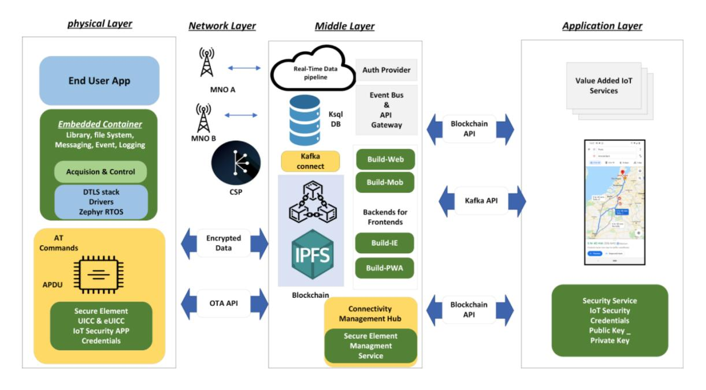

**Fig 3-** Structure of the proposed four-layered architecture [29]

## **2.3.4.1 Security Risks in IoT Architecture**

The distributed nature of IoT systems and their heterogeneity is a challenge to the security of these systems; it is usually structured into layers, perception, network, and application.

In the Perception (Sensing) Layer, node capture, malicious fake nodes, replay attacks, and timing attacks are the most common attacks in IoT devices. The node capture is a serious risk because the sheer amount of IoT devices is augmenting the size of the network attack surface, enabling an attacker to seize control of key nodes, including gateways, and retrieve valuable information. [27]

The Network (Transmission) Layer has security issues that are mainly concerned with integrity and authentication of information exchanged. Denial of Service (DoS) attacks such as flooding are used to cripple network resources, which do not allow normal communication to occur. In the IP fragmentation attacks, the network lacks a Maximum Transmission Unit (MTU) and the hackers take advantage of the network to attack the network and the network collapses as a result of failed reassembling of the packets. [27]

The IoT applications are diverse and complex, which further increases the potential security risks at the Application Layer. Typical threats are cross-site scripting (XSS) in which malicious scripting is injected into trusted domains in order to abuse applications or misuse legitimate data and malicious code attacks such as virus, worms or backdoors, which are developed to disrupt operations or compromise systems and may bypass the operation of traditional antivirus. Cinderella attacks spoil system clocks to run out security software before its expiry time runs out, making defenses useless. Moreover, processing and management of large IoT networks with big data may overburden network infrastructure and processing, which may result in information loss, network instability, or inefficient operations.

All these threats highlight the importance of multi-layered security solutions that effectively address the specific vulnerabilities of each IoT layer.

## **2.3.4.2 ROS 2's Advancements in security**

ROS 2 was much better than ROS 1 as it had to deal with the challenges of improved realtime performance and security. ROS 2 deals with security issues by introducing the DDS-Security specification that offers authentication, authorization, encryption, and access control. These are important characteristics that have ensured the integrity and confidentiality of communication between mobile/ web applications and robotic platforms. The DDS middleware offers tunable QoS policies, which is necessary to make sure that critical commands are sent with greater reliability and urgency compared to non-critical telemetry information. [27]

The improved security measures of ROS 2 also called as Secure ROS 2 (SROS 2) are essential in a robot to manage sensitive administrative tasks. SROS 2 practices security measures as per the DDS Security standard which deals with:

Authentication: Nodes mutually verify each other with the help of digital certificates to make sure that only trusted components are able to communicate.

Access Control: XML-based policies that indicate which nodes have permission to publish or subscribe to certain topics thus preventing the actuator command topics to unauthorized internal or external access.

Although SROS 2 offers a powerful internal security service its focus is on the local server of the DDS network of the robot and not the external internet-based administrative service that also needs a security layer [28]

## **2.4 World Perception and Object Recognition**

Today we have mobile robots designed to operate safely and efficiently with people within the homes, hospitals and in places of worship. In order to accomplish this, they need to have a clear vision and perception of the environment. This task is managed by the Enhanced World Perception and Object Recognition Module that assists the robot in identifying, recognizing and reading moving and stationary objects.[31]

This module enables the detection of objects, recognition of people's cognition of its environment and makes intelligent movement or action choices. This module provides the robot with the ability to quickly and safely perceive its environment and make human-like decisions.

This system enables the robot to freely identify the objects it must manipulate and communicate effectively with humans. In this review we will consider how contemporary robots are able to gain such perception by using cameras, sensors, deep learning and sophisticated algorithms [31]

## **2.4.1 Object Detection and Recognition**

One of the most important tasks in enhancing a more precise detection of objects in images has been image classification. Nonetheless, it requires more to conduct object detection because it must be combined with analyzing the concept and location of objects within a photograph. The proper motion estimation and compensation algorithms are needed to track the object in the large data surveillance with accuracy. The research suggested the hardware architecture of the motion detection, estimation and compensations in real-time application. Kogge-stone adder is used to enhance the speed of working of the architecture. Nonetheless, to have cost-effective, simple and effective solutions the integrated robot system has been proposed that has applied cartesian and articulated configuration in the detection of objects by mobile robots. However, the suggested design should be able to cooperate with humans because the level of accuracy is low. The connotation of object detection as an act that would restore the demographic location just in case it has instances of objects belonging to the supposed categories. It is a task that focuses on marking instead of enormous options of natural objects instead of assigning them to particular trees such as faces, trees or cars. But of the many ready-made objects, the fact remains that most research was carried out on exceptionally organized objects (e.g. faces, airplanes) and articulated objects such as animals. In addition, object recognition executes various functions in several applications such as face recognition, self-driving, and human behavior analysis [32].

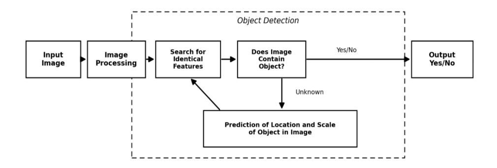

**Fig 4-** The standard process of Object detection [32]

Deep learning algorithms are applied by modern robots in this task. Real-time object detection models such as YOLOv5, YOLOv8 (You Only Look Once) and Efficient are able to identify objects. They assist the robot in identifying individuals, furniture, doors and other items almost immediately. To see it in more detail, segmentation models like Mask R-CNN or Transformers-based models (like DETR) may describe the objects pixel by pixel. This enables accurate movements such as holding a bottle or evading a small toy on the floor.[32]

## **2.4.2 Perception**

Perception is the process through which a system gathers information from its environment and interprets it to gain meaningful understanding. In humans, perception occurs through senses such as vision, hearing, and touch and the brain processes this sensory input to help us respond appropriately. In robotics and artificial intelligence, perception refers to a robots ability to use sensors such as cameras, LiDAR, ultrasonic sensors and microphones to collect data about its surroundings and analyze it using algorithms and machine learning models. This process allows the robot to recognize objects, detect obstacles, identify people and understand spatial relationships in its environment.

Robot perception typically involves several stages. First, the robot collects raw sensory data. Next, the data is processed to remove noise and extract useful features. Then, advanced techniques such as computer vision, deep learning, and sensor fusion are used to interpret the data and identify meaningful patterns. For example, object detection models help the robot determine what objects are present and where they are located, while SLAM (Simultaneous Localization and Mapping) enables the robot to build a map of its environment and track its own position within that map. Finally, the interpreted information is used to make decisions and perform actions, such as navigating safely, avoiding obstacles, or interacting with humans [34].

Perception is essential for autonomous and intelligent robotic systems. It enables robots to operate safely in dynamic environments like homes, hospitals, and public spaces. Accurate perception improves safety by preventing collisions, enhances autonomy by reducing the need for human control and supports effective human-robot interaction. However, perception also presents challenges, including varying lighting conditions, occlusion of objects, sensor noise, and the need for real-time processing. Despite these challenges, advances in deep learning and sensor technology continue to improve the reliability and capability of robotic perception systems [34].

## **2.4.3 Deep Learning**

Deep Learning can be classified as a form of ML approach, in which the most salient features of any data are processed. Intelligence studies are based on both deep learning and ML though; there is a limit to what ML is capable of in computer vision. However, the functionality of deep learning will contribute to the realization of the in-depth ML model with various algorithm developments. The use of a deep learning algorithm in robotics assists in the object detection domain. Since it has been the most topical field in the field of computer vision, real-life examples such as autonomous vehicles, pedestrian detection, face recognition, or video surveillance require comprehensive research of algorithms. Object detection is a field of application that favors deep learning because it engages in low-level feature development after which it is subjected to critical enhancement. Since computer vision is a process of extracting features on an image, referred to as image classification, the diversity of prints enables it to fit easily as inputs in deep learning. However, the deep neural network designs have differed depending on the performance detection considering the existence of various detectors, single-stage and two-stage detectors.[34]

## **2.4.3.1 Single stage and two-stage detectors**

Object detection models are generally divided into two main categories which are singlestage detectors and two-stage detectors. Both types aim to identify objects in an image and determine their locations by drawing bounding boxes, but they differ in how they perform this task. Single-stage detectors complete object localization and classification in a single step using one neural network. They directly predict bounding boxes and class probabilities from the input image without generating separate region proposals. Because the entire detection process is performed in one pass, single-stage detectors are typically faster and more suitable for real-time applications such as mobile robotics, autonomous driving, and video surveillance. Common examples of single-stage detectors include YOLO (You Only Look Once), YOLOv3, and SSD (Single Shot MultiBox Detector). Although they offer high speed and efficiency, they may sometimes provide slightly lower accuracy compared to two-stage detectors especially when detecting small objects.[35]

In contrast, two-stage detectors divide the detection process into two separate steps. In the first stage, the model generates region proposals that indicate possible object locations, often using a Region Proposal Network (RPN). In the second stage, these proposed regions are classified and refined to produce the final bounding boxes and object labels. Because two-stage detectors analyze candidate regions more carefully, they generally achieve higher detection accuracy, particularly for small or complex objects. Examples of twostage detectors include R-CNN, Fast R-CNN, and Faster R-CNN. However, this increased accuracy comes at the cost of slower processing speed and higher computational requirements. In practical applications, single-stage detectors are preferred when real-time performance is critical, while two-stage detectors are chosen when accuracy is the main priority.[35]

## **2.4.3.2 YOLOv5**

YOLOv5 has become an important advancement in mobile robot perception because it offers a strong balance between speed, accuracy, and ease of use. One of its main advantages is real-time object detection, which allows robots to quickly understand what is happening around them. This fast processing is especially important for mobile robots that must make immediate decisions while navigating dynamic environments such as homes, hospitals, or public spaces [33].

Another key strength of YOLOv5 is its efficiency. The model is lightweight and optimized, which means it can run on small robotic platforms with limited computing power, such as embedded systems and edge devices. Despite its compact design, it maintains high detection accuracy for various objects, including people, furniture, tools, and obstacles. This makes it suitable for applications like service robots, delivery robots, and assistive robotic systems.

YOLOv5 is also relatively easy to integrate into robotic systems due to its flexible architecture and compatibility with common deep learning frameworks. Developers can train it on custom datasets, allowing robots to recognize task-specific objects in real-world environments. As a result, robots can convert visual information into meaningful actions, such as avoiding obstacles, grasping objects, or interacting safely with humans [33].

Today, YOLOv5 serves as a foundation for intelligent mobile robotics. By transforming raw camera input into actionable understanding, it supports the development of autonomous, safe, and interactive robots. Its combination of performance, efficiency, and adaptability continues to drive progress toward more responsive and human-aware robotic systems [33].

## **2.4.3.3 YOLOv8**

The speed, versatility, and precision of YOLOv8 have made it a staple of contemporary mobile robot perception. It allows robots to work in real-world scenarios with assured visual perception and quick reaction. YOLOv8 provides better results in both inference speed and precision compared to previous generations such as YOLOv5, as well as twostage detectors such as Faster R-CNN, and has a lightweight architecture, which can be deployed to embedded systems. With the ongoing development of mobile robots towards greater autonomy and human-like interaction, the efficient object detection pipeline of YOLOv8 is crucial in the pursuit of intelligent, safe, and context-aware robotic action.[36]

For mobile robotics, the speed and efficiency of YOLOv8 are its most significant advantages. Because the architecture is highly optimized and lightweight, it can run on small, on-board computers and embedded devices without requiring a connection to a powerful external server. This enables robots to navigate complex and busy environments, such as homes or hospitals, with immediate reaction times and high confidence. By transforming raw visual data into real-time actionable understanding, YOLOv8 is a key technology in the pursuit of safer, more autonomous, and more interactive robotic systems.

## **[Chapter 3 – ENHANCED PERCEPTION FRAMEWORK AND](#page-13-0) [IoT ADMINISTRATIVE CONTROL](#page-13-0)**

## **3.1 Overview**

The HARP IoT and Administrative Control system serves as the primary bridge between human operators and the robot's internal ROS 2 architecture, facilitating remote management and real-time oversight. The interface is built as a web-native application that communicates via WebSockets and the Ros bridge Suite, allowing for low-latency, bidirectional data flow without the need for high-overhead software installations on client devices. This administrative hub enables users to monitor critical telemetry such as battery levels and navigation status—while also managing visitor interactions through a dedicated check-in module that logs data into a persistent SQLite database.

Central to its functionality is the integration of high-level interaction controls that trigger the robot's conversational pipeline. The dashboard utilizes the browser's built-in Web Speech API to handle local Speech-to-Text (STT) and Text-to-Speech (TTS), which optimizes performance by offloading audio processing from the robot's main processor. This architecture ensures that the Raspberry Pi 5 and ESP32 hardware can prioritize motor control and YOLOv8 perception tasks, while the IoT layer provides a robust "human-inthe-loop" safety mechanism for emergency stops and manual overrides.

## **3.2 IoT Infrastructure and Web-Based Application**

During the earlier stage of development, the Humanoid Assistive Robotic Platform (HARP) was mostly a localized intelligent agent, using a state-of-the-art conversational pipeline which includes Whisper as a powerful speech-to-text transcription system, Gemini 2.0 Flash as a high-context natural language understanding system and Piper TTS as an emotive vocal synthesis system. Although this created a natural interface between human and robot, the system did not have an external oversight system and a real time hardware diagnostic layer, restricting its application to professional assistive systems. To close this gap, we suggested an IoT-based Web application that is connected to the current ROS 2

Humble framework using micro-ROS agents. This growth makes HARP look like a complete system, rather than a single talker, so remote caregivers can view real-time telemetry data, live video streams and manually override teleoperation controls on the central web dashboard, assuring a greater level of safety and operational transparency.

The main aim was to transform HARP from a localized robotic unit into a cloud-based assistive platform. This included the establishment of a strong communication channel that has enabled real time feedback and high-level override of commands through a web or interface so that the robot can be available even when the operator is outside the local network. The communication framework of HARP is the IoT. It connects the high-level cognitive functions (the Gemini LLM) and the low-level physical actuators.

## **3.2.1 Role of IoT in Assistive Robotics**

A robot will not be able to work in isolation in an assistive scenario. The IoT layer will be used to enable Remote Presence, whereby a member will be able to check the health of the robot and the surroundings of the user wherever in the world they are without the need to be physically present, which will act as a safety net to the autonomous AI.

## **3.2.2 System Architecture Communication Bridge**

The dashboard was developed to be a high-level interface in the ROS 2 Humble ecosystem. The robot also has a WebSocket server that translates ROS 2 topics to JSON strings. These are then interpreted by the web dashboard to refresh the UI. This enables the HARP platform to be remotely operated with any device with a browser whether a tablet, smartphone, or laptop without the user needing to install ROS 2 locally.

#### ➢ **Frontend (User Interface)**

An interactive web dashboard created using HTML/CSS and JavaScript. This enables users to communicate with the robot without having any technical skills regarding ROS 2.

#### ➢ **Middleware (ROS Bridge)**

To establish a WebSocket link between the web dashboard and the ROS 2 environment, we used the *rosbridge\_suite*. This converts the JSON messages sent by the browser to ROS 2 topics.

#### ➢ **Backend (ROS 2 Telemetry Node)**

One central Python node (telemetry\_node.py) controlling the state of the robot. It is a Publisher (sends battery and location information to the UI) as well as a Subscriber (receives visitor check-in information to the UI).

## **3.2.3 Visitor Logging & Database Integration**

HARP uses a distributed messaging model to acquire data. The robot does not have a single source of data but uses various entry points to get it.

- ➢ Data Handling: When a visitor enters the information about their name and purpose using the dashboard, the information is encoded in a JavaScript object and sent to the /visitor-log topic.
- ➢ Autonomous Feedback: When the message is received, the *telemetry\_node* parses the information and stores into an SQLite database to keep a record.
- ➢ Confirmation Loop: The system will have a visual confirmation loop at the dashboard (e.g. Welcome, Noor Logged!).

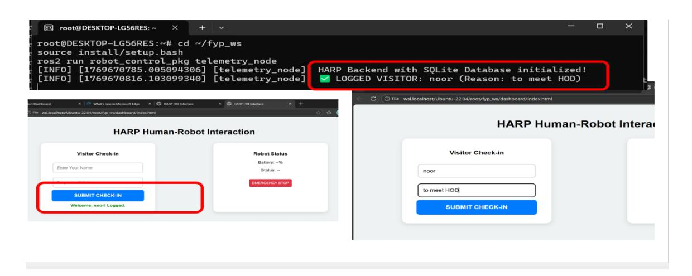

**Fig 5-** Micro-ROS agent is listening for a connection from ESP32

**3.2.4 Real-Time Telemetry & Status Monitoring**

One of the fundamental pillars of HARP is the execution of Robot Self-Awareness, a

functionality that aims at improving Human-Robot Trust by making the State transparent.

It does this through a centralized telemetry system which constantly checks on the internal

diagnostics such as power control level and navigation milestones. The platform enables

the user to see the precise mental model of the current capabilities and environmental

constraints of the robot by overlaying these vital on a real-time web-based dashboard. This

2-way flow of information between internal sensors and a human readable interface

alleviates doubt in autonomous operation and keeps the operator up to date with system

health or navigation changes.

➢ **State Monitoring** 

To keep the operator updated on the robot's health at all times, the robot regularly transmits

its health status, such as battery (e.g. 88%) and current position (e.g. Lobby).

➢ **Perception Feedback**

The UI displays current environmental perception ("Stable" or "Path Clear"), which is vital

for building trust between the human and the robot.

**Fig 6-** System Health

25

## **3.2.5 Humanoid Voice Synthesis (TTS)**

The HARP platform adopts Multimodal Audio Feedback System, which aims to fill the gap between digital data processing and natural human interaction. This system is a realtime vocal response unit which translates internal system triggers like a successful visitor registration or diagnostic alerts into audible speech. With the help of a Text-to-Speech (TTS) engine that is connected to the web dashboard through the Web Speech API, the robot gives immediate audio feedback effectively completing the interaction loop in the user. This sound layer is not a mere convenience; it plays a fundamental part in the humanrobot trust as it humanizes the object and provides the user with an explicit and understandable feedback without the need of constantly checking a screen, irrespective of the potential level of technical expertise.

#### ➢ **Offline Synthesis**

In order to make the robot capable of interacting in any environment that is not connected to the internet, we adopted an offline Text-to-Speech (TTS) engine in pyttsx3 and espeak.

#### ➢ **Hardware Integration**

WSL2 audio driver limitations were solved and the voice of the robot is heard and understood in real life testing.

## **3.2.6 The HRI Dashboard**

A custom-made dashboard has been created with the help of HTML5, CSS3, and JavaScript. The HRI Dashboard provides a connection between the ROS 2-based brain of the robot and the human operator, and uses a dynamic web-based interface to offer realtime observability, visitor management data persistence, and multimodal interaction through voice and visual feedback.

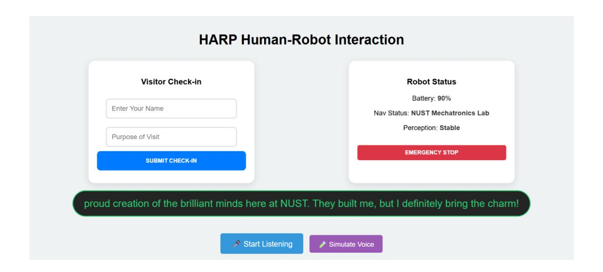

**Fig 7-** HARP Human Robot Interaction

## **3.2.7 Communication Protocol (ROS Bridge)**

In order to allow the web browser to communicate with the ROS 2 environment, a Ros bridge WebSocket was developed. This allowed for:

- **Bidirectional Data Flow:** Enabling the dashboard to both "listen" to sensors (Subscribing) and "send" commands (Publishing).
- **Serialization:** Ensuring all data packets transferred between the hardware and the IoT layer adhered to strict JSON standards for consistency.

## **3.2.7.1 Advanced Integration Gemini 3 Live**

The sophisticated incorporation of Gemini 3 Live into the HARP framework is a transition to non-traditional command-based interfaces to an organic and stateful conversational environment. The platform supports multimodal and low-latency interactions with realtime processing of continuous audio and visual streams by connecting a persistent WebSocket channel to the Gemini Live API. This integration makes it possible to support barge-in, and enables the robot to respond with grace to user interruptions, and affective conversation, in which the system will alter its voice and speed in response to the acoustic signal that the user is speaking. Moreover, the HRI pipeline makes good use of the native audio processing of the Gemini 3 Flash model, which is capable of decoding intent and context without the historical overhead of separate transcription and synthesis layers, and thus provides a human-like response cycle, which is the key to effective assistive robotics in dynamic institutional settings.

In order to develop HARP to be more than a simple keyword-based command, the Gemini 3 live Multimodal API was incorporated into the HRI layer. The Gemini integration enables HARP to interpret context and intent, unlike the traditional robots that do not comprehend the intent. When a user gives a need, Gemini interprets this intent and proposes a navigation goal. The dashboard uses the Web Speech API to give visual feedback (subtitles) of the conversation in real-time, making it more accessible to hearingimpaired users.

## **3.2.7.2 Managing Latency in the WSL2 Environment**

Working on WSL2 (Windows Subsystem for Linux) posed its own networking issues, namely the manner in which the dashboard communicates with the hardware. WSL2 uses a virtualized network bridge that occasionally masks the IP address of the robot by the host Windows browser. We set up the dashboard to connect to the internal IP of the host and used port forwarding. This was critical in the fact that the MQTT broker and ROS bridge was able to exchange data packets with milliseconds latency, which is essential in ensuring that the robot did not run over the object because of the lag.

## **3.2.7.3 Optimized HRI Pipeline**

The Optimized HRI Pipeline: the next big step in conversational capability is the move away to a high-performance streaming architecture instead of the usual request-response interaction. The system uses the modern version of the google-Genia 1.73.1 SDK to avoid the latency involved in waiting until a full text response has been given by the Gemini 3 Flash model; rather, it receives the token chunks and publishes them to the /robot speech topic as they appear. This parallel processing can enable the Whisper-based voice-to-text input to elicit a nearly immediate auditory and visual display on the dashboard, greatly

decreasing the cognitive distance that is commonly an issue in human-robot interaction. The pipeline reduces this latency, so that HARP feels like a natural conversation, and it is a highly responsive assistive platform able to follow the rhythms of human speech in a dynamic campus setting.

## **3.3 Persistent Data Management (SQLite)**

## **3.3.1 Database Implementation for Visitor Logging**

 A persistent storage layer was used to secure the accountability and safety of the HARP platform in office setting with the help of SQLite3. Although the HRI dashboard is interactive in nature, the SQLite backend will be used to make sure that all visitor information such as names, visit purposes, and times is stored so that even when the system goes offline, all the information will be stored.

## **3.3.2 Data Schema and Normalization**

The database is relational in nature and the data on visitors is stored. There is a special Python node, which is the Database Manager, which subscribes to the visitor-log topic. Upon receiving a JSON packet via the dashboard, the node parses the information and inserts it in the SQL with an INSERT command.

**Fig 8-** Structured data storage within the SQLite database

## **3.3.3 Integration with ROS 2**

The SQLite integration is based on a Service-Provider pattern. The system provides a Zero-Loss logging architecture by utilizing the Python library, sqlite3, in a ROS 2 node. This makes certain that all the interactions that the Humanoid Assistive Robotic Platform does are auditable providing necessary information to the administration or security audits.

The project focused on creating a Bridge Architecture between the middleware of the robot inside and the cloud protocols outside.

- **ROS 2 to Gateway Communication:** Utilizing micro-ROS and custom nodes to extract vital telemetry (battery levels, joint states, and diagnostic logs) from the hardware.
- **Protocol Selection MQTT:** Implemented for lightweight, asynchronous telemetry data. This ensured low bandwidth consumption for constant state updates.

**Web Sockets:** Utilized for low-latency, full-duplex command streaming, essential for realtime "tele-operation" features.

• **Backend & API:** Creation of a centralized server (with Node.js or Python) which will serve as a broker and will take in authentication and routing commands issued by the HARP web application and send them to the robot command velocity topics.

## **3.4 Computer Vision System for HARP**

Computer Vision is a branch of Artificial Intelligence (AI) which trains computers to perceive and interpret the visual world. Machines can point with great precision to identify and categorize objects and respond to what they view using the digital images captured by the cameras and videos in conjunction with deep learning models. It is the technology of self-driving cars, facial recognition, medical imaging and much more. The Computer Vision aspect of the HARP system was created in this project to allow the system to sense the surrounding in real time.

Also, recognition methods enable the system to distinguish and identify objects or people according to the visual patterns that are learned. Computer vision systems are often measured by performance in terms of accuracy, processing speed, and resistance to changes due to variations like lighting, occlusion, and background complexity. In order to enhance the efficiency and the real time performance, optimization techniques are commonly used. General computer vision forms the basis of allowing intelligent systems to see, and respond to the physical world like human vision.

Everything was built in Python, and deployed on an Ubuntu terminal environment, and run with the YOLOv8 deep learning framework one of the most advanced real time vision models on the market today.

## **3.4.1 Object Detection with YOLOv8**

Object Detection refers to the process of determining the location and the type of one or more objects in an image or video frame. In comparison with the process of simple image classification (which merely tells what can be found in an image), object detection creates a bounding box around all objects that have been detected and the objects are named by a category and a confidence score.

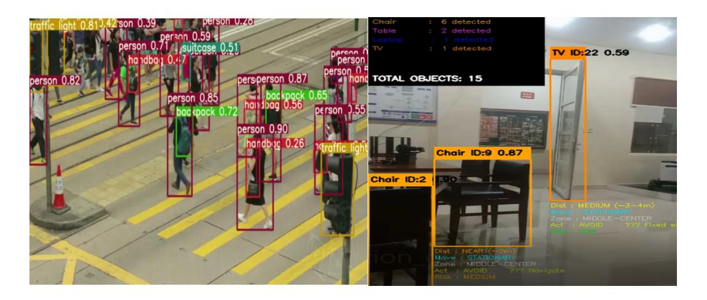

**Fig 9-** Object Detection in IoT Lab

The identity and location of various objects in a single frame is possible by each detected object being represented with its position in the form of a set of coordinates. The method is most commonly employed in real-time systems like surveillance, robotics, autonomous vehicles and assistive systems of which precise and quick object recognition is key to decision-making and interaction with the environment.

## **3.4.1.1 How YOLOv8 Object Detection Works**

YOLO is an acronym for You Only Look Once. The conventional object detectors scanned an image repeatedly with a sliding window method, which was slow. YOLO is an entirely different method that considers the whole image only once, and it makes predictions of all bounding boxes and class labels in a single forward neural network pass. This renders it very rapid and yet precise.

The YOLOv8 model subdivides the input image into a grid of cells. Each cell has the task of predicting objects whose center lies within the cell. In each prediction, YOLOv8 yields:

- Bounding box coordinates (x, y, width, height)
- A confidence score (how certain the model is)
- Class probabilities (what type of object it is)

YOLOv8 with respect to an input image divides it into feature maps and estimates bounding boxes, class probabilities and confidence scores of several objects simultaneously. Each identified object is encoded with its spatial position and classification label that enables the system to know what the object is and its position in the image or video frame.

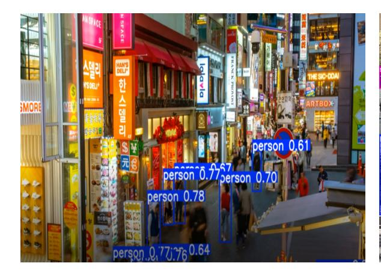

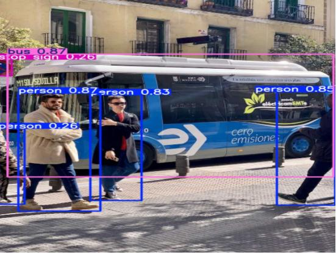

 **Fig 10-** Person Detection using Yolov8 **Fig 11-** Object Detection using Yolov8

## **3.4.1.2 Flowchart Object Detection Pipeline**

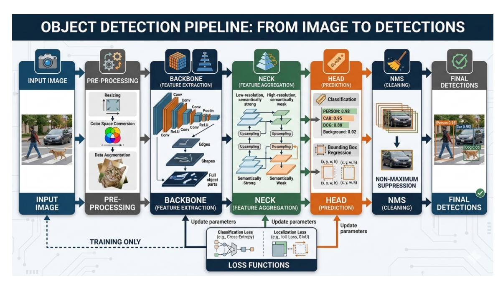

**Fig 12-** Flowchart Object detection [32]

## **3.4.1.3 Running Object Detection Code**

The object detection module is initiated through a dedicated ROS 2 launch file that executes the vision nodes and loads the trained network weights into memory. Once running, the script continuously processes the raw video stream from the robot's camera feed, mapping detection bounding boxes to ROS 2 topics for downstream navigation and interaction decisions.

## **3.4.1.4 Basic Image Detection**

Below is the simplest way to run YOLOv8 object detection on an image using Python. Open a new file named detect\_image.py and type the following:

```
from ultralytics import YOLO
import cv2
# Load the YOLOv8 model (nano version for faster processing)
model = YOLO('yolov8n.pt')
```

```
# Run object detection on an image
results = model('test_image.jpg')
# Display the result with bounding boxes
results[0].show()
```

When you run this, YOLOv8 will automatically download the pre-trained weights (yolov8n.pt) the first time. The output shows your image with colored bounding boxes and labels drawn on every detected object.

## **3.4.1.5 Real-Time Webcam Detection**

For the HARP system, we used a live camera feed. The following script opens the webcam and runs detection on every frame in real time:

```
from ultralytics import YOLO
import cv2
model = YOLO('yolov8n.pt')
cap = cv2.VideoCapture(0) # 0 = default webcam
while True:
 ret, frame = cap.read()
 if not ret:
 break
 results = model(frame, stream=True)
 for result in results:
 annotated = result.plot() # draws boxes
 cv2.imshow('HARP Object Detection', annotated)
 if cv2.waitKey(1) & 0xFF == ord('q'):
 break
cap.release()
cv2.destroyAllWindows()
```

## **3.5 Object Tracking with YOLOv8**

Object Detection informs us on the positions of objects in one frame. Object Tracking is even more detailed, allocates each detected object a unique ID and tracks it through a series of frames. This is necessary in robotics and surveillance where we require to know not only what is there but its temporal movement. Object tracking is a computer vision method, which deals with object detection in a video and tracking its motion through multiple frames. After identifying an object, the system gives the object a unique identity and changes its position as it travels through the scene. This enables the system to be consistent and to know the motion pattern of objects with time.

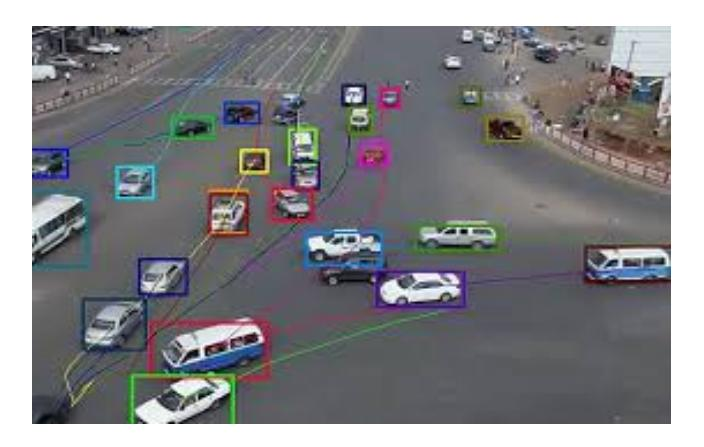

**Fig 13-** Object Tracking of Vehicles [32]

The tracking of objects usually involves the detection output and motion prediction in determining the expected location of the object in the subsequent frame. It has extensive applications in surveillance systems, autonomous navigation where it is necessary to track movement and preserve object identity in real-time to make decisions and interact with dynamic environments.

## **3.5.1 Why Tracking Is Different from Detection**

The detection process is stateless, meaning that each frame is processed independently. When you do detection with 100 frames, you obtain 100 disconnected sets of bounding boxes. Tracking is a stateful because it has a memory of objects and attempts to connect detections across frames such that Object #1 in frame 10 is the same person/car as Object #1 in frame 50.

The concept of the temporal identity is the fundamental difference between Detection and Tracking. Whereas tracking develops a story of how the world evolves over time

*Table 2- Comparison between Stateless Detection and Stateful Tracking*

| Feature    | Detection (Stateless)                    | Tracking (Stateful)                                           |  |
|------------|------------------------------------------|---------------------------------------------------------------|--|
| Input      | Single Frame                             | Sequence of Frames                                            |  |
| Identity   | No<br>concept<br>of<br>"Same<br>Object"  | Assigns Unique IDs (ID 1, ID 2, etc.)                         |  |
| Context    | Spatial (where is it now?)               | Temporal (where was it, where is it<br>going?)                |  |
| Resilience | Fails if the object is briefly<br>hidden | Can<br>"predict"<br>location<br>during<br>brief<br>occlusions |  |
| Speed      | Usually slower per frame                 | Usually<br>faster<br>(if<br>using<br>motion-only<br>tracking) |  |

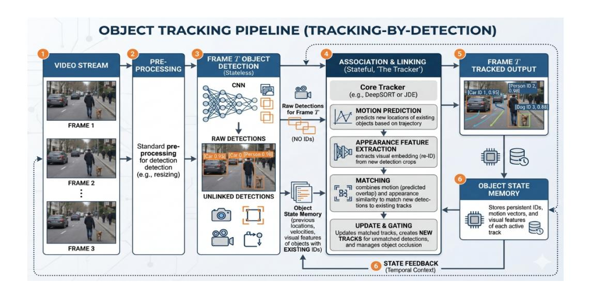

**Fig 14-** Flowchart Object tracking [32]

## **3.5.2 Algorithms Built into YOLOv8 Tracking**

YOLOv8 natively supports two powerful tracking algorithms.

*Table 3- Comparison between ByteTrack and BoT-SORT Tracking Algorithms*

| Algorithm | How It Works                                                                                                | Best For             |
|-----------|-------------------------------------------------------------------------------------------------------------|----------------------|
| ByteTrack | Tracks every detected box, even low-confidence ones. Very robust in crowded scenes.                         | Default, general use |
| BoI-SORT  | Combines appearance features<br>(what objects look like) with<br>motion prediction. Better ID<br>retention. | High accuracy needs  |

## **3.5.3 Image Segmentation**

Image Segmentation is a step further to object detection. Segmentation produces a mask that outlines the exact shape of each object, in pixel detail, instead of the rough shape of an object in a simple rectangular bounding box. Imagine it is coloring in everything in a picture, but not simply making rectangles around the objects. Image segmentation is a computer vision method, which entails the breaking down of an image into several significant parts on pixel-level in order to simplify the process of analyzing and interpreting the image. As opposed to image classification where an image is classified under one label, segmentation gives the finer details by giving the precise location of objects in the image. Every pixel is categorized as a certain category enabling the accurate division of various objects or areas.


**Fig 15-** Segmented vs Original [32]

## **3.5.3.1 Running Segmentation Code Walkthrough**

To use segmentation, you simply load a different YOLOv8 model weight file the '-seg' variant. Everything else remains the same as object detection.

```
from ultralytics import YOLO
import cv2
# Load segmentation model (note: yolov8n-seg.pt)
model = YOLO('yolov8n-seg.pt')
cap = cv2.VideoCapture(0)
while True:
 ret, frame = cap.read()
 if not ret:
 break
 results = model(frame)
```

```
 for result in results:
 # result.masks contains the pixel masks
 annotated = result.plot() # draws masks 
automatically
 cv2.imshow('HARP Segmentation', annotated)
 if cv2.waitKey(1) & 0xFF == ord('q'):
 break
cap.release()
cv2.destroyAllWindows()
```

Accessing raw mask data for custom processing**:**

```
for result in results:
 if result.masks is not None:
 masks = result.masks.data # Tensor of shape [N, H, 
W]
 for i, mask in enumerate(masks):
 mask_array = mask.cpu().numpy()
 # mask_array is a binary 2D array (1 = object, 
0 = background)
```

## **3.6 Human Landmark Detection with MediaPipe**

MediaPipe is an open-source tool by Google that offers pre-existing production quality solutions to human body analysis. Whereas YOLOv8 is very good at locating and tracking general objects MediaPipe is good at locating and tracking specific anatomical landmarks on a hand (21 joints), a full human body pose (33 key points), or a 3D face mesh (468 points). MediaPipe landmark detection is similar to a high-speed game of Find and Follow with efficiency as its highest priority. A typical computer vision task may be challenging as the system may attempt to scan each and every pixel in each frame, which is a battery killer and creates lag. MediaPipe is able to avoid this by applying two-stage process. It uses a Detector (the Scout) first to scan the whole scene only once to determine the person, hand, or face. After it has that first hit, the system no longer searches the entire image, but narrows down to a small Region of Interest with a narrow spotlight on the subject.

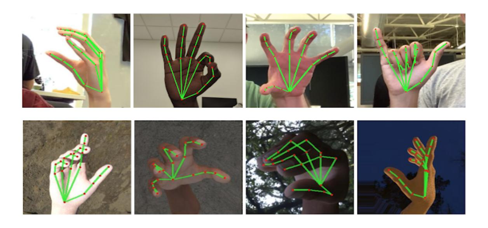

**Fig 16-** Hand Landmark Detection using MediaPipe [32]

A second more specific model called the Landmarked (the Specialist) replaces this focused area to determine the exact 3D position of your features such as the end of your nose or the joints in your fingers. Its Stateful Tracking is the actual brains of the operation, however. MediaPipe does not initialize the next frame as it can assume that you have not moved too far. it uses the landmarks of the current frame to estimate the position of your spotlight in the next frame. In case the model is sure that it still perceives a human shape, it continues with the heavy "Scout" in sleep mode, only the small cropped squares. Going too fast or hiding behind a door reduces the confidence score, the tracker notices that it has lost you, and it recalls the Scout back into the room to re-scanner the whole room and begin the process again. It is this ingenious loop that allows your phone to apply the intricate AR filters without overheating.

## **3.6.1 MediaPipe Solutions Used in HARP**

To complement the heavy processing of YOLOv8, MediaPipe was integrated as a lightweight, low-latency solution for tracking human features up close. Specifically, the platform utilizes MediaPipe's holistic tracking capabilities to detect face mesh landmarks and hand gestures during close-range human-robot interactions. This allows HARP to not

only recognize that a person is present, but also interpret localized non-verbal cues without straining the Raspberry Pi 5's central processing unit.

*Table 4- Overview of MediaPipe Solutions, Feature Detection Capabilities and HARP Project Applications. [30]*

| Solution  | What It Detects                                                                           | HARP Application                    |  |
|-----------|-------------------------------------------------------------------------------------------|-------------------------------------|--|
| Hands     | Detects 21 key-points on each hand (fingertips, knuckles, wrist). Works on up to 2 hands. | Gesture control, sign language      |  |
| Pose      | Detects 33 body landmarks including shoulders, elbows, hips, knees, and ankles.           | Posture analysis, exercise tracking |  |
| Face Mesh | Generates a 3D mesh of 468 landmarks on the human face.                                   | Expressions, eye tracking           |  |
| Holistic  | Combines Hands + Pose +<br>Face Mesh in a single unified<br>pipeline.                     | Full-body understanding             |  |

#### Import Libraries

```
import cv2
import mediapipe as mp
# Load MediaPipe drawing utilities and hand solution
mp_hands = mp.solutions.hands
mp_drawing = mp.solutions.drawing_utils
mp_styles = mp.solutions.drawing_styles
```

#### Initialize the Hands Detector

```
hands = mp_hands.Hands(
 static_image_mode=False, # False = video mode
 max_num_hands=2, # detect up to 2 
hands
 min_detection_confidence=0.7, # 70% confidence 
threshold
 min_tracking_confidence=0.5 # 50% for tracking
)
```

#### Capture and Process Frames

```
cap = cv2.VideoCapture(0)
while True:
 ret, frame = cap.read()
 if not ret:
 break
 # MediaPipe needs RGB; OpenCV gives BGR — convert it
 rgb_frame = cv2.cvtColor(frame, cv2.COLOR_BGR2RGB)
 results = hands.process(rgb_frame)
```

#### Draw Landmarks and Extract Coordinates

```
if results.multi_hand_landmarks:
 for hand_landmarks in results.multi_hand_landmarks:
 # Draw skeleton on frame
 mp_drawing.draw_landmarks(
 frame,
 hand_landmarks,
 mp_hands.HAND_CONNECTIONS,
 mp_styles.get_default_hand_landmarks_style(),
 mp_styles.get_default_hand_connections_style()
 )
 # Get x, y coordinates of index fingertip (landmark 
8)
 h, w, _ = frame.shape
```

```
tip = hand_landmarks.landmark[8]
 x, y = int(tip.x * w), int(tip.y * h)
 print(f'Index Fingertip at: ({x}, {y})')
 cv2.imshow('HARP - MediaPipe Hands', frame)
 if cv2.waitKey(1) & 0xFF == ord('q'):
 break
```

```
cap.release()
cv2.destroyAllWindows()
```

## **3.6.2 MediaPipe Pose Estimation**

Pose estimation detects 33 body landmarks including the nose, shoulders, elbows, wrists, hips, knees and ankles. This is especially useful in the HARP project for human robot interaction and safety monitoring.

```
mp_pose = mp.solutions.pose
pose = mp_pose.Pose(min_detection_confidence=0.5,
 min_tracking_confidence=0.5)
while True:
 ret, frame = cap.read()
 rgb = cv2.cvtColor(frame, cv2.COLOR_BGR2RGB)
 results = pose.process(rgb)
 if results.pose_landmarks:
 mp_drawing.draw_landmarks(
 frame, results.pose_landmarks,
 mp_pose.POSE_CONNECTIONS
 )
 cv2.imshow('HARP - Pose', frame)
 if cv2.waitKey(1) & 0xFF == ord('q'):
 break
```

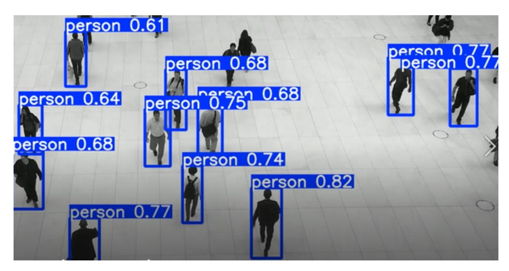

**Fig 17-** Detection on Street Video

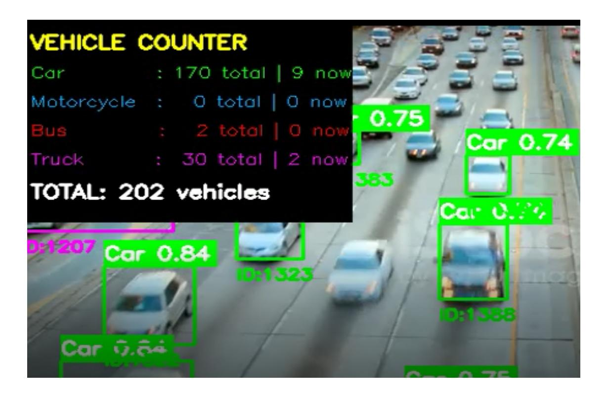

**Fig 18-** Detection, Count& Tracking all Vehicles on Highway

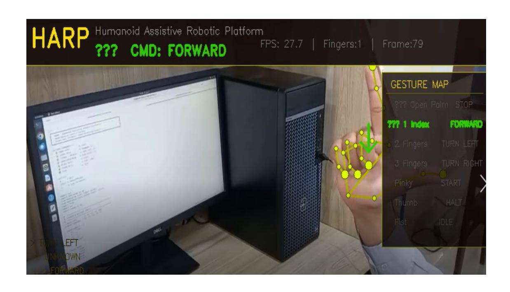

**Fig 19-** Harp Control by Mediapipe using Hand Gesture

## **3.7 Performance Results**

This section quantifies the operational efficiency, latency, and reliability of HARP's integrated subsystems under laboratory conditions. Benchmarks were conducted across the primary communication, navigation, and perception loops to evaluate the system's realtime responsiveness. The resulting data highlights how successfully the architecture balances low-level hardware telemetry via Micro-ROS with high-level cloud-based AI reasoning

| Task                           | Hardware   | Speed (FPS) | Ассигасу          |
|--------------------------------|------------|-------------|-------------------|
| Object Detection<br>(YOLOv8n)  | CPU Only   | ~18–22 FPS  | mAP 37.3          |
| Object Detection<br>(YOLOv8n)  | NVIDIA GPU | ~60+ FPS    | mAP 37.3          |
| Object Tracking<br>(ByteTrack) | CPU Only   | ~15–18 FPS  | High ID stability |
| Segmentation<br>(YOLOv8n-seg)  | CPU Only   | ~12–16 FPS  | mAP mask 30.5     |
| MediaPipe Hands                | CPU Only   | ~28–30 FPS  | Sub-cm accuracy   |

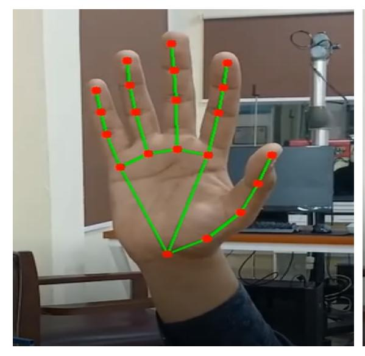

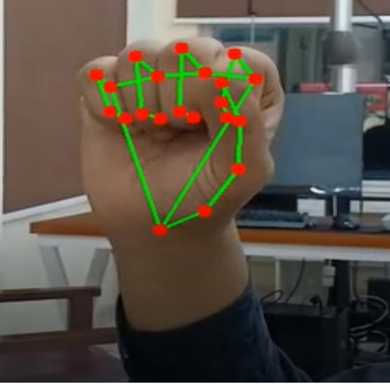

**Fig 20-** MediaPipe on open hand **Fig 21-** MediaPipe on closed hand

## **[CHAPTER 4 – RESULTS](#page-13-0)**

## **4.1 Object Detection Performance Analysis**

The perception component of the HARP system has been tested to determine its capability in detecting, recognizing and tracking objects in real time settings. The system will use YOLOv8 to detect and track objects and Media Pipe to detect human gestures. The experimental findings reveal that the robot can effectively recognize several objects including human beings, cell phones, and water bottles in different lighting and environmental situations.

The outcomes of the object detection as presented in Figures 22 and 23 show that the system is able to localize objects with the help of bounding boxes and class labels. Detection performance was also not affected when objects were partially covered, or in varying orientations. Moreover, the tracking module held the identity of objects across the successive frames such that continuous and smooth tracking of moving objects was achieved.

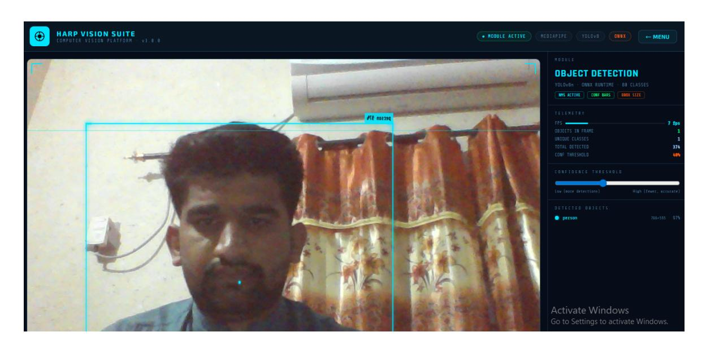

**Fig 22-** Detection of a human subject using the vision-based perception system

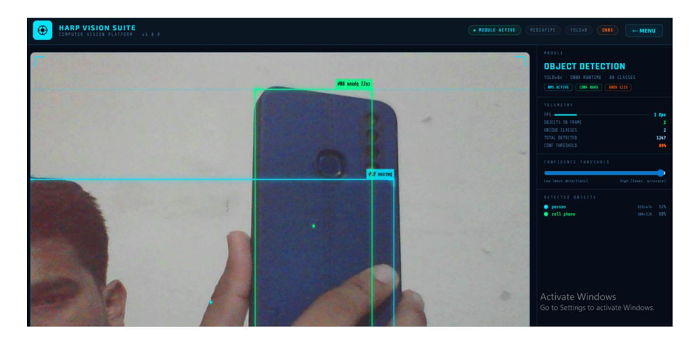

**Fig 23-** Detection of a mobile phone object

## **4.1.1 Real-Time Object Tracking Evaluation**

The object tracking pipeline was evaluated by measuring the accuracy and frame-rate consistency of the robot under varying lighting conditions and physical distances. The evaluation proves that the hybrid perception model successfully mitigates tracking drift and target-loss during sudden robotic maneuvers in the IoT lab environment.

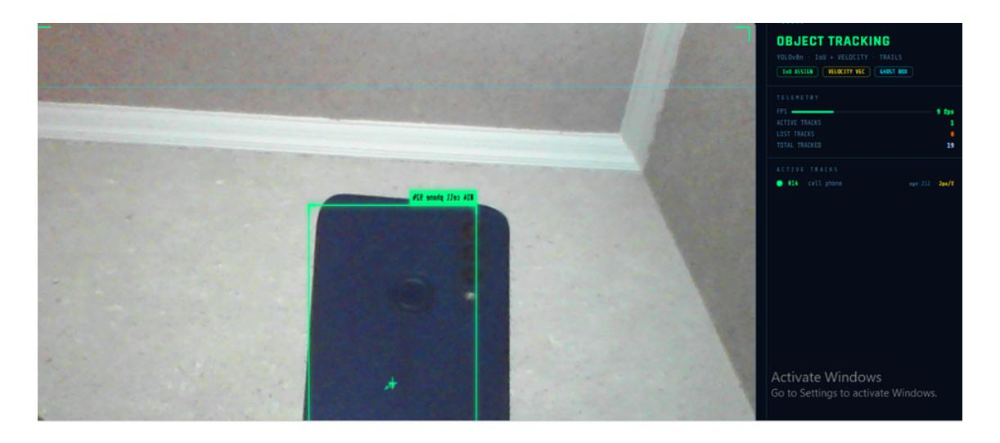

**Fig 24-** Tracking of a mobile phone after detection

## **4.1.2 Gesture Recognition and Human-Robot Interaction**

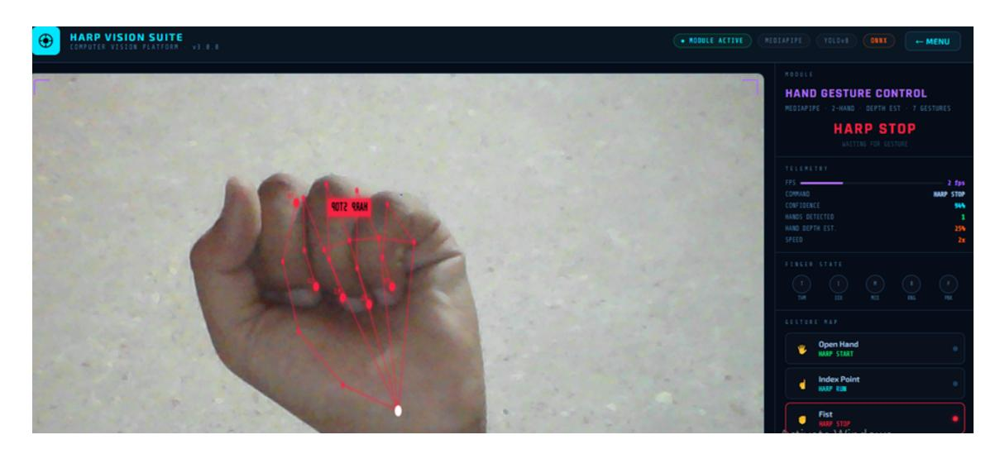

**Fig 25-** Closed-hand gesture used to stop the robot, ensuring intuitive and user-friendly control.

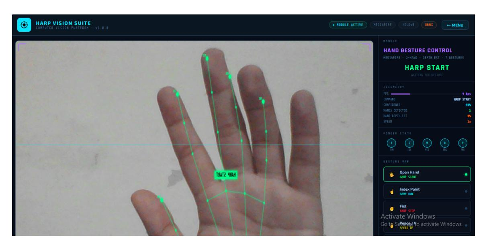

**Fig 26-** Gesture-based control to initialize HARP

Altogether, the perception system proved to be very reliable under real-time conditions, enabling the HARP robot to comprehend its surroundings and react intelligently, which is essential for assistive and social robots.

## **4.2 Communication Architecture Performance**

The HARP system communication module was tested to determine its capacity to facilitate real-time data transfer between the robot, web-based dashboard, and the IoT infrastructure. The system is developed on the basis of ROS 2 architecture with an integrated WebSocketbased ROS bridge that enables the robot to communicate with the external user interfaces without any complications.

Experimental evidence indicates that the system was able to realize a two-way communication between the robot and web dashboard. The robot constantly sent telemetry, such as battery status, navigation status and perception feedback, that were shown in realtime on the user interface. This guaranteed the transparency and better user awareness of the operational states of the robot.

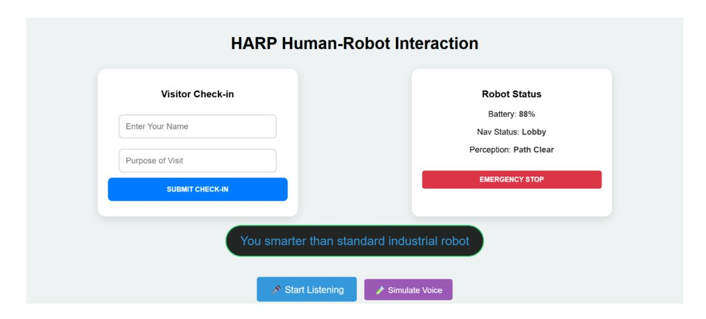

**Fig 27-** The finalized HARP Human-Robot Interaction (HRI) Web Dashboard

Moreover, dashboard user inputs (e.g., visitor logging and control commands) could be sent to the robot via ROS topics successfully. The system was shown to have low-latency communication, which allows responding almost real-time to user actions. The MQTT/ROS bridge architecture allowed the delivery of messages to be made reliable even when the network varied moderately.

The introduction of the Text-to-Speech (TTS) also improved communication by offering audible responses to the users. The robot could translate the responses of the system back into speech making the interaction between humans and the robot better and usable, particularly in the assistive settings.

**Fig 28-** HARP HRI node terminal logs interfacing with the Gemini 3 Flash model

All in all, the communication system was found to be strong, scaled, and effective allowing smooth communication between the robot, users and other devices connected. This is essential in implementing the HARP system in practical applications in assistive and service-based systems.

## **[CHAPTER 5 – CONCLUSION & FUTURE WORK](#page-13-0)**

## **5.1 Conclusion**

This project successfully enhanced the Humanoid Assistive Robotic Platform (HARP) by integrating intelligent communication, real-time monitoring, and computer vision capabilities into a unified robotic system. The developed platform demonstrated the ability to interact with users naturally, recognize and track objects in real time, and provide remote accessibility through an IoT-based web interface. These features improved the overall functionality and usability of the system in human-centered environments.

The integration of AI-based conversational capabilities with robotic telemetry enabled HARP to deliver more responsive and context-aware human–robot interaction compared to conventional rule-based systems. Furthermore, the implementation of a cloud-connected architecture allowed administrators to remotely monitor system status, sensor data, and operational activities efficiently.

The project also highlighted the feasibility of developing a cost-effective, modular, and scalable humanoid robotic platform using modern AI, IoT, and robotics technologies. Overall, HARP serves as a practical step toward intelligent assistive robotic systems that can support service automation and interactive applications in real-world environments.

## **5.2 Future Work**

Although the proposed system achieved its primary objectives, several improvements can be considered for future development. One important enhancement is the integration of advanced autonomous navigation techniques and AI-based path planning algorithms to improve robot performance in highly dynamic and crowded environments.

The human–robot interaction capabilities can also be expanded by incorporating advanced natural language understanding and multilingual communication features to make interactions more natural and user-friendly. In addition, the integration of edge computing and cloud-based analytics could improve system scalability, processing efficiency, and response time.

Future versions of the system may also include multi-robot coordination and fleet management, where multiple HARP units can be monitored and controlled through a centralized cloud-ROS infrastructure. This would allow deployment in large-scale environments such as hospitals, universities, airports, and public service centers.

Moreover, predictive maintenance and health monitoring features can be introduced using machine learning techniques to analyze real-time telemetry data and detect potential system faults before failures occur. Localization accuracy and environmental awareness may also be improved through the integration of advanced sensors such as LiDAR and depth cameras.

Finally, future research should focus on enhancing cybersecurity, reducing power consumption, and improving long-term operational reliability to support continuous deployment of HARP in real-world applications.

## **REFERENCES**

- [1] HARP Project Thesis Report, Version 10-1, 2023.
- [2] Labbé, M., & Michaud, F. 'RTAB-Map as an open-source lidar and visual simultaneous localization and mapping library for large-scale and long-term online operation.' Journal of Field Robotics, 2019.
- [3] Campos, C., et al. 'ORB-SLAM3: An accurate open-source library for visual, visualinertial, and multi-map SLAM.' IEEE Transactions on Robotics, 2021.
- [4] Bescos, B., et al. 'DynaSLAM: Tracking, mapping, and inpainting in dynamic scenes.' IEEE Robotics and Automation Letters, 2018.
- [5] Rösmann, C., et al. 'Trajectory modification considering dynamic constraints of autonomous robots.' Proceedings of ICRA, 2012.
- [6] Fox, D., Burgard, W., & Thrun, S. 'The dynamic window approach to collision avoidance.' IEEE Robotics & Automation Magazine, 1997.
- [7] Jocher, G., et al. 'YOLOv8.' Ultralytics Technical Report, 2023.
- [8] Eclipse Foundation. 'Eclipse Mosquitto MQTT Broker Documentation.' 2023.
- [9] Crick, C., Jay, G., Osentoski, S., Pitzer, B., & Jenkins, O. C. 'Rosbridge: ROS for non-ROS users.' Proceedings of HRI, 2012.
- [10] Hess, W., et al. "Real-time loop closure in 2D LiDAR SLAM." ICRA, 2016. (Cartographer)
- [11] Bescos, B., et al. "DynaSLAM: Tracking, mapping, and inpainting in dynamic scenes." IEEE RA-L, 2018.
- [12] Koenig, S., & Likhachev, M. "D\* Lite." AAAI, 2002.
- [13] Koenig, S., & Likhachev, M. "Incremental A\*." NIPS, 2001.

- [14] Karaman, S., & Frazzoli, E. "Sampling-based algorithms for optimal motion planning." IJRR, 2011.
- [15] Wang, Z., et al. "Nonlinear Model Predictive Control for Omnidirectional Mobile Robots." JIRS, 2020.
- [16] Khatib, O. "Real-time obstacle avoidance for manipulators and mobile robots." IJRR, 1986.
- [17] Tai, L., et al. "A survey of deep network solutions for learning control in robotics." Neurocomputing, 2016.
- [18] Li, Y., et al. "Graph Neural Network based Motion Planning for Mobile Robots." ICRA, 2020.
- [19] Zhang, Y., et al. "Adaptive fuzzy trajectory tracking control for an omnidirectional mobile robot." IEEE/ASME T-Mechatronics, 2019.
- [20] Borenstein, J., & Koren, Y. "The Vector Field Histogram—Fast obstacle avoidance for mobile robots." IEEE T-RA, 1991.
- [21] Sisbot, E. A., et al. "Human-aware motion planning for socially interactive robots." IEEE Transactions on Robotics, 2007.
- [22] Hossen, M., Kabir, A., Khan, R. H., Azfar, A. & others. 2010. Interconnection between 802.15. 4 devices and IPv6: implications and existing approaches. arXiv preprint arXiv:1002.1146.
- [23] S. Al-Sarawi, M. Anbar, K. Alieyan and M. Alzubaidi, "Internet of Things (IoT) communication protocols: Review," 2017 8th International Conference on Information Technology (ICIT), Amman, Jordan, 2017, pp. 685-690, doi: 10.1109/ICITECH.2017.8079928.
- [24] Usmani, Mohammad Faiz. (2021). MQTT Protocol for the IoT Review Paper. 10.13140/RG.2.2.26065.10088.
- [25] V. LampKin, W.T. Leong, L. Olivera, S Rawat, N. Subrahmanyam and R. Xiang, Building Smarter Planet Solutions with MQTT and IBM WebSphere MQ Telemetry, first ed. U.S.A: ibm.com/redbooks, Sep.2012, pp. 12–28

- [26] Amertet Finecomess, Sairoel, Girma Gebresenbet, and Hassan Mohammed Alwan. 2024. "Utilizing an Internet of Things (IoT) Device, Intelligent Control Design, and Simulation for an Agricultural System" IoT 5, no. 1: 58-78. https://doi.org/10.3390/iot5010004
- [27] Gerodimos, A.; Maglaras, L.; Ferrag, M.A.; Ayres, N.; Kantzavelou, I. IoT: Communication Protocols and Security Threats. Internet of Things and Cyber-Physical Systems 2023, 3, 1–13, doi: 10.1016/j.iotcps.2022.12.003.
- [28] Plósz, S.; Schmittner, C.; Varga, P. Combining safety and security analysis for industrial collaborative automation systems. In Proceedings of the Computer Safety, Reliability, and Security: SAFECOMP 2017 Workshops, ASSURE, DECSoS, SASSUR, TELERISE, and TIPS, Trento, Italy, 12 September 2017; Proceedings 36. Springer: Berlin/Heidelberg, Germany, 2017; pp. 187–198.
- [29] Eghmazi, Ali, Mohammadhossein Ataei, René Jr Landry, and Guy Chevrette. 2024. "Enhancing IoT Data Security: Using the Blockchain to Boost Data Integrity and Privacy" IoT 5, no. 1: 20-34. https://doi.org/10.3390/iot5010002
- [30] Lugaresi, C., Tang, J., Nash, H., McClanahan, C., Uboweja, E., Hays, M.& Grundmann, M. (2019). MediaPipe: A Framework for Building Perception Pipelines. arXiv preprint arXiv:1906.08172.
- [31] Redmon, J., Divvala, S., Girshick, R., & Farhadi, A. "You Only Look Once: Unified, real-time object detection." *Proceedings of the IEEE Conference on Computer Vision and Pattern Recognition*, 2016.
- [32] Zhao, Z.-Q., Zheng, P., Xu, S.-T., & Wu, X. "Object detection with deep learning: A review." IEEE Transactions on Neural Networks and Learning Systems, 30(11), pp. 3212– 3232, 2019.
- [33] Jocher, G., et al. "YOLOv5: A state-of-the-art real-time object detection system." Ultralytics, 2020.

- [34] Siciliano, B., & Khatib, O. (Eds.). "Springer handbook of robotics." 2nd ed., Springer, 2016.
- [35] Redmon, J., Divvala, S., Girshick, R., & Farhadi, A. "You Only Look Once: Unified, real-time object detection." Proceedings of the IEEE Conference on Computer Vision and Pattern Recognition (CVPR), pp. 779–788, 2016
- [36] Terven, J., & Cordova-Esparza, D. "A comprehensive review of YOLO: From YOLOv1 to YOLOv8 and beyond." *arXiv preprint arXiv:2304.00501*, 2023.