# Project Completion Report

## Humanoid Assistive Robotic Platform (HARP)

**National University of Sciences and Technology (NUST)**
College of Electrical and Mechanical Engineering, Rawalpindi
NUST Flagship Project No. FSP-23-13

---

## 1. Project Information

| Item | Detail |
|---|---|
| Title of Project | Humanoid Assistive Robotic Platform (HARP) |
| Date of Approval | 17 November 2023 |
| Approved Duration | 12 months (after extensions: 24 months and 29 days) |
| Date of Completion | 30 December 2025 |
| Funding Agency and Scheme | NUST Flagship |

## 2. Project Budget

| Item | Amount (PKR) |
|---|---|
| Approved Amount | 1,000,000 |
| Amount Received | 1,000,000 |
| Amount Expended | 920,736 |
| Amount in Balance | 79,264 |

## 3. Project Team

**Principal Investigator**
Dr. Kanwal Naveed, College of Electrical and Mechanical Engineering (CEME), NUST
Email: kanwalnaveed@ceme.nust.edu.pk

**Co-Principal Investigators**
Dr. Tahir Habib Nawaz, CEME, NUST (tahir.nawaz@ceme.nust.edu.pk)
Sen. Lec. Usman Asad, CEME, NUST (usman.asad@ceme.nust.edu.pk)

**Other Team Members**
Dr. Muhammad Moazam Fraz, School of Electrical Engineering and Computer Science (SEECS), NUST. Development of Artificial Intelligence and Machine Learning modules.
Dr. Anas Bin Aqeel, CEME, NUST. Co-supervision of final year design projects on mechanical design and system integration.

**Research Assistants**
Kashaan Ansari (7 months) and Ahyan Ahmed (5 months), hired under the project HR budget. Details are given in Section 12.

**Undergraduate Teams**
Three final year design project (FYDP) teams of the Department of Mechatronics Engineering, CEME, worked on the platform across three academic cycles (2023-24, 2024-25, and 2025-26), together with five undergraduate interns. Details are given in Section 11.

## 4. Equipment and Materials Purchased

All items below were purchased under the consumables head and are installed on the HARP platform or were consumed during its construction. Permanent items are held in the Robot Design and Development Lab (RDDL), NCRA.

| S. No | Item | Cost (PKR) | Location / Status |
|---|---|---|---|
| 1 | NVIDIA Jetson Nano Developer Kit | 90,000 | RDDL, NCRA |
| 2 | Intel RealSense Depth Camera D435i | 163,390 | RDDL, NCRA |
| 3 | Samsung Galaxy Tab A7 Lite | 78,000 | RDDL, NCRA |
| 4 | 7 inch HDMI capacitive touch LCD screen (Raspberry Pi / Jetson Nano) | 16,750 | RDDL, NCRA |
| 5 | Samsung 10,000 mAh power bank | 11,000 | RDDL, NCRA |
| 6 | Servo gimbal, 2 DoF rotating head base | 15,376 | Installed on HARP |
| 7 | Mechanical 3D printing material (PETG filament, aluminum sheets, 3K carbon fiber cloth, epoxy resin) | 139,665 | Consumed for robot construction |
| 8 | Aluminum sheets for robot structure | 25,000 | Consumed for robot construction |

---

## 5. Introduction

### 5.1 Background and Motivation

Intelligent robots give us a chance to deploy Artificial Intelligence in daily life, especially as facilitators. Robots of this kind are candidates for many service tasks, including cleaning, delivery, and reception duties. They belong to the category of socially interactive robots (SIR) and socially assistive robots (SAR).

There is a growing need for social robots that can provide continuous support in environments facing workforce shortages, such as hospitals, elderly care facilities, and rehabilitation centers. Human caregivers alone are often not enough to meet the rising demand for personalized care. At the same time, most existing assistive platforms have real limitations. Many cannot perceive complex human behavior, cannot hold a natural spoken conversation, and cannot move safely on their own. Many also depend on expensive, power-hungry active sensors such as LiDAR, and are built as inflexible, non-modular systems that are hard to extend.

HARP was conceived to address these gaps. The goal was a low-cost, modular, and scalable humanoid platform that can see, listen, talk, and move in real indoor service environments, built largely from commodity hardware and open software.

### 5.2 Related Work

Several earlier systems informed the design of HARP. A "roboceptionist" was employed at Carnegie Mellon University. It featured a conversational agent called Valerie, displayed on a screen, that interacted with visitors through a dialogue system. ASKA, deployed at NAIST in Japan in 2003, was a research receptionist robot combining visual recognition, speech recognition, voice response, and web retrieval. It could answer questions about university matters with synthesized speech, hand gestures, and head movement. Wakamaru, introduced by Mitsubishi in 2005, worked as a receptionist and domestic assistant. More recent examples include iCub (2014), which can guide visitors to locations on a university map, and DEVI (2019), an open-source receptionist robot with proximity sensing, face recognition, and a chatbot core. Commercial social robots such as SoftBank's Pepper, with its omnidirectional wheeled base and human-like interaction, served as direct design inspiration for the mechanical work.

The literature reviews carried out by the student teams also covered holonomic wheel configurations, visual SLAM algorithms (RTAB-Map, ORB-SLAM3, DynaSLAM), emotion and behavior recognition methods, the use of large language models as a robotic "brain", and studies on the acceptance of assistive humanoids in healthcare. These reviews shaped the specific technical choices described in Section 7.

---

## 6. Objectives of the Project

1. To develop HARP, a humanoid assistive robot with robust perception, seamless human-robot interaction, and safe autonomous mobility, capable of reliable operation in real-world service environments.
2. To enhance operational efficiency and customer satisfaction by delivering consistent, personalized, and uninterrupted services through AI-driven learning and decision-making.
3. To integrate advanced technologies, including natural language processing, computer vision, and machine learning, into a scalable and cost-effective service solution.

---

## 7. Research Methodology and System Development

### 7.1 Development Approach

The system uses edge computing as its guiding principle. Complex AI tasks are executed directly at the source of the data, on embedded computers carried by the robot (initially a Raspberry Pi 4B and Jetson Nano, and finally a Raspberry Pi 5), with cloud AI services used only where they add clear value, such as large language model conversation. This keeps latency and bandwidth use low. ROS 2 is used throughout for data exchange and synchronization among sensors and modules.

At the system level, HARP is organized into five main modules:

1. **Sensing Module.** Acquires data from the environment through voice, video, depth, and proximity sensors.
2. **Perception Module.** Processes the sensed data to produce meaningful information: who is present, where they are, what they are doing, and what they are saying. Its submodules include face detection and recognition (with gender and emotion estimation), human behavior recognition, object detection and tracking, gesture recognition, and speech recognition.
3. **Cognition Module.** Generates appropriate responses and actions. It includes natural language processing based on large language models, a retrieval system that grounds answers in supplied documents, and decision logic for navigation and interaction.
4. **User Interface Module.** A tablet screen on the robot's chest for text, graphics, and touch input, an animated face on the head display, and audio output through onboard speakers.
5. **Mobility Module.** The wheeled base, motor drivers, and navigation stack that move the robot safely through indoor spaces.

The work was carried out iteratively over three academic cycles. Each final year project team, working with the research assistants and the investigators, took the platform further. The first cycle (2023-24) delivered the mechanical structure, the first perception and chatbot modules, and the web interface. The second cycle (2024-25) delivered a new omnidirectional base, the gimbal neck, behavior recognition, the modern speech pipeline, passive visual SLAM, and full ROS 2 integration. The third cycle (2025-26) delivered the IoT administrative layer, the enhanced vision system, and the low-latency conversational upgrade. In parallel, the research team developed and hardened the robot control software and a next-generation conversational "brain", described in Sections 7.7 and 7.8.

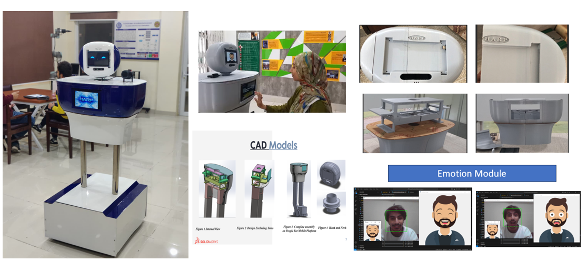

*Figure 1. Snapshots of the HARP development process: the assembled prototype, a public demonstration, SolidWorks CAD models, 3D printed structural parts, and the emotion recognition module.*

### 7.2 Mechanical Design and Fabrication

#### 7.2.1 First Iteration: Torso, Head, and Neck on the PeopleBot Platform

The first design cycle built the humanoid body. A PeopleBot mobile platform was available to the project, so the design effort focused on a torso, head, and neck that could mount on it. The target was a robot about five feet tall with a friendly, humanoid appearance, drawing inspiration from Pepper, ARMAR III, and BHR-5.

Because no CAD model of the PeopleBot existed, the team first measured the physical platform and produced a simplified SolidWorks model of it. Several torso concepts were then explored and refined through iterative design reviews. The final torso is a shell of four 3D printed sections around an internal component structure. Dedicated plates hold the computing hardware, speakers, and provisions for future arms, and a holder carries the chest tablet. The head houses a 7 inch display and the depth camera, with a neck that manages cabling down to the torso and bolts to the body.

The design was validated in ANSYS before manufacture. Static structural analysis was performed on the load-bearing internal parts, with the applied forces representing the screen, camera, and tablet weights, and with mesh convergence studies used to confirm the results. The analysis identified stress concentrations near mounting points and screen housing edges, which led to minor design changes. Deformations under load were small, confirming the structure could carry the imposed loads. An explicit dynamics study then simulated the torso colliding with a concrete wall at speeds from 0.3 to 0.7 m/s, covering the PeopleBot speed range. The von Mises stress concentrated at the front center of the torso and spread symmetrically, remaining within allowable limits.

For manufacturing, candidate materials (mild steel, carbon fiber, acrylic, PLA, PETG, ABS) and methods (CNC machining, casting, forging, sheet metal work, injection molding, laser cutting, thermoforming, 3D printing) were compared. The selected combination was 3D printing in PLA for the shaped body parts and laser-cut plates for the base interfaces. The base plates were first made from mild steel by laser cutting and welding, but alignment and weight issues during assembly led to their replacement with 5 mm transparent acrylic. The 3D printed parts were assembled with keys, bolts, and screws, with some re-drilling to align holes against the unmodifiable PeopleBot plate.

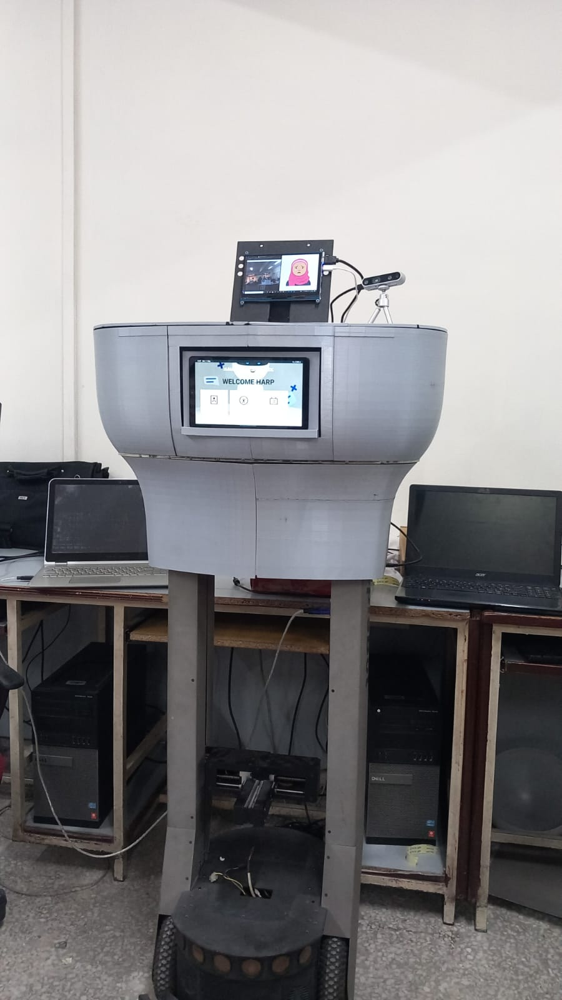

*Figure 2. The first torso assembly mounted on the PeopleBot mobile platform.*

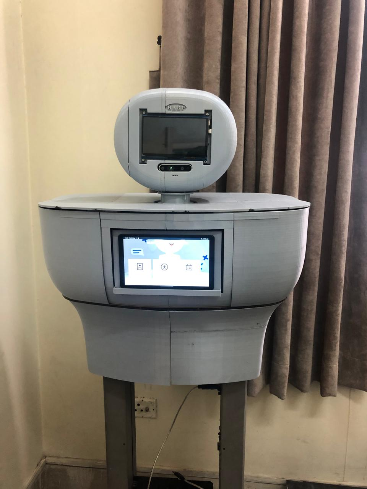

*Figure 3. The assembled head, carrying the 7 inch display and the Intel camera, with the neck support below.*

#### 7.2.2 Second Iteration: Custom Omnidirectional Base

The second design cycle replaced the PeopleBot with a purpose-built base. Traditional differential drives can only move forward, backward, and turn in place, which is slow and space-consuming in tight indoor environments. An omnidirectional base lets the robot move in any direction without turning first, which makes its motion smoother and more natural around people. The design requirements were a four mecanum wheel configuration, a total system weight of up to 60 kg, direct replacement of the PeopleBot, and a total robot height above five feet.

The base frame was designed in SolidWorks through several iterations. Early drafts failed static analysis or lacked room for the control electronics, and one otherwise sound draft proved unstable in dynamic simulation. Supporting engineering calculations covered required torque (3.84 Nm per wheel against 9.81 Nm available per motor), acceleration (6.57 m/s²), tipping stability (17.7 degrees sideways tipping angle with a centered center of gravity), motor power (45 W total), wheel traction against ADA friction values (51.5 N available against 49.3 N required), and battery sizing (about 6.8 hours of runtime from a 24 V, 5 Ah pack at nominal draw).

The final design was verified in ANSYS Workbench with three analyses:

| Analysis | Key Result | Interpretation |
|---|---|---|
| Static structural | Max von Mises stress 59.6 MPa against 250 MPa yield; max total deformation 0.90 mm | Factor of safety of about 4.2; structurally sound |
| Modal | First natural frequency 20.3 Hz | Well above operational excitation; no resonance risk |
| Eigenvalue buckling | First positive buckling load factor 162.4 | Buckling would require over 40,000 N; no realistic risk |

A URDF model was exported from SolidWorks using the URDF Exporter plugin and used for dynamic stability simulation in CoppeliaSim. Early versions toppled at low speeds, so the base area was increased and the center of mass lowered until the simulated platform was stable.

The frame was fabricated from 16-gauge mild steel square tube (0.75 by 0.75 inch), cut, welded, drilled, and finished with anti-rust primer and paint. Fiberglass sheets form a skirt around the lower perimeter for a clean outer appearance. Custom motor couplers were machined because the supplied couplers did not fit the motor shafts. Motor brackets were laser cut from sheet metal and bent to 90 degrees, and a gimbal mounting plate was CNC milled to attach the head assembly.

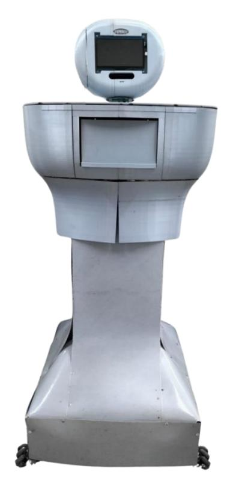

*Figure 4. The fabricated HARP platform after the second mechanical iteration.*

#### 7.2.3 The 2 DoF Neck Mechanism

A fixed head limits social interaction, so the second cycle added a two degree of freedom neck. A servo-powered gimbal assembly provides pitch and yaw motion. A lightweight 3D printed head, carrying the camera and the face display, mounts on the gimbal through the CNC milled plate. The servos are driven by an ESP32 microcontroller through a PCA9685 servo driver, which receives angle commands over serial from the main computer. Servo angles are constrained to a safe mechanical range (yaw 20 to 90 degrees, pitch 40 to 70 degrees) to protect the mechanism. A mechanical design patent covering the platform has been filed through the NUST Intellectual Property Office.

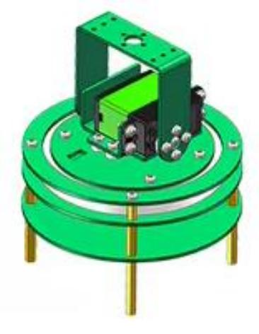

*Figure 5. The 2 DoF servo gimbal that carries the robot head.*

### 7.3 Perception Module

#### 7.3.1 Face Detection with Depth, Gender, and Emotion

Face perception went through three generations. The first system used OpenCV Haar cascade detection feeding two neural networks: a custom convolutional network for emotion recognition, trained on the FER-2013 dataset (over 35,000 images across seven emotions: angry, disgust, fear, happy, neutral, sad, surprise), and a pre-trained CNN for gender classification evaluated against the Adience benchmark. The emotion network used four convolutional blocks (32, 64, 128, and 256 filters with 3x3 kernels and ReLU activations), max pooling, and dense layers, trained with the Adam optimizer and categorical cross-entropy. The combined system ran in real time and drove gender-matched emoticons on the head display, so a happy male visitor and a happy female visitor each saw an avatar that mirrored them.

The second generation moved emotion recognition to the DeepFace library, wrapped in a ROS 2 service so that recognition runs only when another subsystem requests it. This on-demand pattern cut resource use substantially and improved the responsiveness of the rest of the system.

The final deployed system runs a YOLOv8n-face model in ONNX Runtime on the CPU of the Raspberry Pi 5, processing the RealSense color stream at 640x480 with letterboxing and non-maximum suppression implemented in NumPy. The depth stream is aligned to the color frame, so every detected face has a real-world distance. Distance is taken as the median depth over a small patch at the face center, which is robust to holes and noise in the depth map. The nearest face is selected as the interaction target and its pixel center is published on the ROS topic `/target_face` at approximately 30 FPS. Gender and emotion estimates are overlaid on the same pipeline, as shown in Figure 6.

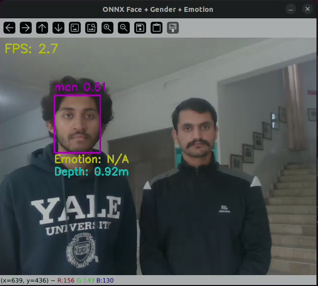

*Figure 6. The deployed perception pipeline detecting a face with gender classification, emotion field, and a fused depth estimate of 0.92 m from the RealSense camera.*

#### 7.3.2 Human Behavior Recognition

To let HARP respond to what people are doing, not just where they are, a video-based behavior recognition capability was developed. A self-trained CNN-LSTM classifier was built first. EfficientNetB0 extracted 1280-dimensional features from each frame, and a 32-unit LSTM classified sequences of up to 30 frames. Training data combined the KTH action dataset with a Kaggle activity dataset, giving eight final classes (hand waving, clapping, walking, falling, running, sitting, lying down, and standing), doubled in size by horizontal-flip augmentation with the Vidaug library. Training used Adam, early stopping, learning rate reduction on plateau, and checkpointing. The trained model reached good validation accuracy but generalized poorly to live webcam input, since no webcam footage was present in the training data.

The production system therefore uses MoViNet, Google's family of mobile video networks trained on the Kinetics-600 dataset. MoViNet uses factorized (2+1)D convolutions and a stream buffer of causal convolutions, so it processes one frame at a time while keeping temporal context. It runs as a quantized TensorFlow Lite model, which makes it well suited to the robot's edge hardware. Inference is multithreaded so that classification never stalls the video feed.

#### 7.3.3 Object Detection, Tracking, and Segmentation

The third cycle added general world perception with YOLOv8. The robot detects and labels objects in its surroundings in a single network pass, tracks them across frames with persistent identities using ByteTrack (with BoT-SORT available where identity retention matters more than speed), and produces pixel-level masks with the YOLOv8 segmentation variant. The vision nodes launch through a dedicated ROS 2 launch file and publish detections as ROS 2 topics for the navigation and interaction logic. Detection performance held up under partial occlusion and varying object orientations, and the tracker maintained object identities across successive frames during robot motion.

Measured performance on the laboratory hardware:

| Task | Hardware | Speed | Accuracy |
|---|---|---|---|
| Object detection (YOLOv8n) | CPU only | ~18-22 FPS | mAP 37.3 |
| Object detection (YOLOv8n) | NVIDIA GPU | ~60+ FPS | mAP 37.3 |
| Object tracking (ByteTrack) | CPU only | ~15-18 FPS | High ID stability |
| Segmentation (YOLOv8n-seg) | CPU only | ~12-16 FPS | mask mAP 30.5 |
| MediaPipe Hands | CPU only | ~28-30 FPS | Sub-cm landmark accuracy |

#### 7.3.4 Gesture Recognition

MediaPipe complements YOLOv8 for close-range interaction. It detects 21 hand landmarks per hand and 33 body pose landmarks using a two-stage detector and tracker design that is light enough for the Raspberry Pi 5. Gestures were mapped to robot control: an open palm initializes HARP and a closed fist stops it, giving visitors an intuitive, contact-free way to command the robot. In the conversational software, a raised open palm that is held and then released acts as a greeting cue (a wave), debounced so that one gesture fires exactly one event.

*Figure 7. Gesture-based control. An open palm initializes HARP; a closed fist stops the robot.*

### 7.4 Active Head Tracking and the Expressive Face

The head tracking subsystem closes the loop between perception and the neck hardware. A ROS 2 node subscribes to `/target_face` and runs an independent PID controller per axis on the normalized pixel error between the face center and the frame center, with integral wind-up clamping and derivative terms. Tuned gains of Kp = 1.5, Kd = 0.5, Ki = 0.1 (yaw) and Kp = 0.7, Kd = 0.6, Ki = 0.1 (pitch) give smooth, jerk-free motion. The controller output is converted to servo angles, clamped to the safe mechanical limits, and streamed to the ESP32 over serial as a compact command at about 20 Hz.

When no face is visible, the robot behaves autonomously. If the face is lost for under half a second, tracking simply continues. After two seconds the head returns to a neutral rest pose. After three to four seconds a smooth look-around sweep begins across the yaw range, staged so it can be interrupted the instant a face reappears. The node also publishes a boolean on `/face_detected` so the rest of the system knows whether a person is present. In practice the robot holds eye contact, follows the nearest person smoothly, and visibly searches for company when alone, all with classical, tunable control.

The face itself is an animated pair of eyes rendered in HTML, CSS, and JavaScript, hosted full screen in a PyQt5 window with QtWebEngine. The web page connects to the ROS graph over rosbridge (a websocket on port 9090) and subscribes to two topics: `/user_emotions`, carrying one of happy, sad, angry, focused, surprise, or neutral, and `/face_detected`. The eyes blink procedurally and switch expression keyframes as emotions change, and they react when a person appears or leaves. Because expression and presence are just ROS messages, any subsystem can change HARP's face without touching the UI code.

### 7.5 Speech and Conversational AI

Conversation is what turns HARP from a machine into a companion, and it received sustained attention across all three cycles.

**First generation: scripted chatbot with RAG.** The initial system used the pyttsx3 text-to-speech engine and the SpeechRecognition library with Google's recognizer, wrapped around a command-matching chatbot. It was then upgraded to Google's Gemini model with safety settings, temperature control, and a speech front end. To ground answers in facts, Retrieval-Augmented Generation (RAG) was implemented with LangChain: PDF documents were loaded with PyPDFLoader, split into chunks, embedded with Google Generative AI embeddings, and stored in a Chroma vector database. At question time the retriever fetched the most relevant chunks and the model answered from them, falling back to the base Gemini model when retrieval found nothing suitable. Combining RAG with the language model raised answer accuracy to roughly 80 to 90 percent on the supplied documents while keeping responses fluent. Evaluation covered accuracy, response time, fluency, and relevance.

**Second generation: cloud speech pipeline.** The second cycle replaced the desktop-style pipeline with a modern three-stage system. OpenAI's Whisper (large-v3) transcribed the user's speech with strong robustness to accents and noise. Gemini 2.0 Flash generated the response, with instructions tailoring it to HARP and a 150-token cap to keep replies short and conversational. Piper, an open-source text-to-speech engine using the "amy-low" voice, spoke the reply in a calm, natural female voice. A spoken hot word ("hello") started a conversation, and "bye" ended it. Offloading transcription and language processing to the cloud kept the onboard computation light, at the cost of internet dependency and a short round-trip delay.

**Third generation: native audio, full duplex, bilingual.** The final deployed assistant abandons the chained speech-to-text, language model, text-to-speech design entirely. It uses Google Gemini Live with a native audio model, streaming microphone audio to the model and playing the model's audio straight back, over an asynchronous pipeline built with Python asyncio. This audio-to-audio approach gives lower latency and much more natural turn-taking, including barge-in, where the robot yields gracefully when the user interrupts. Because the model is steered by a system instruction to mirror the user's language rather than by a pinned language code, HARP converses in both English and Urdu and switches between them mid-conversation. Camera frames can be streamed alongside the audio so the model can see what it is talking about. The assistant carries a fixed HARP persona: it identifies itself as a NUST CEME Mechatronics project funded by the Pro Rector RIC NUST, keeps a warm and concise tone, never claims emotions or consciousness, and closes conversations with a scripted goodbye. Robust audio handling detects the correct microphone and speaker by name, queries native sample rates, and resamples the model's 24 kHz output to whatever the speaker supports.

The third cycle also integrated the Gemini 3 generation Live API into the human-robot interaction layer with a streaming architecture. Instead of waiting for a full response, the system receives token chunks through the google-genai SDK and publishes them to the `/robot_speech` topic as they arrive, so the spoken and on-screen response begins almost immediately. The dashboard shows live subtitles of the conversation through the Web Speech API, which also makes the interaction accessible to hearing-impaired users.

### 7.6 Autonomous Mobility and Navigation

#### 7.6.1 Drive Control

For the mecanum base, the inverse kinematics of the four-wheel omnidirectional configuration convert desired body velocities (Vx, Vy, and rotation) into individual wheel angular velocities. An Arduino Mega received velocity commands from ROS over serial, applied the kinematic model, and closed a PID speed loop per wheel using quadrature encoder feedback, so each wheel reached and held its commanded speed despite load changes.

The final integrated platform drives on two RMD-X8 brushless servo motors on dedicated serial ports. The motor driver software builds the motors' raw speed-command byte frames directly (header, little-endian signed speed, checksum), provides forward, reverse, turning, stopping, and live speed ramping, and always zeroes the motors on exit for safety. Two input paths feed the same driver: direct keyboard teleoperation, and a PS4 wireless controller node that maps the D-pad and face buttons to motion commands published on the ROS topic `/cmd_input`. The same topic accepts commands from higher-level software, so the platform is both remote-controlled and autonomy-ready. A separate MQTT bridge lets external IoT devices publish motion commands into the same pipeline.

#### 7.6.2 Passive Visual SLAM

HARP's navigation deliberately avoids costly active sensors such as LiDAR. Instead it uses passive visual SLAM built around the Intel RealSense D435i, which provides synchronized RGB images, depth maps, and 6-axis IMU data. The active stereo depth system with its infrared projector maintains depth accuracy of about ±2 percent at 2 meters even on low-texture surfaces.

Real-Time Appearance-Based Mapping (RTAB-Map) fuses the RGB and depth streams into densely colored 3D point clouds as the robot moves, adding keyframes to a SLAM graph and updating the robot's pose through visual odometry. For navigation, the 3D point cloud is projected onto a 2D occupancy grid that classifies each cell as occupied, free, or unknown, published as a standard ROS occupancy grid message.

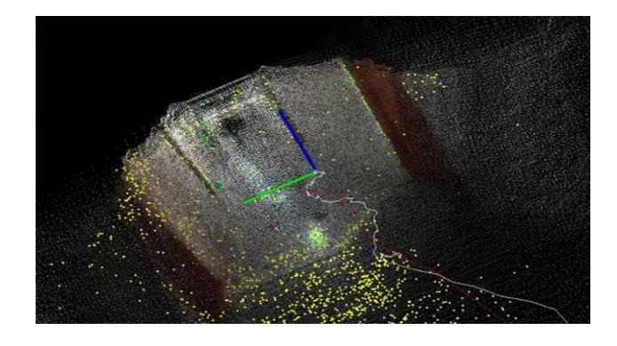

*Figure 8. RTAB-Map 3D point cloud map built from the RealSense RGB-D stream.*

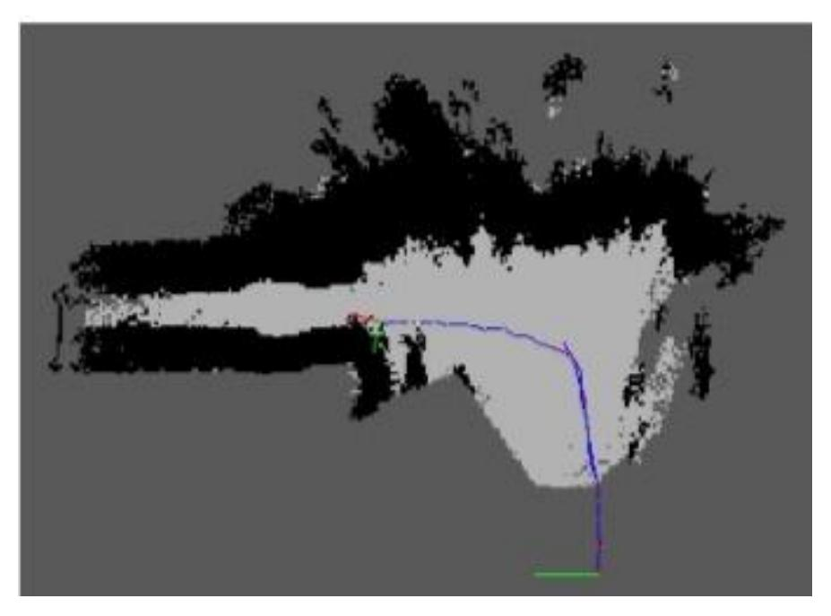

*Figure 9. The 2D occupancy grid derived from the 3D map, used for path planning.*

Path planning uses the A* algorithm on the occupancy grid. A* was chosen over Dijkstra's algorithm because its heuristic cost term finds short paths with far less search effort. The planner was first validated in simulation with ROS, Gazebo, and RViz on a simulated four-wheel mecanum robot, which confirmed smooth lateral and diagonal trajectories around obstacles. On the physical robot, RTAB-Map runs in two modes. In mapping mode the robot is driven through the environment while the map is built. In localization mode it loads the stored map, matches current camera frames against stored keyframes to estimate its pose, and navigates autonomously to goals selected in RViz or through the dashboard.

Beyond RTAB-Map, ORB-SLAM3 was studied in simulation to prepare the platform for dynamic environments where people and furniture move. ORB-SLAM3 fuses IMU data with the visual pipeline and maintains accurate localization in large, cluttered spaces. Figures 10 and 11 show the simulation environment and the resulting maps.

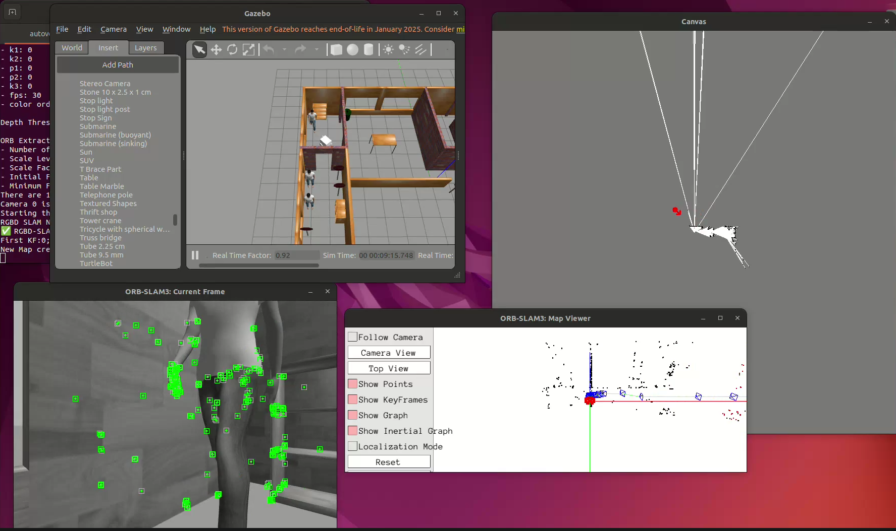

*Figure 10. ORB-SLAM3 running against a simulated indoor environment in Gazebo. The current frame view (bottom left) shows tracked ORB features, and the map viewer shows the growing keyframe graph.*

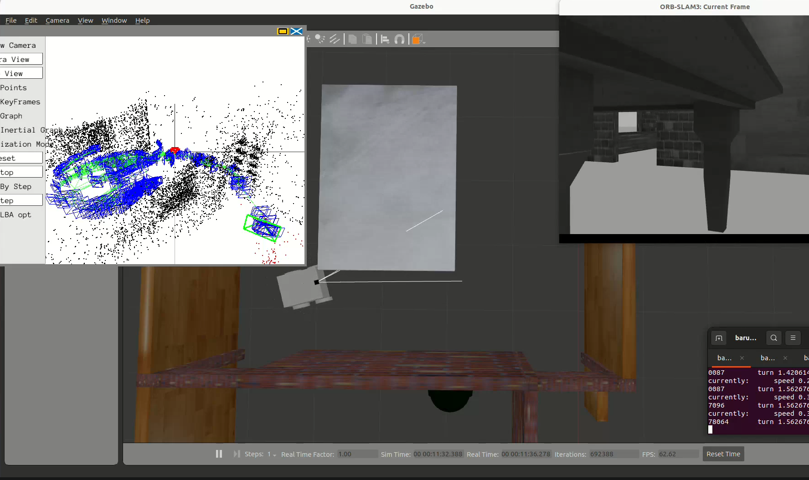

*Figure 11. The ORB-SLAM3 map viewer showing the accumulated point cloud and keyframe trajectory during a simulated mapping run.*

### 7.7 System Integration on ROS 2

Both the demonstrated robot and its software follow one architectural thesis: independent components that communicate only through messages, never by importing one another. On the physical robot, ROS 2 topics are the message bus. Perception, head control, mobility, teleoperation, voice, and the animated face are separate ROS nodes and processes, coupled only by named topics such as `/target_face`, `/face_detected`, `/cmd_input`, `/user_emotions`, and `/robot_speech`. A single launch file brings up the entire system: rosbridge, the face UI, the voice assistant, the drive motor controller, PS4 teleoperation, depth detection, and face tracking. Even the browser front-end is just another node, bridged in over rosbridge.

The integrated modules are:

- **Vision module.** Captures camera frames with OpenCV, runs face tracking and publishes offsets to `neck_coordinates`, and exposes emotion detection as an on-demand ROS 2 service.
- **Neck module.** Subscribes to face coordinates, runs the per-axis PID, streams servo commands to the ESP32, runs the look-around behavior, and publishes the current expression on `user_emotions`.
- **Face animation module.** Displays the animated eyes and switches expressions from `user_emotions` and `/face_detected`.
- **Speech module.** Runs the conversational pipeline described in Section 7.5.
- **Teleops and MQTT modules.** Route movement commands from operators and IoT devices to the drive motors.

The final deployment platform is a Raspberry Pi 5 (8 to 16 GB) running Ubuntu 24.04, Python 3.11, and ROS 2 Jazzy, with the RealSense camera, the ESP32 head controller, the drive motors, a USB microphone and speaker, the head display, and the PS4 controller attached as peripherals. This node-per-responsibility design means each subsystem is independently runnable and testable, which is exactly what allowed three student cohorts and two research assistants to grow the platform without rewrites.

### 7.8 The Conversational Software Brain

In parallel with the robot control stack, the research team engineered a from-scratch conversational agent that packages HARP's intelligence in a robust, modular, provider-independent form. It applies the same message-passing philosophy inside a single process: an asynchronous publish/subscribe event bus is the spine, and the orchestrator, wake listener, vision, voice bridge, and dashboard publish and consume typed events without ever importing each other.

Its main capabilities:

- **Provider-independent real-time voice.** One interface drives either Google Gemini Live or the OpenAI Realtime API, selectable at runtime. The rest of the system is written once against a normalized event stream, so retrieval, vision, memory, and the UI do not care which vendor is live. Conversation is full duplex, interruptible, and bilingual in English and Urdu, including natural mid-conversation code-switching.
- **Cost-aware session supervision.** An orchestrating state machine keeps the assistant alive continuously but opens the paid cloud session only when someone is actually there, on a wake word, a loud sound, or a wave. It closes the session at the end of the interaction, narrates errors aloud, retries with capped exponential backoff, and publishes heartbeats so a watchdog can detect a hang.
- **Always-on local wake listening.** While idle, the microphone is monitored locally. A loudness threshold wakes the agent immediately, and quieter speech is transcribed offline on the CPU with faster-whisper and checked for configurable wake words, including Urdu-script phrases. The wake transcript is passed to the model as context, so HARP knows why it woke.
- **Grounded answers through retrieval.** A keyword search index (BM25) over supplied markdown documents, with English and Urdu tokenization, is exposed to the language model as a tool call. The model retrieves before answering questions about the documents and grounds its reply on what came back. The document folder is fully general, so the same robot can host an expo, a lab, or a reception desk just by swapping files.
- **Face identity and per-person memory.** InsightFace embeds detected faces into 512-dimensional vectors on-device and matches them against enrolled people by cosine similarity. When a known person appears, the session is told who it is talking to, so HARP greets them by name and in context. Each person has a human-editable memory record with their name, role, notes, and accumulating conversation summaries. Unknown faces are reported but never stored, and enrollment photos are kept out of version control, which is the project's privacy stance.
- **Developer dashboard.** A read-only web dashboard shows the live state machine, the grouped conversation transcript, tool calls, presence and identity events, heartbeats, errors, and the live camera view with detection overlays. It is reachable over the LAN, so the team monitored demonstrations from a phone.

The engineering methodology behind this software is a project outcome in its own right. The hardest unknown, real-time bilingual voice quality, was proven in a throwaway spike before any architecture was committed. The full architecture was then scaffolded as importable skeletons and filled in one subsystem at a time, each verified before being wired into the whole. Around one hundred automated tests run with no camera, no GPU, no model downloads, and no API keys, because every heavy dependency is faked in the test suite. The system degrades gracefully: a missing webcam disables only camera features, and canned status lines rendered with offline text-to-speech let HARP say "starting up" or "no internet" even without a live model.

### 7.9 IoT Administrative Control and Remote Monitoring

The third cycle transformed HARP from a localized robotic unit into a connected assistive platform. An IoT administrative layer now bridges the robot's internal ROS 2 architecture and human operators anywhere on the network.

The centerpiece is a web-native Human-Robot Interaction (HRI) dashboard built with HTML5, CSS3, and JavaScript. It communicates with the robot through a rosbridge WebSocket, which translates JSON messages from the browser into ROS 2 topics and back. Any device with a browser (tablet, phone, or laptop) can operate the robot without installing ROS. The dashboard provides:

- **Real-time telemetry.** A central telemetry node publishes battery level, current location, and navigation status, so the operator always sees the robot's state. Perception feedback such as "path clear" builds trust in autonomous operation.
- **Visitor logging with persistent storage.** Visitor check-ins entered on the dashboard flow over a `visitor-log` topic to a database manager node, which stores names, visit purposes, and timestamps in an SQLite database. Every interaction is auditable, which matters for administrative and security records.
- **Voice feedback.** A text-to-speech layer, using the browser's Web Speech API with offline pyttsx3 and espeak engines as fallbacks, converts system events such as a successful check-in into spoken confirmations.
- **Teleoperation and emergency override.** Low-latency WebSocket command streaming gives the operator a human-in-the-loop safety mechanism, including manual override and emergency stop.

The communication design splits traffic by need: MQTT carries lightweight, asynchronous telemetry with low bandwidth use, while WebSockets carry the low-latency, full-duplex command stream. micro-ROS agents connect the ESP32 microcontroller directly into the ROS 2 graph for hardware telemetry. The review of IoT security threats across the perception, network, and application layers informed the deployment, and ROS 2's DDS security features (authentication, access control, and encryption through SROS 2) provide the internal protection model. This offloading also has a performance purpose: with speech handled in the browser and heavy reasoning in the cloud, the Raspberry Pi 5 and ESP32 stay focused on motor control and YOLOv8 perception.

*Figure 12. The finalized HARP Human-Robot Interaction web dashboard, showing telemetry, visitor check-in, and interaction controls.*

---

## 8. Capability Achieved

A fully functional prototype of HARP was developed, demonstrating robust perception, seamless human-robot interaction, and safe autonomous mobility in real-world indoor service environments, as proposed. In its final form the platform:

- Detects the nearest person in real time with fused color and depth sensing, estimates gender and emotion, and holds eye contact through active PID head tracking, with an autonomous look-around behavior when no one is present.
- Converses naturally in English and Urdu through a full-duplex, interruptible, cloud audio-to-audio pipeline, grounded in supplied documents through retrieval, with an expressive animated face that reacts to emotion and presence.
- Recognizes human actions, everyday objects, and hand gestures, and accepts gesture commands to start and stop.
- Moves under both remote control (PS4 controller, keyboard, and web dashboard) and autonomous navigation, using passive visual SLAM with RTAB-Map, a derived occupancy grid, and A* path planning, without any LiDAR.
- Reports its own health and accepts administrative control through a web dashboard, with persistent visitor logging and spoken feedback.

Operational efficiency and user experience were enhanced through consistent, personalized, and uninterrupted service delivery enabled by AI-driven learning and decision-making. The successful integration of natural language processing, computer vision, and machine learning on low-cost edge hardware resulted in a scalable and cost-effective humanoid service platform.

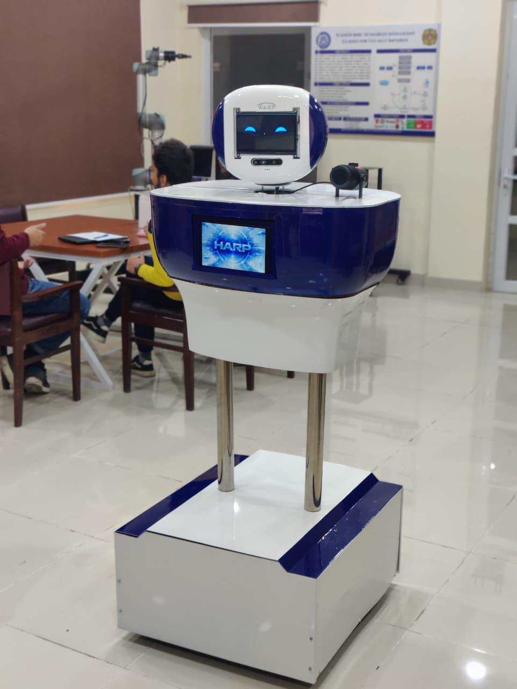

*Figure 13. The final HARP prototype: animated face and camera on the gimbal head, RealSense depth camera and tablet on the torso, and the drive base below.*

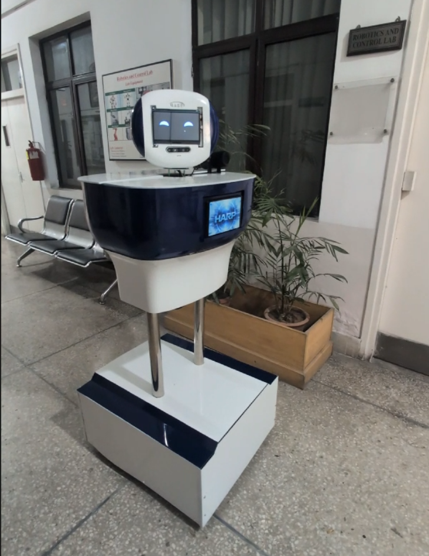

*Figure 14. HARP operating in a corridor outside the Robotics and Control Lab.*

---

## 9. Benefits of the Project

### 9.1 Market Potential

**Patient assistance and navigation.** HARP's multimodal perception, emotion recognition, and multilingual communication let it guide patients and visitors to departments, clinics, and facilities efficiently. This is especially relevant in Pakistan's linguistically diverse environment, where the ability to serve visitors in both Urdu and English makes hospital services more inclusive while reducing staff workload.

**Reception and information desk automation.** HARP can function as an interactive reception assistant, handling common inquiries, appointment guidance, and real-time information such as doctor availability. The visitor logging system keeps an auditable record of every check-in. This relieves congestion at reception counters and improves visitor satisfaction.

**Teleoperation and logistics support.** Through teleoperation and autonomous mobility, HARP can assist with routine logistical tasks such as delivering medication, transporting documents, and carrying equipment between wards, reducing physical strain on staff.

**Infection control and contactless interaction.** HARP supports contactless interaction, including gesture commands and voice-only conversation, for symptom screening, information provision, and patient guidance. This reduces unnecessary human contact and infection risk, a lesson reinforced by the pandemic.

Beyond healthcare, HARP has strong commercialization potential in banking and corporate service environments. Initial discussions are underway with JS Bank, with two online meetings held, to explore the deployment of humanoid assistants for customer engagement and service automation.

### 9.2 End Users and Organizations

Hospitals, banks, hotels, university receptions, rehabilitation and elderly care centers, and public service facilities.

### 9.3 Marketing and Commercialization Strategy

To commercialize HARP, the team is targeting private and public-sector hospitals through pilot deployments and strategic partnerships. Demonstrations highlighting patient assistance, emotion recognition, and multilingual interaction are being used to show gains in operational efficiency and patient experience. HARP was showcased at the ASEAN-Pakistan Trade and Investment Expo (APTEX), where it received strong interest and led to an international research collaboration. To support scaling and deployment, research proposals have been submitted under the RASTA/PIDE and NEC NRPU 2025 funding schemes, and the JS Bank discussions continue in parallel.

---

## 10. Tangible Outputs of the Project

| Output | Detail |
|---|---|
| Journal paper | One journal paper under review, submitted to Advanced Mechatronics (Taylor and Francis, W category) |
| Patent / IP | Mechanical design patent filed at the NUST Intellectual Property Office |
| Product type | Working prototype (design model, software, and integrated hardware platform) |
| Software | Two open codebases: the ROS 2 robot control stack and the modular conversational agent, plus the student teams' repositories (including the FYDP ROS 2 environment on GitHub) |
| Processes / methods | One documented development methodology: message-passing architecture across ROS 2 and an in-process event bus, with test-driven development against faked hardware |

---

## 11. Research Supervised

Three final year design projects of the Department of Mechatronics Engineering were completed on the platform, involving twelve undergraduate students in total, and five undergraduate internships were conducted across different modules.

| Cycle | Team | Focus |
|---|---|---|
| 2023-24 (DE-42 MTS) | Hassan Rizwan, Numan Siddique, Ifrah Sajjad, Fiza Hassan | Mechanical design and fabrication of the torso, head, and neck; emotion and gender recognition; Gemini chatbot with RAG; web user interface |
| 2024-25 (DE-43 MTS) | Syed Muhammad Daniyal Gillani, Muhammad Abdullah Khalid, Wajieh Badar, Umair Shahzad | Omnidirectional mecanum base design and fabrication; 2 DoF neck gimbal; behavior recognition; speech pipeline; passive visual SLAM; ROS 2 integration |
| 2025-26 | Noor-Ul-Ain, Muhammad Abdullah, Muhammad Zubair, Aqib Ali | IoT administrative control and web dashboard; visitor logging; YOLOv8 object detection, tracking, and segmentation; MediaPipe gesture control; Gemini Live integration |

No postgraduate students were funded under the project.

## 12. Research Assistants Hired

| S. No | Name | Monthly Salary (PKR) | Duration | Total Cost (PKR) |
|---|---|---|---|---|
| 1 | Kashaan Ansari | 30,000 | 7 months | 216,620 |
| 2 | Ahyan Ahmed | 30,000 | 5 months | 125,806 |
| | **Total** | | | **342,426** |

## 13. Linkages with R&D Organizations, Universities, and Industry

| S. No | Counterpart | Type of Linkage | Outcome |
|---|---|---|---|
| 1 | Dr. Daphne Teck Ching Lai, Brunei Darussalam | Research collaboration (initiated at the APTEX showcase) | Joint RASTA/PIDE research proposal submitted |
| 2 | JS Bank | Commercialization discussions | Two online meetings held; deployment discussions in progress |

---

## 14. Socio-Economic Impact of the Project

HARP has significant socio-economic impact potential in Pakistan, particularly in the healthcare sector. By automating routine tasks such as patient navigation, data collection, and reception duties, HARP can reduce the burden on overworked hospital staff and improve healthcare accessibility and quality. Its development and deployment create job opportunities and foster skill development in robotics, AI, and technical support, contributing to local innovation. The project has already trained twelve final year students, five interns, and two research assistants in advanced robotics and AI engineering.

HARP offers hospitals a cost-effective path to resource optimization and better patient care. Its bilingual English and Urdu capability ensures social inclusion for Pakistan's diverse population, and its contactless interaction features enhance public health safety, especially during disease outbreaks. Overall, HARP drives innovation, supports economic growth, and improves service efficiency, making it a practical response to the country's healthcare workforce challenges.

---

## 15. Reasons for Delay

The project was approved on 17 November 2023 for a duration of 12 months. Delays in execution were primarily due to human resource constraints, which led to two cost-neutral extension requests.

**First extension (up to 11 May 2025).** Although the project was approved in November 2023, the hiring of the first Research Assistant completed on 12 February 2024. The Research Assistant then resigned on 12 September 2024 after seven months of service, disrupting project continuity. Several planned activities could not be completed within the original timeline, so a cost-neutral extension was requested to complete the remaining tasks within the approved scope.

**Second extension (up to 30 December 2025).** Following the first extension, multiple hiring drives were conducted to recruit a replacement. One candidate accepted briefly but withdrew before joining, and two shortlisted candidates declined due to the limited remuneration available under the approved budget. A further hiring drive also failed for the same reason. As a result, minor but essential activities, including system refinement, integration, and iterative testing, remained incomplete. A second cost-neutral extension was requested up to 30 December 2025, along with permission to engage undergraduate and postgraduate students under the approved HR budget. This arrangement allowed the third final year team and interns to complete the remaining work.

## 16. Major Problems Faced During Execution

The primary challenge was limited financial resources, which forced expenditure to be prioritized toward the essential hardware, sensors, and computing equipment needed for the prototype. As a result, comparatively little remained for research assistant salaries. The limited remuneration shrank the pool of interested and qualified candidates, which affected manpower availability and, in turn, the execution timeline. Despite these limitations, the project objectives were achieved through optimized resource use, the structured involvement of student teams, and focused development effort.

---

## 17. Recommendations and Future Work

While the current HARP prototype successfully demonstrates perception, interaction, and autonomous navigation, it remains a research and development prototype rather than a market-ready product. Further engineering is needed to reach a fully deployable commercial system. The recommended directions, drawn from the project's own findings, are:

1. **Manipulation.** Integrate articulated arms so HARP can handle objects, open doors, and shake hands. This is the largest single capability gap for real service tasks.
2. **Dynamic navigation.** Move from static-map SLAM to dynamic SLAM (for example ORB-SLAM3 and DynaSLAM approaches already studied in simulation), so navigation remains robust among moving people and furniture. Human-aware planning that respects personal space should follow.
3. **Richer multimodal intelligence.** Adopt vision-language models so the robot can act on combined visual and verbal instructions, and expand per-person memory so long-term relationships with users deepen over time.
4. **Fleet and cloud features.** Extend the IoT layer to multi-robot coordination and centralized fleet management, with predictive maintenance based on telemetry analytics.
5. **Productization.** Industrial-grade hardware design, long-term reliability testing, safety certification, cybersecurity hardening, power optimization, and user-centered interface refinement.

From a commercialization perspective, the current prototype is a strong technology demonstrator. It can be leveraged to attract industry partners, pilot deployments, and follow-on funding. Targeted collaborations with hospitals, banks, and public facilities can move commercialization through controlled pilots before full-scale market entry. The platform will also continue to serve as a social-robotics research testbed for human-robot interaction at NUST.

---

## 18. Conclusion

The HARP project set out to build a humanoid assistive robot that could perceive, converse, and move in real service environments, and it delivered exactly that. Over three iterative development cycles, the project produced a validated mechanical platform, a layered perception system spanning faces, emotions, actions, objects, and gestures, a bilingual conversational intelligence that progressed from a scripted chatbot to a full-duplex native-audio agent, LiDAR-free autonomous navigation, and a connected administrative layer for remote oversight. The work trained a substantial cohort of young engineers, generated a journal submission and a design patent filing, seeded an international collaboration and industry discussions, and left behind two well-engineered codebases on which future research and commercialization can build.
